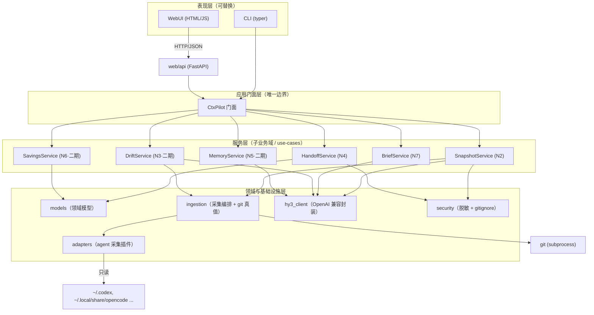
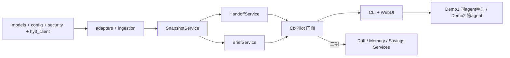

# CtxPilot / 续舱 — 业务分解与解耦设计（DESIGN）

> 应用名（暂定）：**CtxPilot / 续舱** —— 跨会话边界的「上下文连续性层」。
> 面向：腾讯混元 Hy3 犀牛鸟实战 issue #4（Build a vibe-coded application powered by Hy3）。
> 本文是开发前的「骨架契约」：先定模块边界、接口契约、UI/逻辑解耦，再写业务代码。

---

## 0. 设计原则（不可违背）

1. **Core 不知道 UI 存在**：业务逻辑层（domain / adapters / services / core）零 import CLI 或 Web 代码。
2. **UI 只依赖一个 Facade**：CLI 与 Web 都只调用 `CtxPilot` 这个高层门面，绝不直接碰 domain。
3. **子业务可独立演进**：每个 N 需求对应一个独立 service，互不直接依赖，通过 core 编排。
4. **加 agent = 加一个适配器文件**：核心引擎零改动（见 §6）。
5. **Hy3 调用全收敛在一个 client**：换端点 / 换推理模式只动一处。
6. **只读 agent 数据，只写自己产物**：`~/.codex`、`~/.local/share/opencode` 等只读；只产出 `HANDOFF.md` / 导出文件。

---

## 1. 分层架构总览



**核心解耦点**：`CtxPilot` 门面 + `web/api` 路由是 UI 与逻辑之间唯一的接缝。换前端（CLI ↔ Web ↔ 以后 IDE 插件）不动一行业务逻辑。

---

## 2. 子业务域分解（N1–N7 → 模块）

| 需求 | 名称 | 归属层 | 一期/二期 | 说明 |
|---|---|---|---|---|
| N1 | 零负担采集 | `ingestion` + `adapters` | 一期 | 多 agent 日志 + git 真值 → `RawMaterial` |
| N2 | 项目状态快照 | `SnapshotService` + `models` | 一期 | Hy3 生成 `HANDOFF.md` |
| N4 | 跨 agent 交接 | `HandoffService` | 一期 | export/import 可移植信封 |
| N7 | 新会话启动简报 | `BriefService` | 一期 | Hy3 生成 onboarding brief |
| N3 | 漂移看门狗 | `DriftService` | 二期 | 主动识别循环/矛盾/未关报错 |
| N5 | 记忆问答 | `MemoryService` | 二期 | 轻量 RAG + 引用回答 |
| N6 | 省 token 计量 | `SavingsService` | 二期 | 复用 vs 重读 的量化 |

> **MVP 切片 = N1 + N2 + N4 + N7**（一个完整闭环，足以撑 2 个 demo）。N3/N5/N6 二期，靠新增 service 接入，不碰 MVP 代码。

---

## 3. 模块职责与接口契约（逐层）

### 3.1 `models.py` — 领域模型（纯 dataclass，无副作用）
```python
@dataclass
class Message: role, content, tool_calls, tokens, ts

@dataclass
class SessionTranscript:        # adapter 的统一输出
    agent: str
    session_id: str
    messages: list[Message]
    token_usage: int
    files_touched: list[str]
    started_at, ended_at

@dataclass
class ProjectStateSnapshot:     # = HANDOFF 的内部结构
    generated_at, generator("hy3")
    project_map: str            # 结构/关键文件
    goals: list[str]            # 当前目标
    tasks: list[TaskItem]       # 已完成/进行中/阻塞
    decisions: list[Decision]   # 决策 + 理由
    open_issues: list[str]      # 已知错误/技术债
    conventions: str            # 命名/测试/依赖约定
    raw: dict                   # 原始元数据

@dataclass
class HandoffExport:            # 可移植信封
    schema_version: int = 1
    source_agent: str
    snapshot: ProjectStateSnapshot
    meta: dict
```

### 3.2 `adapters/` — agent 采集插件（输入侧多态）
```python
class AgentAdapter(ABC):
    name: str
    @abstractmethod
    def session_dir(self) -> Path: ...          # 该 agent 的会话根目录
    @abstractmethod
    def discover_sessions(self) -> list[Path]: ...
    @abstractmethod
    def parse_session(self, path: Path) -> SessionTranscript: ...

# 一期实现
class OpenCodeAdapter(AgentAdapter): ...   # ~/.local/share/opencode
class CodexAdapter(AgentAdapter): ...      # ~/.codex/sessions/...
```
注册表：`get_adapter(name) -> AgentAdapter`、`list_adapters()` 自动发现 `adapters/` 下子类。

### 3.3 `ingestion.py` — 采集编排（第一真值 = git）
```python
def collect(project_path: Path, adapters: list[AgentAdapter]) -> RawMaterial:
    # 1) git 真值：branch / 近期 commit / diff / 改动文件（subprocess）
    # 2) 各 adapter 读会话（只读）
    # 3) 合并去重 → RawMaterial
```
> 即便某天 codex 改格式，git 真值仍保证核心功能可用；adapter 失败不阻塞整体。

### 3.4 `hy3/client.py` — Hy3 调用封装（唯一出口）
```python
class Hy3Client:
    def __init__(self, api_key, base_url, model="hy3"): ...
    def chat(self, system, user, reasoning_effort="low") -> str:
        # OpenAI 兼容：POST {base_url}/chat/completions
        # 失败重试 + 超时 + 返回裸文本（脱敏在 security 层做）
```

### 3.5 `security.py` — 安全（脱敏 + gitignore）
```python
def sanitize(text: str) -> str:            # 抹 sk-/AKIA/api_key=/token/私钥头/.env 内容
def ensure_gitignore(project_path): ...    # 追加 HANDOFF.md + .env（若不存在）
```

### 3.6 Services — 子业务（use-case，互不直接依赖）
```python
class SnapshotService:
    def build(self, raw: RawMaterial, hy3: Hy3Client) -> ProjectStateSnapshot
    def write(self, snap, project_path): ...   # 先 sanitize 再写 HANDOFF.md

class HandoffService:
    def export(self, snap, target_agent: str | None) -> HandoffExport
    def to_file(self, exp, path): ...
    def import_as_prompt(self, exp) -> str:     # 生成可粘贴/注入新 agent 的首条上下文

class BriefService:
    def generate(self, snap, hy3) -> str:       # 启动简报（先看 3 件事/阻塞/建议文件）
```

### 3.7 `core.py` — `CtxPilot` 门面（UI↔逻辑 唯一边界）
```python
class CtxPilot:
    def __init__(self, config: Config, hy3: Hy3Client | None = None,
                 adapters: list[AgentAdapter] | None = None): ...
    # 依赖注入：hy3 / adapters / config 都可外部传入 → 子业务可单测/可替换
    def snapshot(self, project_path) -> ProjectStateSnapshot
    def export(self, project_path, target_agent=None) -> HandoffExport
    def import_handoff(self, file_path) -> str          # 返回注入文本
    def brief(self, project_path) -> str
    # 二期：def watch(...) / ask(...) / savings(...)
```

---

## 4. UI 与逻辑解耦（关键）

```
CLI (typer) ─┐
             ├─▶ CtxPilot 门面 ─▶ Services ─▶ (adapters / hy3 / git)
WebUI ─▶ web/api (FastAPI) ─┘
```

- **CLI**：`cli.py` 解析参数 → 调 `CtxPilot` → 用 `rich` 打印。无业务判断。
- **Web**：`web/api.py` 暴露 REST（`/snapshot` `/export` `/import` `/brief` `/config`）→ 调 `CtxPilot` → 返回 JSON。`web/static/` 是纯前端（fetch API），不含逻辑。
- **配置/Key**：`Config` 从环境变量 + `.env` 读 `HY3_API_KEY` / `HY3_BASE_URL` / `HY3_MODEL`。WebUI「设置页」只把 Key 写进本地 `.env`（gitignore），**绝不回传云端**。
- **改 UI 不动逻辑，改逻辑不动 UI**：两层只通过 `CtxPilot` 的方法签名契约通信。

---

## 5. 适配器扩展机制（加新 agent 的步骤）

1. 在 `adapters/` 新建 `myagent.py`，继承 `AgentAdapter`，实现 3 个方法。
2. （可选）在 `Config` 注册表加一行名字 → 类映射。
3. 完毕。核心引擎、Services、UI 一律零改动。
> 这正是用户「后续接管要简洁清楚」的诉求落点。

---

## 6. 目录结构（提案）

```
Hy3_APP/
├─ pyproject.toml            # 依赖: httpx, fastapi, uvicorn, typer, rich, python-dotenv
├─ .env.example              # HY3_API_KEY= / HY3_BASE_URL= / HY3_MODEL=hy3
├─ .gitignore                # .venv/ .env HANDOFF.md __pycache__/
├─ DESIGN.md                 # 本文
├─ ISSUE4_REQUIREMENTS.md    # issue 硬性要求
├─ README.md                 # 写明 Hy3 角色（提交用）
└─ src/ctxpilot/
   ├─ __init__.py
   ├─ config.py              # Config + env/.env 读取
   ├─ models.py              # 领域模型
   ├─ core.py                # CtxPilot 门面
   ├─ security.py            # 脱敏 + gitignore
   ├─ hy3/
   │   └─ client.py          # Hy3 封装
   ├─ ingestion.py           # 采集编排 + git 真值
   ├─ adapters/
   │   ├─ base.py            # AgentAdapter ABC + 注册表
   │   ├─ opencode.py
   │   └─ codex.py
   ├─ services/
   │   ├─ snapshot.py        # N2
   │   ├─ handoff.py         # N4
   │   ├─ brief.py           # N7
   │   ├─ drift.py           # N3 (二期)
   │   ├─ memory.py          # N5 (二期)
   │   └─ savings.py         # N6 (二期)
   ├─ cli.py                 # typer 入口
   └─ web/
       ├─ api.py             # FastAPI 路由
       └─ static/            # 纯前端 HTML/JS
```

---

## 7. 一期 / 二期切片与依赖



- **一期依赖链**：基础设施 → 采集 → 快照 → 交接/简报 → 门面 → UI。
- **二期**：只在 `services/` 加 3 个文件 + 门面加方法 + UI 加路由，不回溯改一期。

---

## 8. 安全模块落点

| 风险 | 落点模块 | 措施 |
|---|---|---|
| 日志含密钥 (S1) | `security.sanitize` | 写 HANDOFF.md / 发 Hy3 前默认脱敏 |
| 上下文外发 (S2) | `config` + README | 端点可配；敏感仓库用本地 vLLM |
| HANDOFF 误提交 (S3) | `security.ensure_gitignore` | 默认 gitignore，不自动 commit |
| 误写 agent 库 (S4) | `adapters` 约定 | 只读 `~/.codex` / `~/.local/share/opencode` |
| Key 泄露 (S5) | `config` | 仅 env/.env；`.env` gitignore；WebUI 只写本地 |
| 转录提示注入 (S6) | `hy3/client` + system prompt | 转录当数据；忽略嵌入指令 |
| 供应链 (S7) | 依赖最小化锁版本 | 只解析文件，绝不执行 agent 命令 |

---

## 9. 运行环境

- **用户运行环境**：已有 conda 虚拟环境（`python` 可用）。依赖最小化，conda 内 `pip install` 即可。
- **开发/自测环境**：WorkBuddy 托管 Python 3.13.12 + 独立 venv，与用户 conda 互不干扰。
- **Hy3 接入**：`HY3_BASE_URL`（云端 `https://api.hunyuan.cloud.../v1` 或本地 `http://127.0.0.1:8000/v1`）+ `HY3_API_KEY`（用户自备）。`model=hy3`，`reasoning_effort` 按任务选 `low`(常规)/`high`(复杂)。

---

## 10. 数据流：两个 Demo 如何走通

**Demo 1 — 同 agent 重启（命中场景 A / 漂移）**
```
opencode 长会话（漂移）
  → ctxpilot snapshot  (ingestion+git → Hy3 → HANDOFF.md，脱敏后写入)
  → ctxpilot export    (生成 HandoffExport)
  → 新 opencode 会话 import_handoff  (返回注入文本，新会话读它而非重读仓库)
  → ctxpilot brief     (生成启动简报：先看3件事/当前阻塞)
  → 新会话立刻对齐、修 bug、零重读
```

**Demo 2 — 跨 agent 交接（命中场景 B）**
```
opencode 做一半
  → ctxpilot export --target codex
  → codex 会话 import_handoff (读 HANDOFF.md 而非整个仓库)
  → codex 无缝续上，无需重读
```

两条数据流完全相同地证明 Hy3 角色：摘要/压缩、简报生成、跨 agent 上下文桥接。

---

## 11. 下一步（待用户拍板）

1. 确认应用名 **CtxPilot / 续舱** 是否沿用。
2. 确认 MVP 切片（N1+N2+N4+N7）+ 二期（N3/N5/N6）。
3. 提供 Hy3 端点形态（云端 Key / 本地 vLLM），用于 `config` 默认值。
4. 批准后由我搭建 §6 脚手架（pyproject / .gitignore / adapter 接口骨架），再逐 service 写业务。
