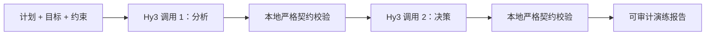

# ScenarioForge：Hy3 决策演练台

> 在现实发生前，先让计划经历一次可控的坏结局。

ScenarioForge 是一个由 **Tencent Hy3** 驱动的本地 Web 应用。用户输入待执行方案、成功目标与不可违反的约束；Hy3 先从多个利益相关者视角寻找计划薄弱点，再构造反事实情景，最后把风险收敛为可核验的执行门禁、未来 48 小时动作和止损条件。


## 54 秒交互演示

下方 GIF 连续展示两条端到端界面流程：校园公益夜市与企业账单引擎发布。录制时使用的是仓库内置离线夹具，页面右上角和结果元数据均明确显示“非 Hy3 输出”；它用于验证交互与展示链路，不能冒充真实模型证据。


## Hy3 在系统中的角色

应用的语义判断全部通过 Hy3 的 OpenAI-compatible Chat Completions API 完成，不训练、不微调、不在本地部署模型：

1. **约束建模**：从自然语言计划中提取目标、不可妥协项和待验证假设。
2. **多视角质询**：以安全、运营、客户等相关角色检查同一计划，并引用计划内证据。
3. **反事实生成**：构造触发条件、早期信号、影响和响应均完整的失败情景。
4. **决策收敛**：给出 `GO / CONDITIONAL_GO / NO_GO`，并生成有条件、负责人、期限和退路的执行门禁。

程序本身只负责输入边界、提示词隔离、JSON 契约校验、重试、错误脱敏、稳定摘要和页面展示。它不会用本地规则替代 Hy3 做语义决策。



## 两条内置流程

| 流程 | 计划 | 演练重点 | 离线夹具结论 |
|---|---|---|---|
| 01 | 雨季校园公益夜市 | 降雨、电气、食品安全、消防通道、志愿者排班 | 有条件执行 |
| 02 | 企业账单引擎周五发布 | 不可逆迁移、重复账单、观察窗口、回填与对账 | 暂停执行 |

真实模式允许直接编辑任意计划。离线模式只接受两条原样内置流程；一旦编辑，服务端会拒绝请求并提示切换真实 Hy3，避免把夹具包装成模型结果。

## 快速启动

要求 Python 3.10+，运行时无第三方依赖。

### 真实 Hy3 模式

先在 TokenHub 创建 API Key，然后：

```bash
cd apps/scenarioforge
export HY3_BASE_URL=https://tokenhub-intl.tencentcloudmaas.com/v1
export HY3_API_KEY='your-tokenhub-key'
export HY3_MODEL=hy3
python3 -m scenarioforge.server
```

打开 <http://127.0.0.1:8787>。密钥只保留在服务端环境变量中，不会发送给浏览器或写入日志。

也支持任意部署了 Hy3 的 OpenAI-compatible 地址：

```bash
export HY3_BASE_URL=http://127.0.0.1:8000/v1
export HY3_API_KEY=EMPTY
export HY3_MODEL=hy3
python3 -m scenarioforge.server
```

### 离线界面演示

```bash
cd apps/scenarioforge
SCENARIOFORGE_DEMO_MODE=1 python3 -m scenarioforge.server
```

离线模式会在页面上持续显示橙色标识，结果元数据固定为 `api calls: 0`。

## 配置

| 变量 | 默认值 | 说明 |
|---|---|---|
| `HY3_BASE_URL` | `https://tokenhub-intl.tencentcloudmaas.com/v1` | OpenAI-compatible API 根地址 |
| `HY3_API_KEY` | 空 | 真实模式必填；本地无鉴权服务可用 `EMPTY` |
| `HY3_MODEL` | `hy3` | API 模型名 |
| `HY3_TIMEOUT_SECONDS` | `120` | 单次 API 超时 |
| `SCENARIOFORGE_DEMO_MODE` | 空 | 设为 `1/true/yes` 才启用离线夹具 |

可复制 [`.env.example`](.env.example) 查看配置，但标准库服务器不会自动读取 `.env`，避免配置来源不透明。

## 验证

```bash
cd apps/scenarioforge
python3 -m unittest discover -s tests -v
python3 -m compileall -q scenarioforge tests
node --check scenarioforge/static/app.js
ruff check .
```

当前提交的本机结果：

- Python 单元/集成测试：**20/20 passed**。
- 两条浏览器流程：`POST /api/rehearse` 均为 **HTTP 200**。
- 浏览器控制台：**0 error / 0 warning**。
- 演示 GIF：**54.67 秒**，低于 2 分钟要求。
- 当前机器未提供 `HY3_API_KEY` 或可达的自托管 Hy3，因此没有把离线输出标成在线推理证据。详见 [验证台账](docs/VALIDATION.md)。

## 安全与可靠性边界

- API Key 不进入前端、导出文件或错误详情。
- 用户计划用 XML 风格边界包裹，并在系统提示中明确作为不可信数据处理。
- 请求体限制为 32 KiB，字段和列表都有长度上限。
- Hy3 两阶段输出分别执行严格字段、数量和枚举校验；坏响应不会直接渲染。
- 只对超时、限流和服务端错误重试一次；鉴权错误不重试。
- 前端通过 `textContent` / DOM 节点渲染模型文本，不把输出作为 HTML 注入。
- 静态响应包含 CSP 与 `X-Content-Type-Options: nosniff`。

## 项目结构

```text
apps/scenarioforge/
├── scenarioforge/
│   ├── config.py       # 环境配置与校验
│   ├── hy3.py          # Hy3 OpenAI-compatible 客户端
│   ├── prompts.py      # 两阶段、可版本化提示词
│   ├── models.py       # 输入与模型输出契约
│   ├── service.py      # 两次 Hy3 调用编排
│   ├── examples.py     # 两条明确标注的离线夹具
│   ├── server.py       # 同源 HTTP API 与静态服务器
│   └── static/         # 原生 HTML/CSS/JS 交互前端
├── tests/              # 单元、协议、HTTP 端到端测试
└── docs/demo/          # 54 秒 GIF 与浏览器截图
```

## AI 协作说明

本应用的产品构思、后端、前端、测试、文档和浏览器验证由 **Codex** 协助完成。没有使用 CodeBuddy 生成代码，因此没有虚构 CodeBuddy 贡献记录。Hy3 是应用运行时的唯一语义模型。

## License

Apache License 2.0，与 Hy3 仓库一致。
