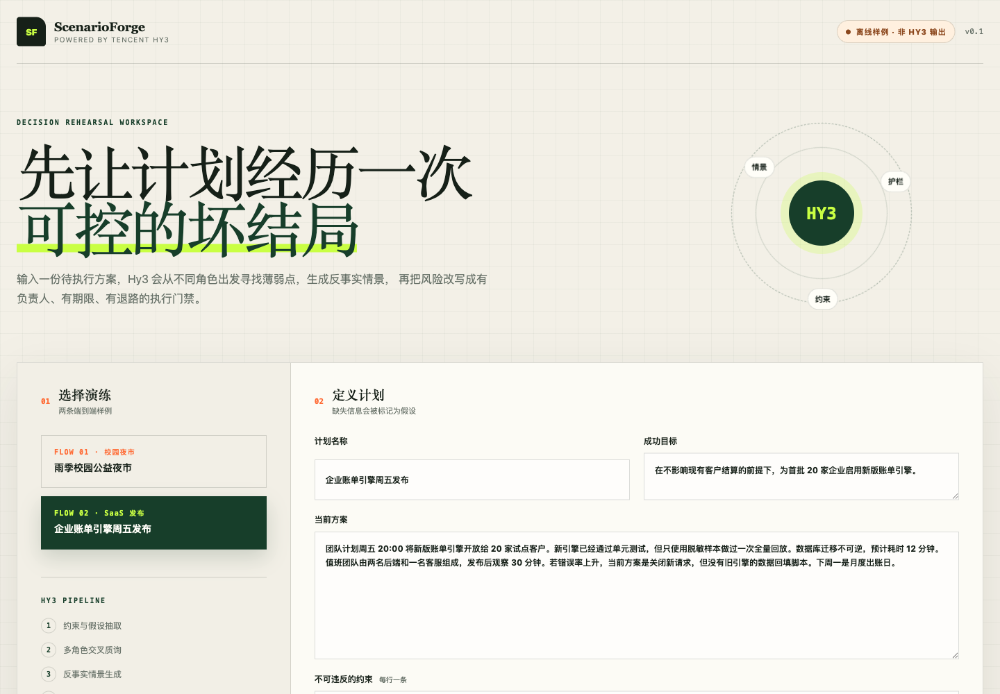

# ScenarioForge: a Hy3-powered decision rehearsal workspace

ScenarioForge stress-tests an execution plan before reality does. It sends the plan, objective,
and non-negotiable constraints to Tencent Hy3 in two structured API calls: the first extracts
assumptions, stakeholder concerns, and counterfactual scenarios; the second converts those risks
into a verdict, owned release gates, immediate actions, and measurable stop conditions.

The application never trains, fine-tunes, or locally runs a model. All semantic decisions use the
OpenAI-compatible Hy3 API. Deterministic code handles input limits, prompt isolation, contract
validation, retries, redacted failures, and rendering.



## Run with Hy3

Python 3.10+ is required; runtime code has no third-party dependencies.

```bash
cd apps/scenarioforge
export HY3_BASE_URL=https://tokenhub-intl.tencentcloudmaas.com/v1
export HY3_API_KEY='your-tokenhub-key'
export HY3_MODEL=hy3
python3 -m scenarioforge.server
```

Open <http://127.0.0.1:8787>. The API key remains server-side.

To inspect the UI without credentials, run the explicitly labelled fixture mode:

```bash
SCENARIOFORGE_DEMO_MODE=1 python3 -m scenarioforge.server
```

Fixture mode accepts only the two unchanged bundled examples. Edited input is rejected until live
Hy3 mode is enabled, and every fixture report says `api calls: 0`.

## Demo and verification

The [54-second GIF](docs/demo/scenarioforge-demo.gif) covers both bundled browser flows. It is an
offline UI walkthrough, not live-model evidence. The local verification run passed 20/20 Python
tests, returned HTTP 200 for both browser flows, and produced no browser console errors or warnings.
The machine used for this contribution did not have a Hy3 API credential, so no live inference is
claimed. See [the verification ledger](docs/VALIDATION.md).

## Hy3 responsibilities

- extract objectives, hard constraints, and unsupported assumptions;
- challenge the plan from three to five stakeholder perspectives with plan-grounded evidence;
- generate concrete counterfactual scenarios with triggers, early signals, impact, and response;
- produce `GO`, `CONDITIONAL_GO`, or `NO_GO` plus owned gates and stop conditions.

## AI collaboration

Codex assisted with the product design, implementation, tests, documentation, and browser
verification. CodeBuddy was not used, so no CodeBuddy-authored blocks are claimed. Hy3 is the only
runtime semantic model.

## License

Apache License 2.0.
