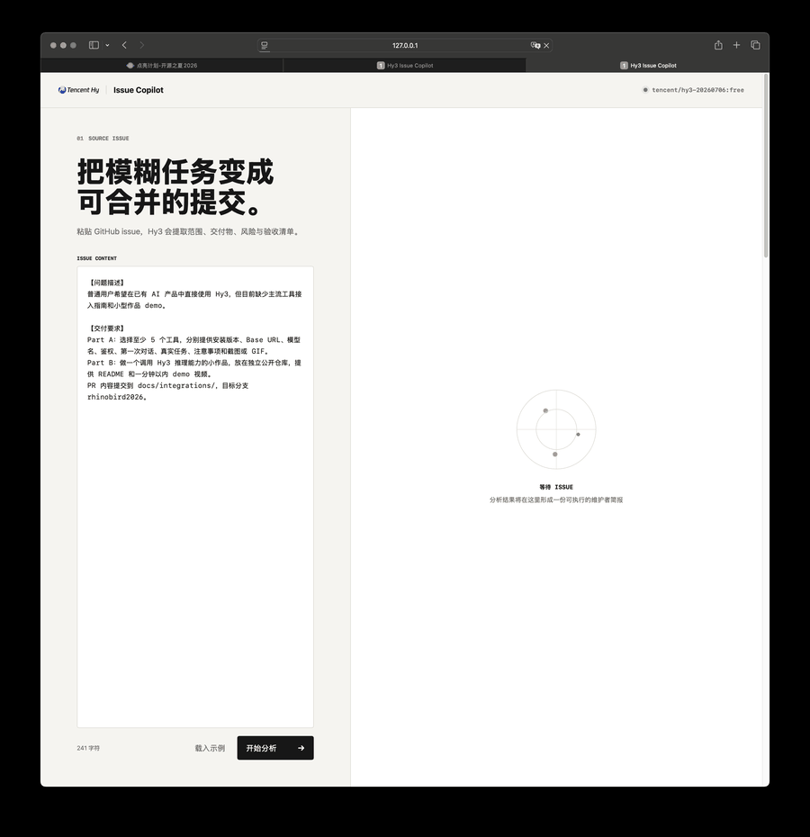

# Hy3 主流 AI 工具接入指南

本目录从终端用户视角说明如何通过 [OpenRouter](https://openrouter.ai/) 在常用 AI 工具中使用 Hy3。每篇指南均包含安装版本、配置、第一次对话、真实任务和故障排查。

## 通用配置

| 配置项 | OpenRouter 托管值 | 自部署值 |
| --- | --- | --- |
| Base URL | `https://openrouter.ai/api/v1` | `http://127.0.0.1:8000/v1` |
| Model | `tencent/hy3:free` 或 `tencent/hy3` | `hy3` |
| API Key | OpenRouter 控制台创建的 Key | `EMPTY` 或网关密钥 |
| 协议 | OpenAI Chat Completions | OpenAI Chat Completions |

API Key 只应放在环境变量或工具的 Secret Storage 中。截图、日志和 Git 提交中不得出现真实 Key。

## 已验证工具

| 工具 | 类型 | 本机验证版本 | 指南与证据 |
| --- | --- | --- | --- |
| OpenRouter | 聚合平台 / API | 2026-07-12 在线 API | [openrouter.md](openrouter.md) |
| Aider | AI 编程 CLI | 0.86.2 | [aider.md](aider.md) |
| Cline | VS Code Agent | 4.0.8 | [cline.md](cline.md) |
| Continue | VS Code Agent | 2.0.0 | [continue.md](continue.md) |
| Roo Code | VS Code Agent | 3.54.0 | [roo-code.md](roo-code.md) |

> 五个工具均完成了真实 Hy3 调用。各指南给出最小提示词、原始响应截图和本机验证版本；不同版本的菜单名称可能略有变化。

## 小作品：Hy3 Issue Copilot

[Hy3 Issue Copilot](https://github.com/shsaihdsaiudh/hy3-issue-copilot) 是一个独立开源的 GitHub issue 分析工作台。它调用 Hy3 的 `high` 推理模式，把 issue 转换为任务范围、可验收交付物、实施路径、风险和 PR 检查清单。

- 独立仓库：<https://github.com/shsaihdsaiudh/hy3-issue-copilot>
- 核心能力：深度推理、严格 JSON Schema、结构化输出
- 实际模型：`tencent/hy3-20260706:free`
- 演示时长：48 秒
- 安全边界：Key 只存在于 Python 服务端环境变量

## 验收记录

- 五个工具均给出安装、配置、首次对话、真实任务与注意事项。
- 所有配置使用环境变量或 Secret Storage，不包含真实 API Key。
- OpenRouter、Aider、Cline、Continue、Roo Code 与 Showcase 均执行了真实 Hy3 请求。
- 三款 VS Code 扩展的验证截图同时保留提示词和返回值，不以安装界面替代调用证据。
- Showcase 独立仓库包含 README、源码、测试、截图和小于一分钟的 GIF。
