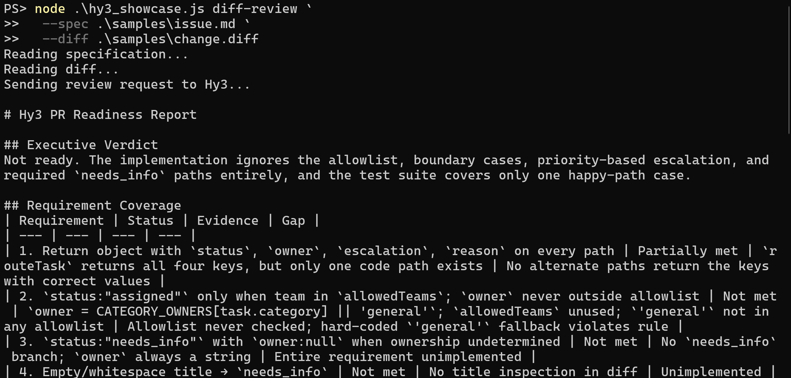
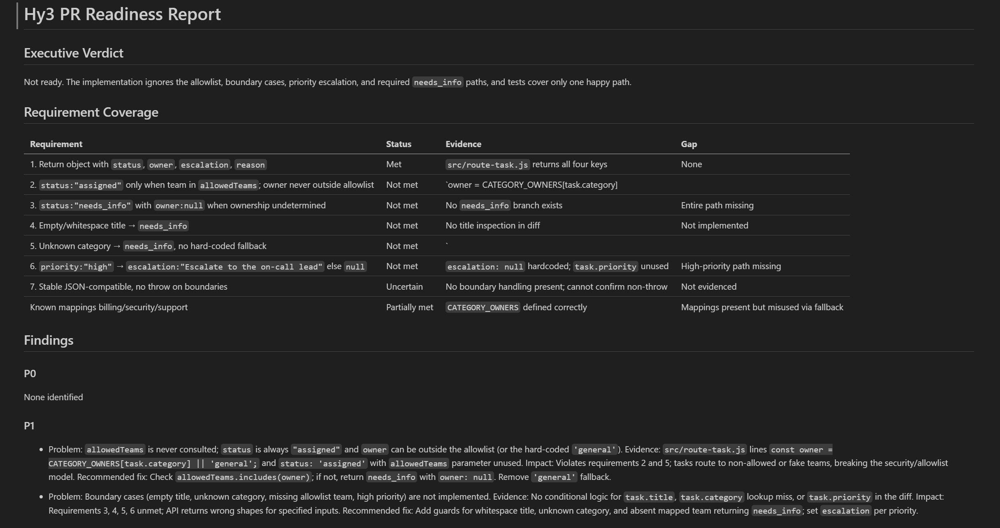

# Hy3 Integrations

This directory contains end-user integration guides for running Hy3 through popular AI tools and clients.

The guides cover two setup modes:

- **TokenHub cloud API mode**: use Hy3 through Tencent Cloud TokenHub without self-hosting.
- **Local self-hosted mode**: run Hy3 locally as an OpenAI-compatible chat completions server.

Client verification status is tracked in the guide table below.

## Setup Modes

| Mode | Setup | Status |
|:---|:---|:---|
| TokenHub cloud API | [tokenhub.md](tokenhub.md) | Chat Completions smoke test and nine tool integrations verified with screenshots |
| Local self-hosted server | [local-server.md](local-server.md) | Repo-documented server facts only |

## TokenHub Cloud API Mode

Use TokenHub cloud API mode when you want to call Hy3 through Tencent Cloud TokenHub without hosting the model yourself.

TokenHub settings used by these guides:

| Setting | Value |
|:---|:---|
| Base URL | `https://tokenhub.tencentmaas.com/v1` |
| Model | `hy3` |
| API key | User-created TokenHub API key, never committed |
| Provider/protocol | OpenAI-compatible |

See [tokenhub.md](tokenhub.md) for setup notes and safety requirements.

The values and screenshots in these guides use the verified Guangzhou / China-mainland TokenHub endpoint. TokenHub uses region-specific domains; users of the Singapore / global service must use the matching endpoint documented in `tokenhub.md`.

## Local Self-hosted Mode

Use local self-hosted mode when you run Hy3 yourself and expose the repository-documented local OpenAI-compatible endpoint.

Local settings used by these guides:

| Setting | Value |
|:---|:---|
| Base URL | `http://127.0.0.1:8000/v1` |
| Model | `hy3` |
| API key for local testing | `EMPTY` |
| API protocol | OpenAI-compatible chat completions |

For shared local server setup, see [local-server.md](local-server.md). The repository quickstart documents calling Hy3 through an OpenAI-compatible chat completions API after deploying Hy3 with vLLM or SGLang. See the root README sections for [Quickstart](../../README.md#quickstart) and [Deployment](../../README.md#deployment).

## Guides

| Tool | Guide | Verification status |
|:---|:---|:---|
| Aider | [aider.md](aider.md) | TokenHub mode verified with screenshots |
| Cline | [cline.md](cline.md) | TokenHub mode verified with screenshots |
| Codex CLI | [codex-cli.md](codex-cli.md) | TokenHub mode verified with screenshots |
| Continue | [continue.md](continue.md) | TokenHub mode verified with screenshots |
| Dify | [dify.md](dify.md) | TokenHub mode verified with screenshots |
| Roo Code | [roo-code.md](roo-code.md) | TokenHub mode verified with screenshots |
| Kilo Code | [kilo-code.md](kilo-code.md) | TokenHub mode verified with screenshots |
| OpenCode | [opencode.md](opencode.md) | TokenHub mode verified with screenshots |
| CodeBuddy Code | [codebuddy-code.md](codebuddy-code.md) | TokenHub mode verified with screenshots |

## Verification Summary

- TokenHub cloud API mode was manually verified for Aider, Cline, Codex CLI, Continue, Dify, Roo Code, Kilo Code, OpenCode, and CodeBuddy Code.
- Each verified guide includes install/version notes, TokenHub endpoint/base URL, model `hy3`, authentication setup, first chat, a real task demo, screenshots, and troubleshooting notes.
- Local self-hosted mode is documented from repository facts, but local tool-by-tool verification is not part of this PR.
- Screenshots and demo media are from real local runs; generated, mocked, or placeholder media should not be used as verification evidence.

## Screenshots / GIFs

Verification media referenced by these guides comes from real local runs.

Do not use generated, mocked, or placeholder media as verification evidence.

## Showcase Project

Part A documents the nine client integrations above. Part B is a standalone showcase that calls Hy3 directly through Tencent Cloud TokenHub's OpenAI-compatible Chat Completions endpoint.

The independent showcase project is **Hy3 TokenHub Spec-to-Diff Reviewer**.

The Node.js CLI compares a written specification with a proposed unified diff and asks Hy3 to generate a structured Markdown PR-readiness report. It accepts specification and diff files, reads a diff from standard input, or reviews changes already staged in Git. Streaming is enabled by default, and a completed report can be published atomically with `--output`.

The report includes:

- an executive verdict;
- requirement-by-requirement coverage;
- evidence-grounded P0-P3 findings;
- missing tests;
- uncertainties; and
- recommended next steps.

The bundled sample intentionally contains an incomplete implementation, so `Not ready` is the expected verdict. This allows the showcase to demonstrate coverage analysis, prioritized findings, uncertainty handling, and missing-test detection.

The demo shows a real streaming request through the Guangzhou / China-mainland TokenHub service boundary, followed by the same completed report rendered as Markdown.





The showcase is separate from this Hy3 repository and uses:

- Endpoint: `https://tokenhub.tencentmaas.com/v1/chat/completions`
- Model: `hy3`
- Protocol: OpenAI-compatible Chat Completions
- Output: structured Markdown
- Default transport: SSE streaming
- Runtime: Node.js 18 or later

Project links:

- Repository: https://github.com/Small-fish-QAQ/hy3-tokenhub-dev-brief
- Demo video: https://github.com/Small-fish-QAQ/hy3-tokenhub-dev-brief/blob/main/docs/assets/hy3-spec-to-diff-demo.mp4
- Streaming screenshot: https://github.com/Small-fish-QAQ/hy3-tokenhub-dev-brief/blob/main/docs/assets/hy3-spec-to-diff-terminal.png
- Rendered report screenshot: https://github.com/Small-fish-QAQ/hy3-tokenhub-dev-brief/blob/main/docs/assets/hy3-spec-to-diff-report.png

Run the bundled sample:

```bash
npm install
# Copy .env.example to .env, then set TOKENHUB_API_KEY.
npm run review:sample
```

The equivalent direct CLI command is:

```bash
node hy3_showcase.js diff-review \
  --spec samples/issue.md \
  --diff samples/change.diff
```

Use the normal non-streaming response path when needed:

```bash
npm run review:sample:no-stream
```
