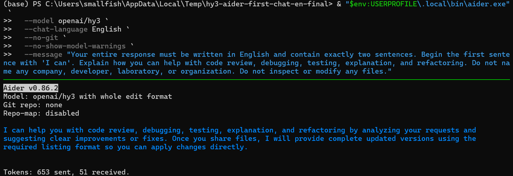
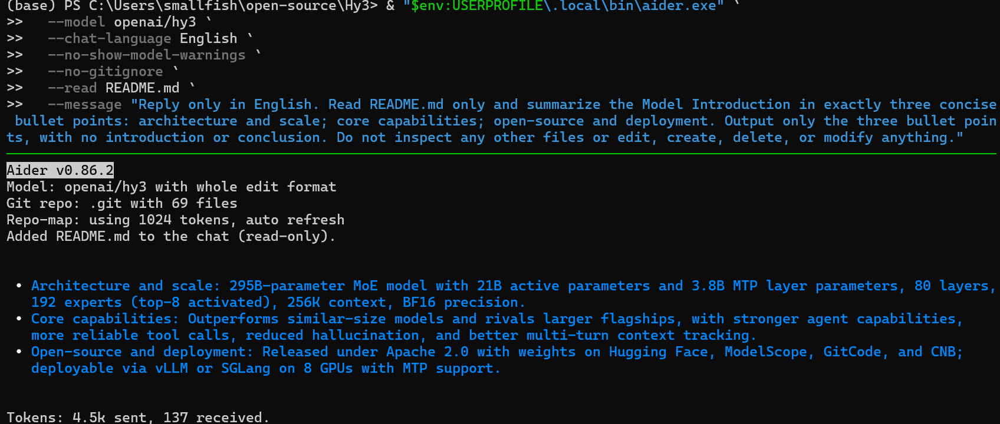

# Use Hy3 with Aider CLI

## Overview

This guide shows how to configure Aider CLI to use Hy3 through an OpenAI-compatible provider.

Verification status: Aider CLI with Hy3 through Tencent Cloud TokenHub mode was manually verified with screenshots.

## Prerequisites

- Verified Aider version: `0.86.2`.
- Observed executable path:
  - `%USERPROFILE%\.local\bin\aider.exe`
- Install Aider by following the [official installation guide](https://aider.chat/docs/install.html). One supported installer flow is:

```powershell
python -m pip install aider-install
aider-install
```

- Confirm the installed version:

```powershell
aider --version
```

- Choose one Hy3 setup mode:
  - TokenHub cloud API mode: manually verified.
  - Local self-hosted mode: Not verified in this PR.

## Option A: TokenHub Cloud API Mode

Use TokenHub when you want to call Hy3 through Tencent Cloud TokenHub without self-hosting.

See [tokenhub.md](tokenhub.md) for shared setup and safety notes.

The basic TokenHub Hy3 Chat Completions API smoke test is verified in [tokenhub.md](tokenhub.md). Aider CLI through TokenHub was also manually verified.

| Setting | Value |
|:---|:---|
| TokenHub base URL | `https://tokenhub.tencentmaas.com/v1` |
| TokenHub Chat Completions endpoint | `https://tokenhub.tencentmaas.com/v1/chat/completions` |
| Aider model | `openai/hy3` |
| TokenHub model | `hy3` |
| `OPENAI_API_BASE` | `https://tokenhub.tencentmaas.com/v1` |
| `OPENAI_API_KEY` | User-created TokenHub API key, not committed and not documented |
| Protocol | OpenAI-compatible Chat Completions |

If the TokenHub API key access scope is limited, Hy3 must be included in that scope.

## Option B: Local Self-hosted Mode

Use local self-hosted mode when Hy3 is running as a local OpenAI-compatible Chat Completions server.

See [local-server.md](local-server.md) for the repository-documented vLLM and SGLang serving examples.

| Setting | Value |
|:---|:---|
| Base URL | `http://127.0.0.1:8000/v1` |
| Model | `hy3` |
| API key for local testing | `EMPTY` |
| API protocol | OpenAI-compatible Chat Completions |
| Verification status | Not verified in this PR |

For TokenHub cloud API mode, no local Hy3 server is required.

For local self-hosted mode, follow [local-server.md](local-server.md).

Aider CLI connectivity with TokenHub mode was manually verified. Local self-hosted connectivity was not verified in this PR.

## Configure the Tool

Set the OpenAI-compatible environment variables before running Aider:

```powershell
$env:OPENAI_API_BASE = "https://tokenhub.tencentmaas.com/v1"
$env:OPENAI_API_KEY = "<user-created TokenHub API key>"
```

Do not commit or document API keys.

Use Aider model `openai/hy3`, which sends TokenHub model `hy3`.

If `aider.exe` is not on `PATH`, call it directly from:

```text
%USERPROFILE%\.local\bin\aider.exe
```

or add `%USERPROFILE%\.local\bin` to `PATH` for the current shell.

The verified screenshots use `--chat-language English` to keep the evidence language consistent. Aider documents this as a supported command-line option.

## First Chat

Run the first-chat check outside the repository or use `--no-git` so the check does not inspect repository context.

Command:

```powershell
& "$env:USERPROFILE\.local\bin\aider.exe" `
  --model openai/hy3 `
  --chat-language English `
  --no-git `
  --no-show-model-warnings `
  --message "Your entire response must be written in English and contain exactly two sentences. Begin the first sentence with 'I can'. Explain how you can help with code review, debugging, testing, explanation, and refactoring. Do not name any company, developer, laboratory, or organization. Do not inspect or modify any files."
```

Result: Aider selected model `openai/hy3` and returned a two-sentence English description of its software-development capabilities. No repository was attached to this run.

## Real Task Demo

Run this command from the Hy3 repository root:

```powershell
& "$env:USERPROFILE\.local\bin\aider.exe" `
  --model openai/hy3 `
  --chat-language English `
  --no-show-model-warnings `
  --no-gitignore `
  --read README.md `
  --message "Reply only in English. Read README.md only and summarize the Model Introduction in exactly three concise bullet points: architecture and scale; core capabilities; open-source and deployment. Output only the three bullet points, with no introduction or conclusion. Do not inspect any other files or edit, create, delete, or modify anything."
```

Result: Aider added `README.md` to the chat as read-only and returned exactly three English bullet points covering architecture and scale, core capabilities, and open-source deployment. No repository files were edited.

## Screenshots / GIFs

- First chat screenshot:



- Real task demo screenshot:



Screenshots are included under `docs/integrations/assets/aider/`. GIFs are optional and were not added.

Screenshots and GIFs must not reveal API keys.

## Troubleshooting

- Aider may warn that `openai/hy3` has unknown context-window size and costs. Use `--no-show-model-warnings` to suppress this warning after manual verification.
- Aider may respond in a language different from the prompt. Use `--chat-language English` when consistent English output is required.
- Aider may ask whether to add `.aider*` to `.gitignore`. For this docs PR, use `--no-gitignore` or answer `N`, then remove local `.aider.chat.history.md`, `.aider.input.history`, and `.aider.tags.cache.v4` before committing.
- Aider may create local `.aider*` files; these should not be committed.
- If `aider.exe` is not on `PATH`, call it directly from `%USERPROFILE%\.local\bin\aider.exe` or add that directory to `PATH` for the current shell.
- Do not include or commit the TokenHub API key.
- TokenHub API key access scope for Hy3: Future verification item.
- Local endpoint connection issue: Not verified in this PR.
- Local self-hosted authentication or API key handling: Not verified in this PR.
- Dedicated streaming-behavior and tool-calling tasks: Not verified in this PR.

## Verified Environment

| Item | Value |
|:---|:---|
| OS | Windows 11 25H2 (build 26200) |
| Tool | Aider CLI |
| Aider version | `0.86.2` |
| Executable path | `%USERPROFILE%\.local\bin\aider.exe` |
| Setup mode | Tencent Cloud TokenHub cloud API mode |
| Hy3 server backend | TokenHub cloud API |
| `OPENAI_API_BASE` | `https://tokenhub.tencentmaas.com/v1` |
| Aider model | `openai/hy3` |
| TokenHub model | `hy3` |
| Chat Completions endpoint | `https://tokenhub.tencentmaas.com/v1/chat/completions` |
| Verified modes | First chat without repository context and read-only README summary |
| Verification date | 2026-07-09 |
