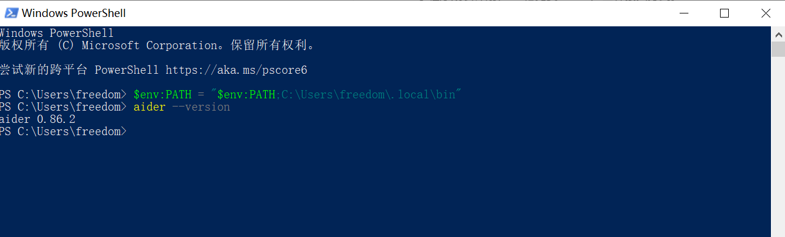
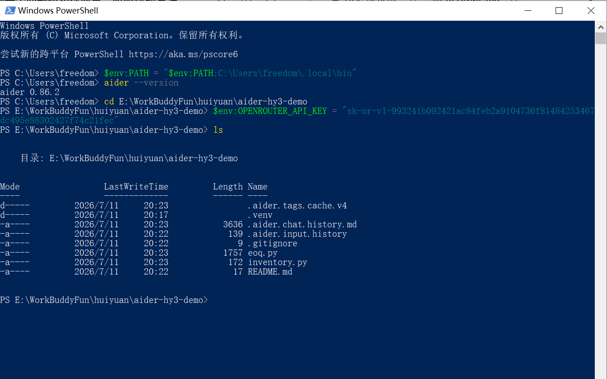
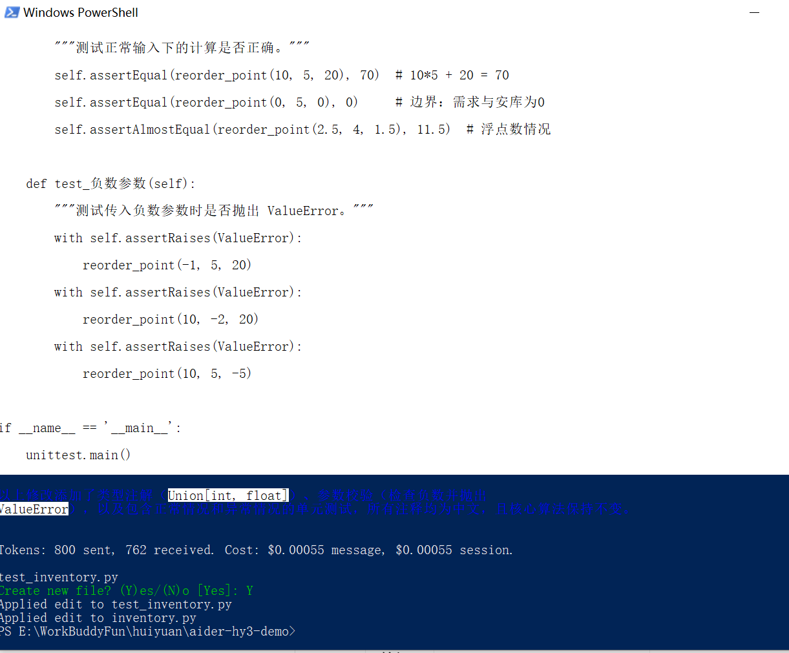
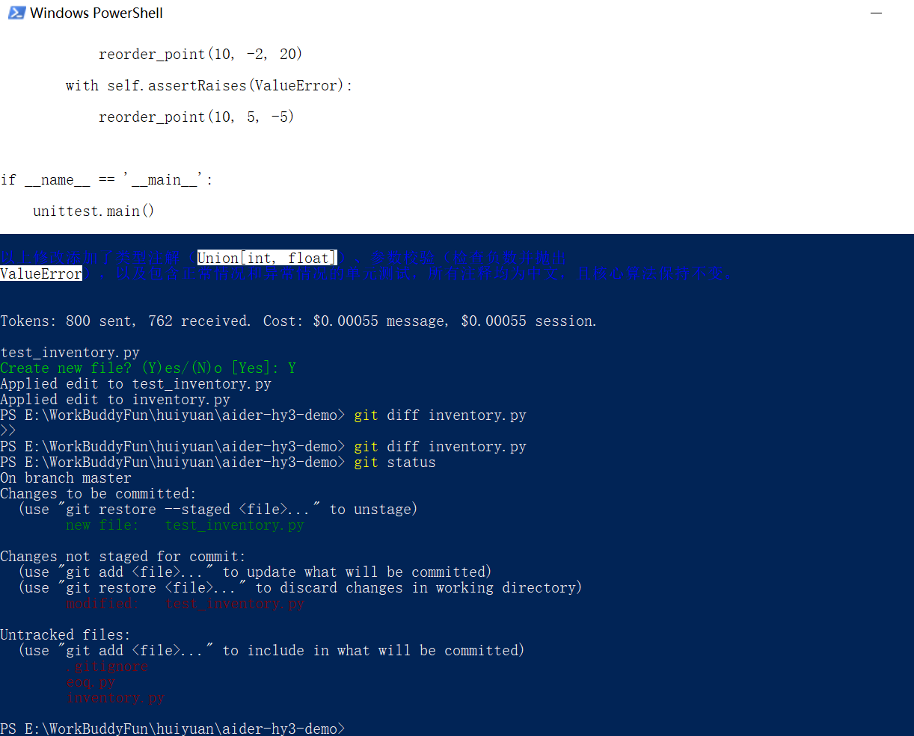

# Aider 接入 Hy3 指南

> Aider 是命令行 AI 结对编程工具，原生支持 Git 集成。通过 OpenRouter 或 TokenHub，可以轻松将 Hy3 接入 Aider 作为编程助手。

## 前置条件

- Python >= 3.10
- Git 已安装
- 一个 OpenRouter 或腾讯云 TokenHub 的 API Key

## 安装与版本要求

```bash
# 推荐使用 pipx 安装（隔离环境）
pipx install aider-chat

# 或使用 pip
pip install -U aider-chat

# 验证安装
aider --version
# 示例输出：aider 0.82.x
```

> **版本要求**：Aider >= 0.75.0 即可。建议使用最新版本以获得最佳模型兼容性。


*Aider v0.86.2 安装验证成功*

## 方式一：通过 OpenRouter 接入

### 1. 配置环境变量

```bash
# 临时设置（仅当前终端）
export OPENROUTER_API_KEY="sk-or-v1-YOUR_KEY"

# 或写入 .env 文件（推荐，Aider 自动读取）
echo 'OPENROUTER_API_KEY=sk-or-v1-YOUR_KEY' >> .env
```

### 2. 启动 Aider

```bash
# OpenRouter 模型名前缀为 openrouter/
aider --model openrouter/tencent/hy3
```

### 3. 首次对话

启动后，Aider 会进入交互式对话界面：

```
> /add calculator.py       # 将文件加入上下文
> 为这个文件写一套完整的单元测试
```


*设置 OPENROUTER_API_KEY 并进入演示目录*

```bash
# 验证 Hy3 连接（非交互式）
aider --model openrouter/tencent/hy3 --message "你好，请用一句话介绍物流管理" --no-auto-commits
```


*Aider 通过 OpenRouter 调用 Hy3，自动完成代码增强*

## 方式二：通过腾讯云 TokenHub 接入

### 配置环境变量

```bash
# TokenHub 使用 OpenAI 兼容协议，模型名前缀为 openai/
export OPENAI_API_BASE="https://tokenhub.tencentmaas.com/v1"
export OPENAI_API_KEY="YOUR_TOKENHUB_KEY"
aider --model openai/hy3
```

### 初始化脚本（一键切换）

创建 `~/aider-hy3.sh`：

```bash
#!/bin/bash
# Aider + Hy3 一键启动脚本

# 选择接入方式（取消注释对应行）
# ---- OpenRouter ----
export OPENROUTER_API_KEY="sk-or-v1-YOUR_KEY"
MODEL="openrouter/tencent/hy3"

# ---- 腾讯云 TokenHub ----
# export OPENAI_API_BASE="https://tokenhub.tencentmaas.com/v1"
# export OPENAI_API_KEY="YOUR_TOKENHUB_KEY"
# MODEL="openai/hy3"

aider --model "$MODEL" "$@"
```

## 端到端实战 Demo

### 场景：为物流再订货点函数添加类型注解与单元测试

**步骤 1：创建项目并初始化 Git**

```bash
mkdir aider-hy3-demo && cd aider-hy3-demo
git init
echo '# Logistics Demo' > README.md
git add README.md && git commit -m 'init'
```

**步骤 2：创建 `inventory.py`**

```python
def reorder_point(daily_demand, lead_time, safety_stock):
    """计算再订货点（Reorder Point）。"""
    return daily_demand * lead_time + safety_stock
```

**步骤 3：配置环境变量并启动 Aider**

```bash
export OPENROUTER_API_KEY="sk-or-v1-YOUR_KEY"
aider --model openrouter/tencent/hy3 \
      --message "给 inventory.py 添加类型注解、参数校验和单元测试，用中文注释。不要修改核心算法。" \
      --no-auto-commits inventory.py
```

> **提示**：`--no-auto-commits` 表示不自动提交，方便你 review 后再决定。

Aider 会先读取文件，然后通过 OpenRouter 调用 Hy3 生成修改方案，最终提示：

```
Create new file? (Y)es/(N)o [Yes]: Y
Applied edit to test_inventory.py
Applied edit to inventory.py
```


*Aider 通过 OpenRouter 调用 Hy3，自动添加类型注解、参数校验和单元测试*

**步骤 4：查看生成的代码**

```bash
git status
```


*`git status` 显示 Aider 新增了 `test_inventory.py` 并修改了 `inventory.py`*

**生成的 `inventory.py` 示例**：

```python
from typing import Union

def reorder_point(
    daily_demand: Union[int, float],
    lead_time: Union[int, float],
    safety_stock: Union[int, float],
) -> Union[int, float]:
    """计算再订货点（Reorder Point）。

    再订货点 = 日均需求量 × 提前期 + 安全库存。
    """
    if daily_demand < 0 or lead_time < 0 or safety_stock < 0:
        raise ValueError("参数不能为负数")
    return daily_demand * lead_time + safety_stock
```

**生成的 `test_inventory.py` 示例**：

```python
import unittest
from inventory import reorder_point

class TestReorderPoint(unittest.TestCase):
    def test_正常情况(self):
        """测试正常输入下的计算是否正确。"""
        self.assertEqual(reorder_point(10, 5, 20), 70)   # 10*5 + 20 = 70
        self.assertEqual(reorder_point(0, 5, 0), 0)      # 边界：需求与安库为0
        self.assertAlmostEqual(reorder_point(2.5, 4, 1.5), 11.5)  # 浮点数情况

    def test_负数参数(self):
        """测试传入负数参数时是否抛出 ValueError。"""
        with self.assertRaises(ValueError):
            reorder_point(-1, 5, 20)
        with self.assertRaises(ValueError):
            reorder_point(10, -2, 20)
        with self.assertRaises(ValueError):
            reorder_point(10, 5, -5)

if __name__ == '__main__':
    unittest.main()
```

**步骤 5：运行测试验证**

```bash
python -m unittest test_inventory.py
```

预期输出：

```
..
----------------------------------------------------------------------
Ran 2 tests in 0.001s

OK
```

## 进阶配置

### 推理模式

```bash
# 启用推理模式增强代码分析
aider --model openrouter/tencent/hy3 \
      --set-env OPENROUTER_EXTRA_BODY='{"reasoning":{"effort":"high"}}'
```

### Architect 模式（节省费用）

使用 Hy3 做"架构师"设计代码，用更便宜的模型做具体编辑：

```bash
aider --model openrouter/tencent/hy3 \
      --architect \
      --editor-model openrouter/qwen/qwen3-32b
```

### 长上下文利用

Hy3 支持 256K 上下文，适合大型代码仓库：

```bash
aider --model openrouter/tencent/hy3 \
      --map-tokens 4096 \
      --max-chat-history-tokens 262144
```

## 常见问题与排错

| 错误现象 | 原因 | 解决方案 |
|---------|------|---------|
| `Error: model not found` | 模型名前缀错误 | OpenRouter 必须用 `openrouter/` 前缀，TokenHub 用 `openai/` |
| `Error: API key not set` | 环境变量未正确设置 | 检查 `echo $OPENROUTER_API_KEY` 是否输出正确 |
| `API Error: 401` | API Key 无效 | 重新生成 API Key |
| `API Error: 429` | 速率限制 | 降低请求频率，或切换至 TokenHub |
| Git 提交失败 | 未配置 git user | 执行 `git config user.name` 和 `git config user.email` |
| 编辑失败（diff 格式） | Hy3 可能不输出标准 diff | 加 `--edit-format whole` 改用整体编辑模式 |

## 小贴士

1. **`.env` 文件**：将 API Key 写入项目 `.env`，Aider 自动读取，无需每次输入
2. **费用控制**：简单编辑用 no_think 模式，复杂重构才开推理
3. **仓库地图**：`--map-tokens 2048-4096` 让 Hy3 了解代码结构，效果优于不传
4. **自动提交**：Aider 默认自动提交，合并代码前建议 review 每个 commit
