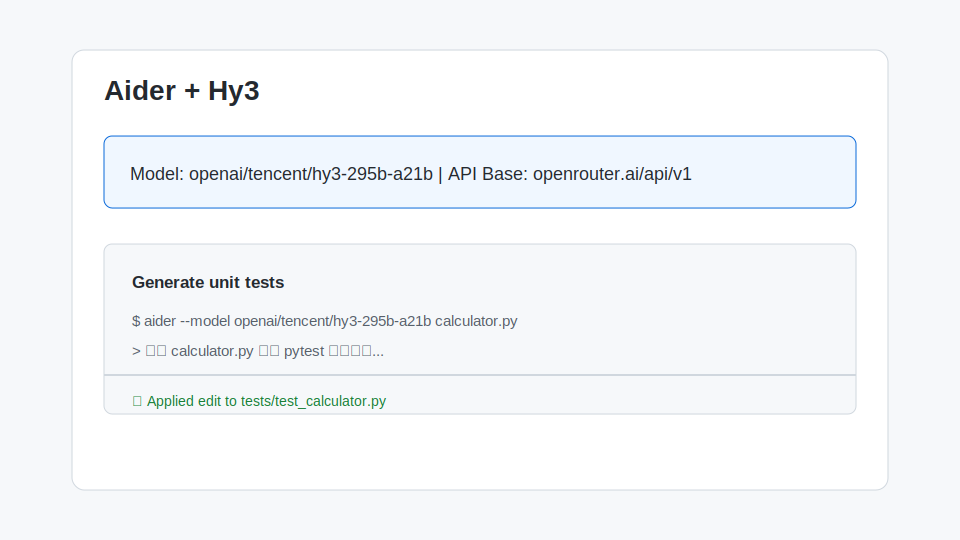

# 在 Aider 中使用 Hy3

[Aider](https://aider.chat/) 是一款流行的 AI 结对编程 CLI，支持 OpenAI、Anthropic、OpenAI-compatible 等多种后端。本文介绍如何把 Aider 的后端切换到 Hy3，实现本地或云端 Hy3 辅助编码。

## 1. 安装与版本要求

- **Python**：≥ 3.10
- **Aider**：推荐最新稳定版
  ```bash
  pip install -U aider-chat
  ```
- **Git**：Aider 依赖 Git 跟踪改动。
- **网络**：能访问本地 vLLM/SGLang、OpenRouter 或 TokenHub。

验证安装：

```bash
aider --version
```

## 2. 核心配置项

Aider 通过环境变量或命令行参数指定模型。最简洁的方式是设置环境变量：

```bash
export OPENAI_API_BASE="https://openrouter.ai/api/v1"
export OPENAI_API_KEY="sk-or-v1-..."
```

然后启动 Aider 并指定模型：

```bash
aider --model openai/tencent/hy3-295b-a21b
```

| 配置项 | 说明 |
| --- | --- |
| `OPENAI_API_BASE` | OpenAI-compatible Base URL，例如 `https://openrouter.ai/api/v1` |
| `OPENAI_API_KEY` | 对应服务商 API Key |
| `--model` | Aider 使用 `openai/<model-name>` 格式指定 OpenAI-compatible 模型 |

如果使用本地 vLLM/SGLang：

```bash
export OPENAI_API_BASE="http://127.0.0.1:8000/v1"
export OPENAI_API_KEY="EMPTY"
aider --model openai/hy3
```

Windows PowerShell：

```powershell
$env:OPENAI_API_BASE="https://openrouter.ai/api/v1"
$env:OPENAI_API_KEY="sk-or-v1-..."
aider --model openai/tencent/hy3-295b-a21b
```

## 3. 第一次对话测试

进入任意 Git 仓库目录，启动 Aider：

```bash
aider --model openai/tencent/hy3-295b-a21b
```

输入最小测试 Prompt：

```text
/hello，请用一句话介绍 Hy3，并输出数字 1
```

预期结果：Aider 正常显示 Hy3 的回复。



## 4. 端到端实战 Demo：为现有项目添加单元测试

假设项目已有 `calculator.py`，希望 Hy3 为其生成单元测试：

```bash
aider --model openai/tencent/hy3-295b-a21b calculator.py
```

在 Aider 中输入：

```text
请为 calculator.py 编写 pytest 单元测试，覆盖所有公开函数，并处理边界情况。测试文件命名为 tests/test_calculator.py。
```

操作步骤：

1. Aider 读取 `calculator.py` 内容并作为上下文。
2. Hy3 生成测试代码。
3. Aider 自动将改动写入 `tests/test_calculator.py`。
4. 运行 `pytest tests/test_calculator.py` 验证。

示例输出（Aider 会话节选）：

```markdown
> Add tests/test_calculator.py
Added tests/test_calculator.py to the chat

#### 请为 calculator.py 编写 pytest 单元测试...

我将为 calculator.py 生成完整的 pytest 测试。...

(Applied edit to tests/test_calculator.py)
```

## 5. 常见注意事项

1. **模型名格式**：Aider 要求 OpenAI-compatible 模型写成 `openai/<model-name>`。OpenRouter 上 Hy3 的完整模型名为 `tencent/hy3-295b-a21b`，因此命令为 `openai/tencent/hy3-295b-a21b`。
2. **编辑模式**：Aider 默认使用“diff”编辑模式，需要模型稳定输出可解析的代码 diff。Hy3 的工具调用和格式遵循能力较强，通常可直接使用；如不稳定，可加上 `--edit-format whole`。
3. **上下文大小**：Aider 会自动添加项目文件到上下文。Hy3 支持 256K 上下文，但如果项目文件过多，仍建议用 `/add` 手动指定相关文件，避免上下文浪费。
4. **Stream 模式**：Aider 默认开启流式输出，不建议关闭，否则长回复可能超时。
5. **本地部署需开启工具解析**：如果使用本地 vLLM/SGLang，部署时需要 `--tool-call-parser hy_v3` / `hunyuan` 与 `--reasoning-parser hy_v3` / `hunyuan`，否则 Aider 的部分 Agent 功能可能异常。
6. **费用控制**：OpenRouter 按 token 计费，建议在 Aider 配置中设置 `weak_model` 为 cheaper 模型，仅把 `model` 指定为 Hy3，用于核心编码任务。
