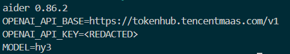
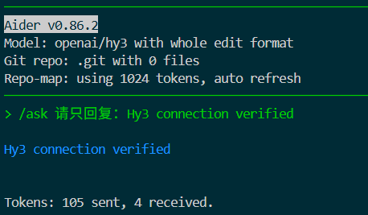
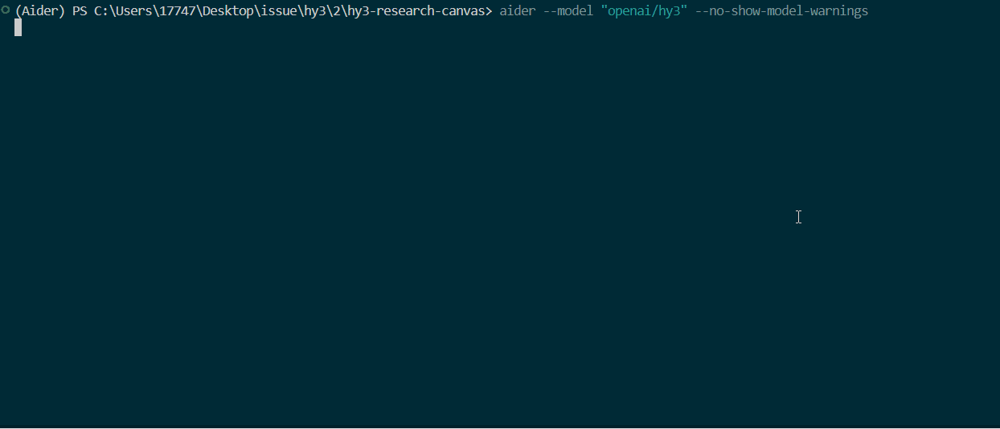

<p align="left">
  English&nbsp; | &nbsp;<a href="aider_CN.md">中文</a>
</p>

# Use Hy3 in Aider

## Overview

Aider can connect to Hy3 through Tencent TokenHub's OpenAI-compatible endpoint. This flow was validated on July 12, 2026 with Aider `0.86.2` and model ID `hy3`.

## Configuration

Set the credential in the environment, then start Aider from the repository you want it to read:

```powershell
$env:OPENAI_API_KEY = "<TENCENT_TOKENHUB_API_KEY>"
aider --model "openai/hy3" `
  --openai-api-base "https://tokenhub.tencentmaas.com/v1" `
  --no-auto-commits
```

Never print the real Key in the terminal or include it in a recording.



## Connection check

```text
Reply with exactly: Hy3 connection verified
```



## Read-only repository task

Provide the relevant files with `--read` or `/read-only`, then use this exact prompt:

```text
Based only on the read-only files provided, summarize this application's
architecture, identify three concrete risks with file references, and propose
a three-step improvement plan. Do not modify files and do not run Git commands.
```



## Troubleshooting

- If Aider reports an unknown model, keep the `openai/` prefix and use model ID `hy3`.
- If it has no repository context, start it in the project root and add files with `--read` or `/read-only`.
- If authentication fails, rotate the Key and confirm the Base URL ends in `/v1`.

## References

- [Tencent TokenHub](https://cloud.tencent.com/product/tokenhub)
- [Aider OpenAI-compatible APIs](https://aider.chat/docs/llms/openai-compat.html)
