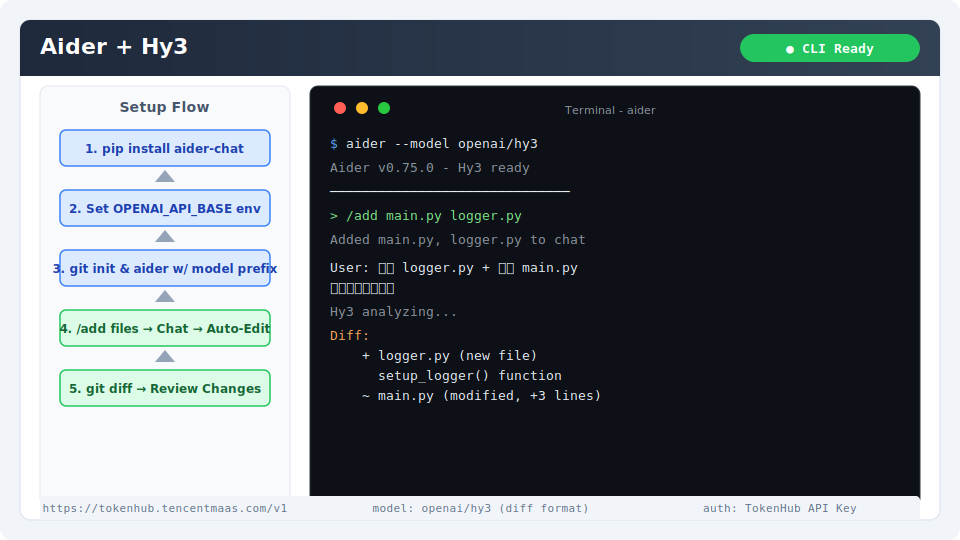

# Aider 集成指南

[Aider](https://aider.chat) 是一个基于终端的 AI 结对编程工具，支持 Git 仓库感知、多文件编辑和多种 LLM 后端。通过配置 OpenAI 兼容接口即可接入 Hy3。

## 安装与版本要求

- **Python**：≥ 3.10
- **Git**：Aider 依赖 Git 跟踪代码变更
- **Aider**：最新版本

安装方式：

```bash
pip install aider-chat
```

验证安装：

```bash
aider --version
```

> 预期输出：`aider 版本号`（如 `aider 0.75.0`）

## 核心配置

### 方式一：命令行参数

```bash
aider \
  --openai-api-base https://tokenhub.tencentmaas.com/v1 \
  --openai-api-key sk-xxx \
  --model openai/hy3
```

### 方式二：环境变量（推荐）

```bash
export OPENAI_API_BASE="https://tokenhub.tencentmaas.com/v1"
export OPENAI_API_KEY="sk-xxx"
```

然后使用：

```bash
aider --model openai/hy3
```

### 方式三：配置文件

创建 `~/.aider.conf.yml`（Windows 路径为 `%USERPROFILE%\.aider.conf.yml`）：

```yaml
openai-api-base: https://tokenhub.tencentmaas.com/v1
openai-api-key: sk-xxx
model: openai/hy3
edit-format: diff
```

### 各部署模式配置

| 模式 | openai-api-base | model | 推荐场景 |
|------|-----------------|-------|----------|
| TokenHub（国内推荐） | `https://tokenhub.tencentmaas.com/v1` | `openai/hy3` | 国内用户首选 |
| TokenHub（海外） | `https://tokenhub-intl.tencentmaas.com/v1` | `openai/hy3` | 海外用户 |
| OpenRouter | `https://openrouter.ai/api/v1` | `openai/tencent/hy3` | 已有 OpenRouter 账号 |
| 本地 vLLM/SGLang | `http://127.0.0.1:8000/v1` | `openai/hy3` | 本地部署开发测试 |

> Aider 使用 `openai/` 前缀标记 OpenAI 兼容模型。模型名格式为 `openai/<model-name>`。

## 第一次对话测试

1. 创建测试目录并初始化 Git：

```bash
mkdir aider-hy3-test && cd aider-hy3-test
git init
```

2. 启动 Aider：

```bash
aider --model openai/hy3
```

3. 在 Aider 提示符下输入：

```
创建一个 calculator.py 文件，包含 add、subtract、multiply、divide 四个函数，每个函数包含 docstring 和类型注解
```

4. 查看生成的文件：

```bash
cat calculator.py
```

**预期结果**：Aider 创建 `calculator.py`，包含四个带类型注解和 docstring 的数学函数。



## 端到端实战 Demo：在现有项目中添加功能模块

### 场景

使用 Aider 在一个现有 Python 项目中添加新的日志记录模块，同时修改已有代码以使用新模块。

### 操作步骤

1. 准备一个简单的 Python 项目：

```bash
mkdir my-project && cd my-project
git init
cat << 'EOF' > main.py
def greet(name):
    return f"Hello, {name}!"

if __name__ == "__main__":
    print(greet("World"))
EOF
git add main.py && git commit -m "initial commit"
```

2. 启动 Aider：

```bash
aider --model openai/hy3
```

3. 在 Aider 中添加文件到上下文：

```
/add main.py
```

4. 输入需求：

```
请完成以下修改：
1. 创建一个 logger.py 文件，包含 setup_logger() 函数，返回配置好的 logging.Logger 实例
2. 日志格式包含时间戳、级别和消息
3. 修改 main.py，在 greet() 函数中添加日志记录（INFO 级别）
4. 确保所有导入正确
```

5. Aider 会自动：
   - 创建 `logger.py` 模块
   - 修改 `main.py` 添加日志调用
   - 运行 git diff 显示变更

6. 验证功能：

```bash
python main.py
cat app.log  # 查看日志输出
```

### 预期输出

```
2026-07-17 14:30:00 - INFO - Greeting requested for: World
Hello, World!
```

## Edit Format 选择

Aider 支持多种编辑格式，适合不同模型：

| 格式 | 说明 | 推荐 |
|------|------|------|
| `diff` | 生成 unified diff 应用变更 | Hy3 首选 |
| `whole` | 重写整个文件 | 适合小文件 |
| `search_replace` | 基于搜索替换的精确编辑 | 适合局部修改 |

推荐使用 `diff` 格式：`--edit-format diff` 或在 `.aider.conf.yml` 中配置。

## 常见注意事项

1. **Git 仓库必须**：Aider 依赖 Git 跟踪代码变更，非 Git 目录下无法正常工作
2. **模型名前缀**：必须使用 `openai/` 前缀（如 `openai/hy3`），否则 Aider 无法识别为 OpenAI 兼容模型
3. **`/add` 命令必须**：默认情况下 Aider 不自动检测项目文件，需要手动 `/add <file>` 将文件加入编辑上下文
4. **Reasoning 模式**：Aider 当前不支持 `chat_template_kwargs` 直接配置，但可通过 `--set-env` 传递自定义请求头或参数控制推理行为
5. **弱模型警告**：Aider 启动时会检测模型能力，Hy3 可能触发 "弱模型" 警告，可通过 `--skip-sanity-check` 跳过
6. **Git 与 Windows**：Windows Git Bash 下 Aider 工作最佳，PowerShell 中可能出现路径编码问题
7. **映射文件（map）**：大型项目中建议使用 `--map-tokens 1024` 限制仓库地图的 token 消耗
