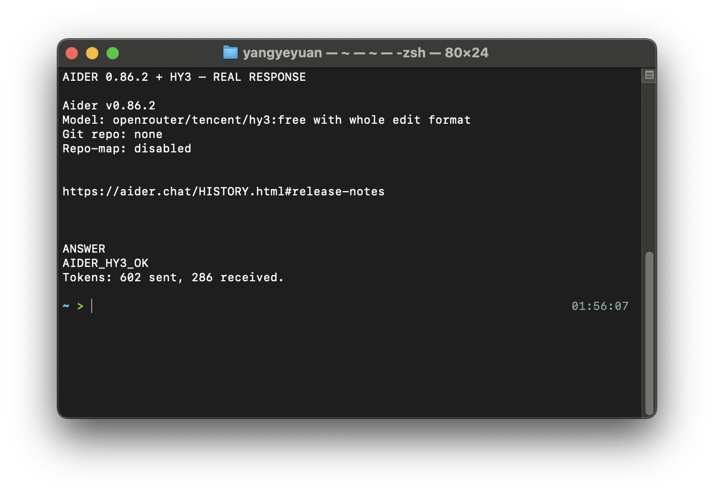

# 在 Aider 中使用 Hy3

Aider 是面向 Git 仓库的命令行结对编程工具。以下流程在 macOS、Aider `0.86.2` 和 `tencent/hy3:free` 上完成真实验证。

## 安装与版本

需要 Python 3.10+ 和 Git。推荐用 `uv` 隔离安装：

```bash
uv tool install aider-chat
aider --version
```

本次验证输出为 `aider 0.86.2`。

## 配置

```bash
export OPENROUTER_API_KEY="your-openrouter-key"
cd /path/to/your/repository
aider --model openrouter/tencent/hy3:free
```

| 配置项 | 值 |
| --- | --- |
| Provider | `openrouter` |
| Model | `tencent/hy3:free` |
| Base URL | Aider 的 OpenRouter provider 自动配置 |
| 鉴权 | `OPENROUTER_API_KEY` 环境变量 |
| 协议 | OpenAI-compatible Chat Completions |

不要把 Key 写进 `.aider.conf.yml` 并提交。如果使用付费 endpoint，把模型换为 `openrouter/tencent/hy3`。

## 第一次对话

```bash
aider --no-git --model openrouter/tencent/hy3:free \
  --message "Return exactly AIDER_HY3_OK and nothing else."
```

真实响应显示 Aider 已选择 Hy3，并返回 `AIDER_HY3_OK`：



## 端到端任务

在一个 Git 仓库中运行 `aider`，输入：

```text
/add README.md
请检查 README 的快速开始章节：
1. 找出无法复现的安装步骤；
2. 补充环境变量示例；
3. 保持现有文档风格；
4. 修改完成后说明验证命令。
```

Aider 会读取文件、给出完整修改并生成 Git diff。退出前执行：

```text
/diff
```

再在另一个终端运行项目测试并检查 `git diff --check`，不要直接接受未审阅的自动提交。

## 注意事项

- 免费 endpoint 容量紧张时可能返回 `429`，稍后重试或切换 `tencent/hy3`。
- Aider 未内置 Hy3 专属模型元数据时会使用通用 edit format；小范围修改更可靠。
- 首次使用先让模型修改单个文件，确认 diff 质量后再扩大范围。
- Aider 可能展示 reasoning 内容；日志公开前先检查是否含敏感上下文。
