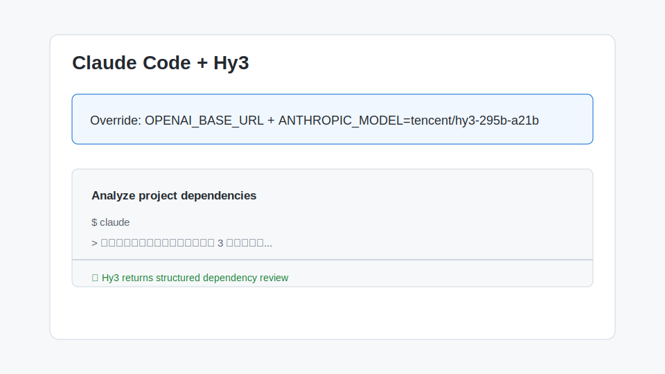

# 在 Claude Code 中使用 Hy3

[Claude Code](https://docs.anthropic.com/en/docs/agents-and-tools/claude-code/overview) 是 Anthropic 发布的 AI 编程 Agent CLI。虽然它原生面向 Claude 系列模型，但通过环境变量覆盖其 OpenAI-compatible 调用路径后，也可以把后端切换为 Hy3。本文介绍在 Claude Code 中接入 Hy3 的方法。

> 注意：Claude Code 对非 Claude 模型的兼容性取决于其内部调用方式。以下方法基于 OpenAI-compatible 覆盖实现，适用于 Claude Code 支持 `OPENAI_BASE_URL` 的版本或后续社区 fork。

## 1. 安装与版本要求

- **Node.js**：≥ 18
- **Claude Code**：通过 npm 安装
  ```bash
  npm install -g @anthropics/claude-code
  ```
- **网络**：能访问本地 vLLM/SGLang、OpenRouter 或 TokenHub。
- **账号**：已有 Hy3 可用的 API Key。

验证安装：

```bash
claude --version
```

## 2. 核心配置项

Claude Code 读取 Anthropic 相关环境变量。要切换到 OpenAI-compatible 后端，可设置以下环境变量：

```bash
export OPENAI_BASE_URL="https://openrouter.ai/api/v1"
export OPENAI_API_KEY="sk-or-v1-..."
export ANTHROPIC_MODEL="tencent/hy3-295b-a21b"
```

然后启动：

```bash
claude
```

| 配置项 | 说明 |
| --- | --- |
| `OPENAI_BASE_URL` | OpenAI-compatible Base URL |
| `OPENAI_API_KEY` | 对应服务商 API Key |
| `ANTHROPIC_MODEL` | 模型名覆盖，填 Hy3 模型名 |

如果使用本地 vLLM/SGLang：

```bash
export OPENAI_BASE_URL="http://127.0.0.1:8000/v1"
export OPENAI_API_KEY="EMPTY"
export ANTHROPIC_MODEL="hy3"
```

Windows PowerShell：

```powershell
$env:OPENAI_BASE_URL="https://openrouter.ai/api/v1"
$env:OPENAI_API_KEY="sk-or-v1-..."
$env:ANTHROPIC_MODEL="tencent/hy3-295b-a21b"
```

> 若 Claude Code 当前版本不接受 `ANTHROPIC_MODEL` 指向 OpenAI-compatible 模型，可尝试社区版 `claude-code` fork，或使用本文档介绍的 [Codex CLI](./codex-cli.md)、[Aider](./aider.md) 作为替代 CLI。

## 3. 第一次对话测试

在项目目录下启动：

```bash
claude
```

输入最小测试 Prompt：

```text
请用一句话介绍 Hy3，并输出数字 1
```

预期结果：Claude Code 收到 Hy3 的回复并展示在终端中。



## 4. 端到端实战 Demo：分析项目依赖并给出升级建议

进入任意 Python 项目目录，启动 Claude Code 后输入：

```text
请分析当前项目的依赖文件（requirements.txt 或 pyproject.toml），列出 3 个建议升级的依赖，并说明升级理由与潜在风险。
```

操作步骤：

1. Claude Code 读取项目文件。
2. 调用 Hy3 进行依赖分析。
3. 输出结构化建议。

示例输出：

```markdown
1. **requests 2.28.1 → 2.32.0**
   - 理由：修复了 CVE-2024-XXXX 安全漏洞。
   - 风险：SSL 验证行为微调，需验证内部 CA 配置。

2. **pydantic 1.10 → 2.7**
   - 理由：性能提升约 5-10 倍，且 Hy3 生成的代码更偏向 v2 语法。
   - 风险：迁移成本较高，需重写验证器装饰器。

3. **pytest 7.4 → 8.2**
   - 理由：支持更简洁的 fixture 作用域语法。
   - 风险：低，向后兼容。
```

## 5. 常见注意事项

1. **协议兼容性**：Claude Code 默认使用 Anthropic Messages API。通过 `OPENAI_BASE_URL` 切换到 OpenAI-compatible 后端时，需要 Claude Code 版本本身支持该覆盖方式；否则会出现请求格式错误。
2. **工具调用**：Claude Code 的 Agent 能力依赖工具调用。Hy3 支持工具调用，但本地部署时需要开启 `--tool-call-parser`。
3. **多模态**：如果 Claude Code 尝试发送图片等多模态内容，而 Hy3 当前版本为文本模型，会报错。此时应避免在 Claude Code 中使用图片相关功能。
4. **Reasoning 输出**：Hy3 的 reasoning 内容可能以特定标签输出。Claude Code 若无法识别，会显示为普通文本，不影响使用。
5. **网络超时**：Claude Code 默认等待时间较短，若 Hy3 后端响应慢，可在环境变量中调大超时：
   ```bash
   export ANTHROPIC_TIMEOUT_MS=120000
   ```
