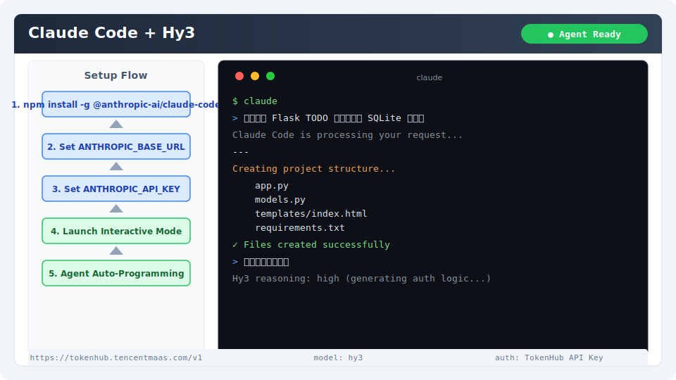

# Claude Code 集成指南

[Claude Code](https://docs.anthropic.com/en/docs/claude-code) 是 Anthropic 官方的 AI 编程 CLI 工具。通过环境变量覆盖可切换后端为 Hy3，实现 Agent 自动编程。

## 安装与版本要求

- **Node.js**：≥ 18
- **Claude Code**：通过 npm 全局安装

```bash
npm install -g @anthropic-ai/claude-code
```

- **Git**：Claude Code 依赖 Git 跟踪代码改动
- **网络**：能访问 TokenHub 或 OpenRouter

验证安装：

```bash
claude --version
```

## 核心配置

通过环境变量指定 Hy3 作为后端：

```bash
export ANTHROPIC_BASE_URL="https://tokenhub.tencentmaas.com/v1"
export ANTHROPIC_API_KEY="your-tokenhub-key"
```

| 配置项 | 说明 |
|--------|------|
| `ANTHROPIC_BASE_URL` | Hy3 API 端点（OpenAI 兼容） |
| `ANTHROPIC_API_KEY` | 对应服务商的 API Key |

### 各部署模式配置

| 模式 | Base URL | 推荐场景 |
|------|----------|----------|
| TokenHub（国内） | `https://tokenhub.tencentmaas.com/v1` | 国内用户首选 |
| TokenHub（海外） | `https://tokenhub-intl.tencentmaas.com/v1` | 海外用户 |
| OpenRouter | `https://openrouter.ai/api/v1` | 已有 OpenRouter 账号 |
| 本地 vLLM/SGLang | `http://127.0.0.1:8000/v1` | 本地部署开发测试 |

### 项目级配置（推荐）

在项目根目录创建 `.env`：

```
ANTHROPIC_BASE_URL=https://tokenhub.tencentmaas.com/v1
ANTHROPIC_API_KEY=sk-xxx
```

> Claude Code 默认使用 Anthropic 消息格式。设置 `ANTHROPIC_BASE_URL` 指向 OpenAI 兼容端点后，CLI 会自动适配协议。

## 第一次对话测试

```bash
claude -p "用 Python 写一个快速排序，并输出数字 1"
```

**预期结果**：终端显示 Hy3 生成的快速排序代码和数字 1。



## 端到端实战 Demo：创建 Flask TODO 应用

### 场景

在交互模式下，让 Hy3 基于 Agent 能力自动创建一个完整的 Web 应用。

### 操作步骤

1. 进入空目录：
```bash
mkdir hy3-todo-demo && cd hy3-todo-demo
git init
```

2. 启动 Claude Code：
```bash
claude
```

3. 输入 Prompt：
```
创建一个 Flask TODO 应用，包含 SQLite 数据库，支持添加/删除/标记完成。需要前端界面。
```

4. 观察 Claude Code 自动：
   - 创建 `app.py`、`models.py`、`templates/` 等文件
   - 安装依赖
   - 输出完整项目结构

5. 运行验证：
```bash
python app.py
```

### 预期输出

```
Creating project structure...
  ✓ app.py
  ✓ models.py
  ✓ templates/index.html
  ✓ requirements.txt
✓ Files created successfully
```

## 常见注意事项

1. **权限确认**：首次运行需确认执行命令和读写文件的权限
2. **工具调用**：本地部署需要 `--tool-call-parser hy_v3` 开启工具解析
3. **Reasoning 模式**：可通过交互模式的 `/thinking` 命令切换
4. **多模态限制**：Hy3 当前为文本模型，避免发送图片内容
5. **超时设置**：如后端响应慢，可加大超时：`export ANTHROPIC_TIMEOUT_MS=120000`
6. **独立项目**：Claude Code 会主动读写文件，建议在独立项目目录中使用
