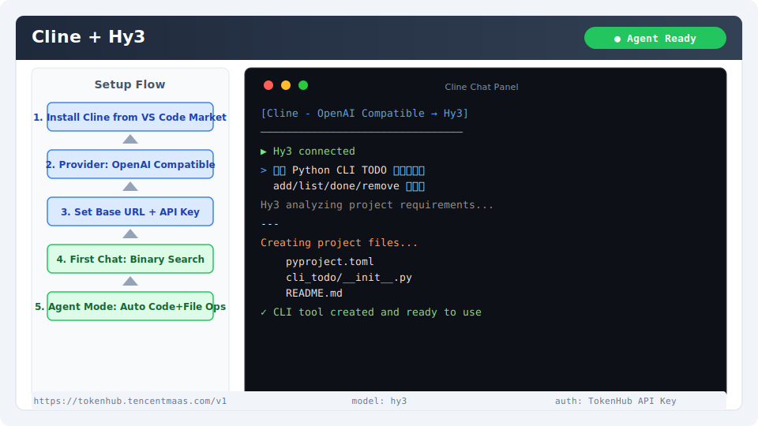

# Cline 集成指南

[Cline](https://github.com/cline/cline) 是 VS Code 上的 AI 编程助手插件，支持多种 API 提供商，具备文件读写、终端命令执行等 Agent 能力。通过自定义 OpenAI 兼容提供商即可接入 Hy3。

## 安装与版本要求

- **VS Code**：1.85+
- **Cline 插件**：最新版本

安装方式：
- VS Code 扩展市场搜索 "Cline" 安装
- 或通过 [Open VSX](https://open-vsx.org/extension/saoudrizwan/claude-dev) 安装

验证安装：安装后 VS Code 侧边栏出现 Cline 图标（机器人图标）。

## 核心配置

### 1. 打开设置

点击侧边栏 Cline 图标 → 点击齿轮图标（⚙️）进入设置。

### 2. API Provider 配置

| 字段 | 值 |
|------|-----|
| API Provider | **OpenAI Compatible** |
| Base URL | `https://tokenhub.tencentmaas.com/v1` |
| API Key | `sk-xxx`（从 TokenHub 获取） |
| Model ID | `hy3` |

### 3. 自定义 System Prompt（可选）

在设置面板的 "Custom Instructions" 中可调整 System Prompt，Cline 会将其拼接到工具调用上下文前。

### 各部署模式配置

| 模式 | Base URL | Model ID | 推荐场景 |
|------|----------|----------|----------|
| TokenHub（国内推荐） | `https://tokenhub.tencentmaas.com/v1` | `hy3` | 国内用户首选 |
| TokenHub（海外） | `https://tokenhub-intl.tencentmaas.com/v1` | `hy3` | 海外用户 |
| OpenRouter | `https://openrouter.ai/api/v1` | `tencent/hy3` | 已有 OpenRouter 账号 |
| 本地 vLLM/SGLang | `http://127.0.0.1:8000/v1` | `hy3` | 本地开发测试 |

## 第一次对话测试

1. 打开任意项目
2. 点击 Cline 图标打开对话面板
3. 输入：

```
Hello! 用 Python 写一个二分查找函数，并添加注释
```

**预期结果**：Cline 调用 Hy3 生成带注释的 Python 二分查找代码。

> 首次使用时 Cline 可能弹出文件操作权限确认，点击 "Allow" 即可。



## 端到端实战 Demo：创建 Python CLI 工具

### 场景

使用 Cline 的 Agent 能力，让 Hy3 自动规划并创建一个完整的 Python CLI 工具项目。

### 操作步骤

1. 创建一个新的空项目目录，用 VS Code 打开
2. 打开 Cline 面板
3. 输入以下 Prompt：

```
创建一个 Python CLI 工具 cli-todo，功能：
- 使用命令行管理 TODO 列表
- 支持 add、list、done、remove 四个子命令
- 使用 JSON 文件存储数据（存在 ~/.cli-todo/tasks.json）
- 使用 argparse 处理命令行参数
- 编写 README.md 和使用示例
- 创建 pyproject.toml 使项目可 pip install
请逐步创建所有必要文件
```

4. 观察 Cline 逐个创建文件
5. 当 Cline 询问是否执行命令时，选择 "Approve" 以允许安装依赖
6. Cline 完成后，在终端中测试：

```bash
pip install -e .
cli-todo add "完成 Cline + Hy3 集成测试"
cli-todo list
cli-todo done 1
```

### 预期行为

- Cline 自动创建项目结构（`pyproject.toml`、`cli_todo/`、`README.md`）
- 生成可运行的 CLI 代码
- 支持完整的 CRUD 操作

## 常见注意事项

1. **API Key 安全**：Cline 将 API Key 存储在 VS Code 的 Secret Storage 中，比明文存放更安全
2. **工具调用权限**：Cline 的 Agent 能力涉及文件读写和终端命令执行，建议在可控项目中使用
3. **上下文窗口管理**：长对话中 Cline 会自动截断历史消息，如果 Hy3 的上下文被截断可能影响回答质量
4. **Reasoning 模式**：在 Cline 的自定义指令区可添加 `"use reasoning mode"` 提示，但无法通过 `chat_template_kwargs` 原生控制推理模式
5. **速率限制**：TokenHub 免费用户可能遇到 429 限流，Cline 的自动重试机制会处理
6. **多文件编辑**：Cline 支持并行的多文件编辑操作，但 Hy3 在复杂多步骤任务中建议逐步推进
