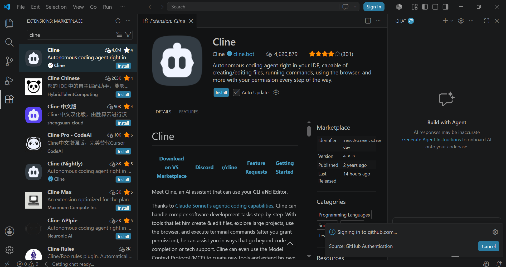
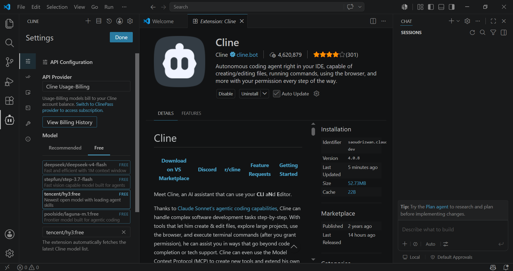
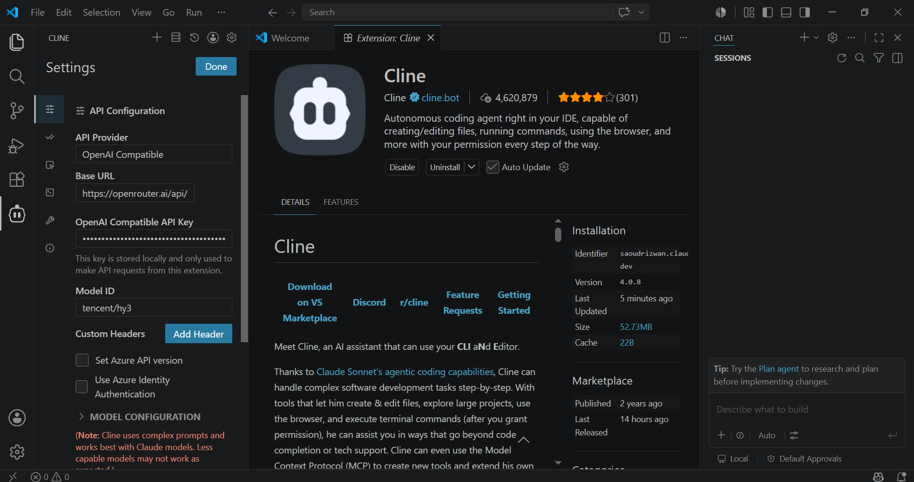
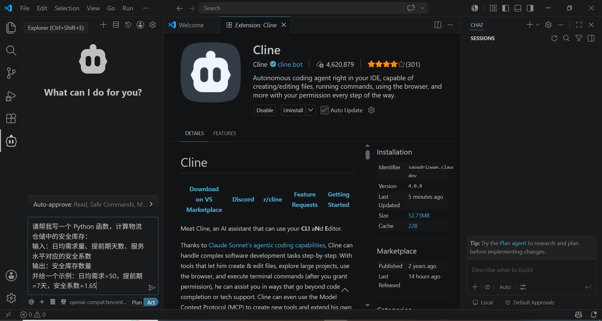
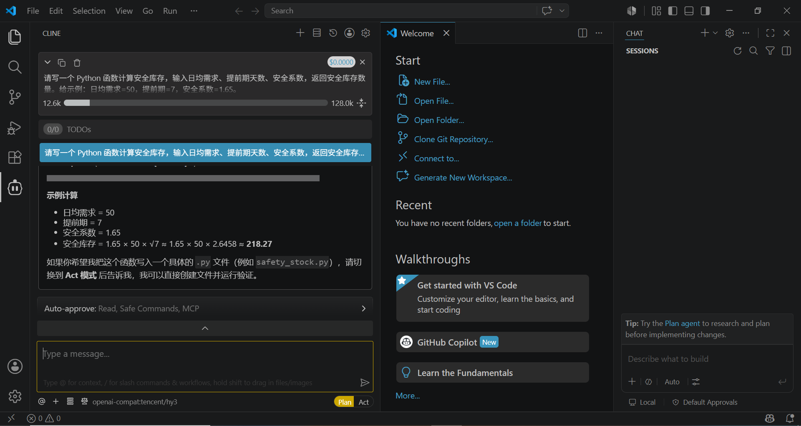
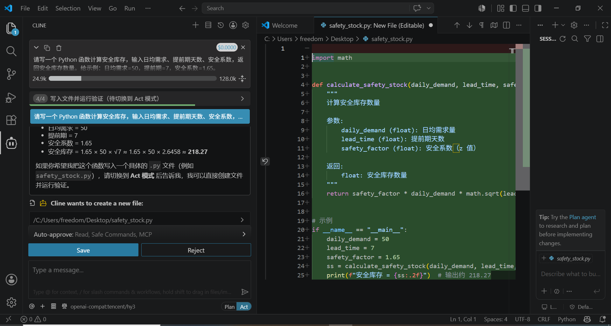
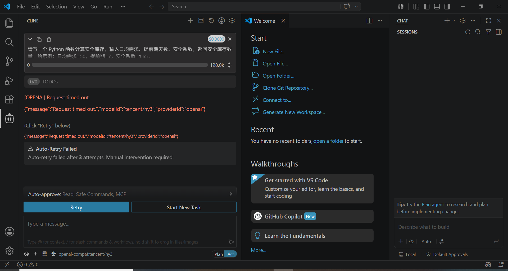

# Cline 接入 Hy3 指南

> Cline（前身 Claude Dev）是 VS Code 中功能强大的 AI 编程插件，支持自主 Agent 编程。通过 OpenAI Compatible 提供者，可将 Hy3 接入 Cline。

## 前置条件

- VS Code >= 1.80
- 一个 OpenRouter 或腾讯云 TokenHub 的 API Key

## 安装 Cline 插件

### 方式一：扩展市场安装

1. 打开 VS Code
2. 按 `Ctrl+Shift+X` 打开扩展面板
3. 搜索 **"Cline"**
4. 点击 **Install** 安装


*（截图：VS Code 扩展市场中搜索并安装 Cline）*

### 方式二：命令行安装

```bash
code --install-extension saoudrizwan.claude-dev
```

安装完成后，侧栏会出现 Cline 的机器人图标。

## 方式一：通过 OpenRouter 接入

### 1. 打开 Cline 设置

点击 Cline 侧栏面板右上角的 **齿轮图标** 进入设置页面。

### 2. 配置 API Provider

| 配置项 | 值 |
|--------|-----|
| **API Provider** | 选择 **"OpenAI Compatible"** |
| **Base URL** | `https://openrouter.ai/api/v1` |
| **API Key** | `sk-or-v1-YOUR_OPENROUTER_KEY` |
| **Model ID** | `tencent/hy3` |

> **重要**：Base URL 必须以 `/v1` 结尾，否则会报 404 错误。


*（截图：Cline 设置中 API Provider 选择 OpenAI Compatible，显示模型列表）*


*（截图：Cline 配置表单填写完整 Base URL、API Key、Model ID 后的状态）*

### 3. 调整高级设置

| 配置项 | 推荐值 | 说明 |
|--------|--------|------|
| **Context Window Size** | `256000` | Hy3 最大上下文 |
| **Max Output Tokens** | `8192` | 单次输出上限 |
| **Temperature** | `0.9` | Hy3 推荐温度 |
| **Support Images** | 关闭 | Hy3 为纯文本模型 |

## 方式二：通过腾讯云 TokenHub 接入

| 配置项 | 值 |
|--------|-----|
| **API Provider** | OpenAI Compatible |
| **Base URL** | `https://tokenhub.tencentmaas.com/v1` |
| **API Key** | TokenHub API Key |
| **Model ID** | `hy3` |

其他高级设置同上。

## 端到端实战 Demo

### 场景：让 Hy3 写一个物流安全库存计算工具

**任务描述**（在 Cline 对话中输入）：

```
请写一个 Python 函数计算物流仓储中的安全库存：
- 输入：日均需求量、提前期天数、服务水平对应的安全系数
- 输出：安全库存数量
- 包含一个示例：日均需求=50，提前期=7，安全系数=1.65

请直接输出完整可运行的 Python 代码。
```


*（截图：Cline 中选择 tencent/hy3 并输入安全库存计算任务）*

### 预期过程

Cline 会：

1. **分析需求** - 理解安全库存计算逻辑
2. **生成代码/说明** - 输出 Python 函数及示例计算
3. **创建文件**（可选）- 在 Act 模式下可自动写入 `safety_stock.py`

> **提示**：OpenRouter 免费模型在高峰时段响应较慢，Cline 默认 60 秒超时可能不够。如遇 `Request timed out`，请按下方排错表调大 Request Timeout 后重试。

### 成功响应示例

在 Plan 模式下，Hy3 会给出清晰的计算说明和示例结果：


*（截图：Hy3 在 Plan 模式下返回安全库存计算说明与示例结果）*

### Act 模式自动创建文件

切换到 Act 模式后，Hy3 可以自动把代码写入文件并提示运行：

```
请切换到 Act 模式，帮我把上面的安全库存函数写入 safety_stock.py 并运行示例。
```

Cline 会：

1. 创建 `safety_stock.py`
2. 写入完整函数和示例代码
3. 提示保存文件


*（截图：Cline 在 Act 模式下自动创建 safety_stock.py 并展示代码）*

### 超时排错示例

如果 OpenRouter 响应超时，Cline 会显示类似错误：

```
[OPENAI] Request timed out.
{"message":"Request timed out.","modelId":"tencent/hy3","providerId":"openai"}
```


*（截图：Cline 调用 tencent/hy3 时因网络/模型响应慢导致 Request timed out 的错误）*

## 进阶配置

### MCP 服务器集成

Cline 支持 MCP（Model Context Protocol），可以为 Hy3 扩展搜索、文件系统等能力：

```json
// ~/.cline/mcp_settings.json
{
  "mcpServers": {
    "filesystem": {
      "command": "npx",
      "args": ["-y", "@modelcontextprotocol/server-filesystem", "/path/to/allowed/dir"]
    }
  }
}
```

在 Cline 中配置 MCP 后，Hy3 可通过工具调用访问这些扩展能力。

### 推理模式

在 Cline 的 Custom Instructions 中添加：

```
在回答复杂编程问题前，请先进行深度推理分析。
在执行代码修改前，先说明修改方案。
```

### 多文件项目

对于大型项目，Cline 可以：

- 自动读取相关文件上下文
- 跨文件执行搜索和编辑
- 运行终端命令（如 `npm install`、`npm test`）

## 常见问题与排错

| 错误现象 | 原因 | 解决方案 |
|---------|------|---------|
| `Failed to fetch` 或 `Connection Error` | 网络问题 | 检查网络连接，国内用户切换 TokenHub |
| `404 Not Found` | Base URL 路径错误 | 确认 URL 以 `/v1` 结尾，不含多余路径 |
| `400 Bad Request` | 模型名错误 | 确认 Model ID 与服务商一致 |
| `429 Too Many Requests` | OpenRouter 速率限制 | 降低请求频率或切换 TokenHub |
| `Request timed out` | OpenRouter 免费模型响应慢，Cline 默认超时不足 | 调大 Cline 的 Request Timeout（建议 120~180 秒），或切换到 TokenHub |
| Agent 任务执行不完整 | Context Window 太小 | 将 Context Window Size 设为 256000 |
| 工具调用失败 | 模型不支持 | 确认使用了正式版 `tencent/hy3`（非 preview） |
| 中文输出乱码 | 编码问题 | 检查 VS Code 文件编码设置为 UTF-8 |

## 注意事项

1. **Base URL 格式**：必须以 `/v1` 结尾，末尾不要有多余斜杠（`/v1/` ❌，`/v1` ✅）
2. **图片支持**：Cline 默认开启图片支持，需要手动关闭，否则 Hy3 调用可能出错
3. **Prompt Caching**：Cline 的 Prompt Caching 功能需要服务商支持，Hy3 在 OpenRouter 上自动启用
4. **文件权限**：Agent 模式下 Cline 可以读写你的文件系统，建议在项目目录范围内使用

## 小贴士

1. **免费窗口**：2026 年 7 月 21 日前使用 OpenRouter 的 `tencent/hy3:free` 完全免费
2. **费用控制**：在 Cline 的 Auto-approve 设置中开启确认，避免 Agent 过度调用
3. **快速测试**：先用简单任务测试连通性（如"写一个 Hello World"），再执行复杂 Agent 任务
4. **MCP 扩展**：配合 Playwright MCP 或 Filesystem MCP，让 Hy3 可以操作浏览器和文件
