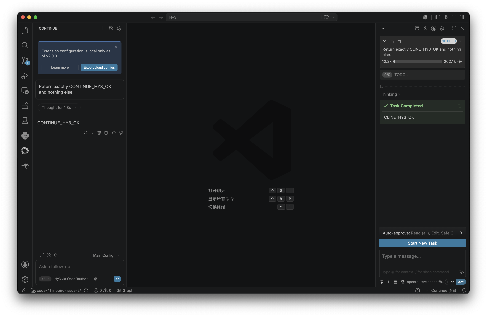

# 在 Cline 中使用 Hy3

Cline 是 VS Code 中常用的 AI 编程 Agent，支持 OpenRouter 和 OpenAI-compatible provider。本指南在 Cline `4.0.8` 上核对。

## 安装与版本要求

- Visual Studio Code 最新稳定版。
- Cline `4.0.8`（其他近期稳定版界面可能略有不同）。
- 已部署 Hy3 OpenAI 兼容服务。

## 配置

1. 打开 VS Code。
2. 安装并打开 Cline。
3. 进入 Cline Settings。
4. API Provider 优先选择 OpenRouter；自部署时选择 OpenAI Compatible。
5. 填写 API Key 并选择或输入 Model ID。

| 配置项 | 示例 |
| --- | --- |
| API Provider | OpenRouter |
| Base URL | Provider 自动配置；兼容模式填 `https://openrouter.ai/api/v1` |
| API Key | OpenRouter Key，保存在 Cline Secret Storage |
| Model ID | `tencent/hy3:free` |

## 第一次对话

在 Cline 中发送：

```text
请检查当前项目，列出 README、docs、assets 相关文件，并建议我如何组织 Hy3 集成文档。
```

Cline 应能读取工作区并调用 Hy3 返回结构化建议。

## 端到端任务

目标：让 Hy3 生成并检查一个接入指南。

Prompt：

```text
请新增 docs/integrations/dify.md，说明如何在 Dify 中通过 OpenAI-API-compatible provider 接入 Hy3。要求包含安装要求、配置表、第一次对话、端到端任务和注意事项。
```

完成后让 Cline 执行：

```text
请检查新增文档是否包含真实密钥、错误 URL 或缺失的截图占位说明。
```

## 常见注意事项

- Base URL 一般填写到 `/v1`，不填写完整接口路径。
- Model ID 必须和服务端模型名一致。
- 如果 Cline 报模型不可用，先用 `curl http://127.0.0.1:8000/v1/models` 检查服务。
- Cline 执行文件修改前建议先让它列计划，再确认执行。

## 真实调用验证

本机在 Cline `4.0.8` 中选择 OpenRouter 和 `tencent/hy3:free`，发送：

```text
Return exactly CLINE_HY3_OK and nothing else.
```

任务完成并返回 `CLINE_HY3_OK`；截图底部同时显示 `openrouter:tencent/h...` 的当前 provider/model。



OpenRouter endpoint 可先按 [OpenRouter 指南](openrouter.md)中的 curl 请求验证；如果 curl 成功而 Cline 失败，重点检查 provider、模型 ID 与 Cline 的网络代理设置。
