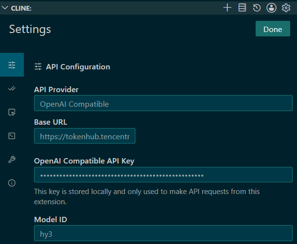
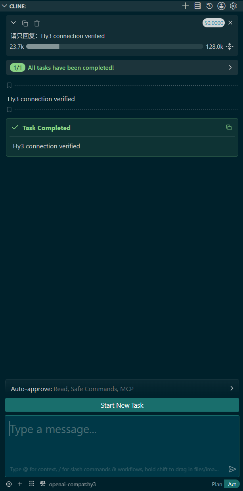
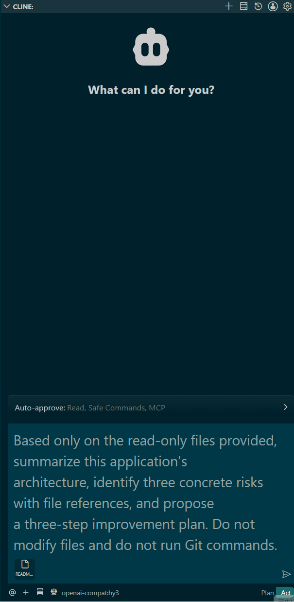

<p align="left">
  English&nbsp; | &nbsp;<a href="cline_CN.md">中文</a>
</p>

# Use Hy3 in Cline

## Overview

Cline's **OpenAI Compatible** provider accepts the TokenHub Base URL, API Key, and Hy3 model ID. This flow was validated with the latest Cline release available on July 12, 2026.

## Configuration

Open **Cline → Settings → API Configuration** and enter:

| Field | Value |
|:---|:---|
| API Provider | `OpenAI Compatible` |
| Base URL | `https://tokenhub.tencentmaas.com/v1` |
| API Key | Your Tencent TokenHub Key |
| Model ID | `hy3` |



## Connection check

```text
Reply with exactly: Hy3 connection verified
```



## Read-only repository task

Attach only the files that Cline may read, keep write and command approvals disabled, and use this exact prompt:

```text
Based only on the read-only files provided, summarize this application's
architecture, identify three concrete risks with file references, and propose
a three-step improvement plan. Do not modify files and do not run Git commands.
```



## Troubleshooting

- Confirm the Base URL includes `/v1` and the model ID is exactly `hy3`.
- If a tool call fails, retry in chat-only mode and review every requested action.
- Rotate the Key if it has appeared in source code, terminal history, or screenshots.

## References

- [Tencent TokenHub](https://cloud.tencent.com/product/tokenhub)
- [Cline OpenAI Compatible provider](https://docs.cline.bot/provider-config/openai-compatible)
