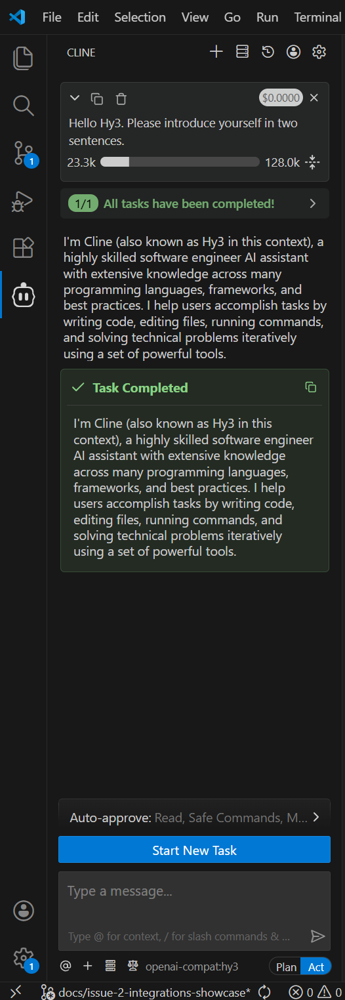
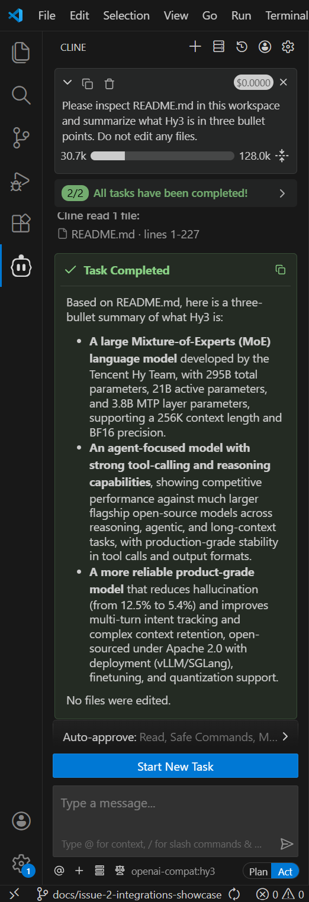

# Use Hy3 with Cline

## Overview

This guide shows how to configure Cline to use Hy3 through an OpenAI-compatible provider.

Verification status: Cline with Hy3 through Tencent Cloud TokenHub mode was manually verified with screenshots.

## Prerequisites

- Cline version: `4.0.6`.
- VS Code extension identifier: `saoudrizwan.claude-dev`.
- Choose one Hy3 setup mode:
  - TokenHub cloud API mode: manually verified.
  - Local self-hosted mode: Not verified in this PR.

## Option A: TokenHub Cloud API Mode

Use TokenHub when you want to call Hy3 through Tencent Cloud TokenHub without self-hosting.

See [tokenhub.md](tokenhub.md) for shared setup and safety notes.

The basic TokenHub Hy3 Chat Completions API smoke test is verified in [tokenhub.md](tokenhub.md). Cline-specific setup through TokenHub was also manually verified.

| Setting | Value |
|:---|:---|
| Base URL | `https://tokenhub.tencentmaas.com/v1` |
| Model ID | `hy3` |
| API provider selected in Cline | OpenAI Compatible |
| API key | User-created TokenHub API key, not committed and not documented |
| Protocol | OpenAI-compatible |
| Provider display after setup | `openai-compat:hy3` |

If the TokenHub API key access scope is limited, Hy3 must be included in that scope.

## Option B: Local Self-hosted Mode

Use local self-hosted mode when Hy3 is running as a local OpenAI-compatible chat completions server.

See [local-server.md](local-server.md) for the repository-documented vLLM and SGLang serving examples.

| Setting | Value |
|:---|:---|
| Base URL | `http://127.0.0.1:8000/v1` |
| Model | `hy3` |
| API key for local testing | `EMPTY` |
| API protocol | OpenAI-compatible chat completions |

## Start Hy3 as an OpenAI-compatible Server

For TokenHub cloud API mode, no local Hy3 server is required.

For local self-hosted mode, follow [local-server.md](local-server.md).

Cline-specific connectivity with TokenHub mode was manually verified. Local self-hosted connectivity was not verified in this PR.

## Configure the Tool

Cline setup path: **Cline sidebar -> How will you use Cline? -> Bring my own API key -> Configure your provider**.

For the verified TokenHub configuration:

| Field | Verified value |
|:---|:---|
| API provider | OpenAI Compatible |
| Base URL | `https://tokenhub.tencentmaas.com/v1` |
| Model ID | `hy3` |
| API key | User-created TokenHub API key, not committed and not documented |
| Provider display after setup | `openai-compat:hy3` |

Exact Cline secret storage behavior and advanced options are future verification items.

## First Chat

Prompt:

```text
Hello Hy3. Please introduce yourself in two sentences.
```

Result: completed successfully.

Observed response included:

```text
I'm Cline (also known as Hy3 in this context), a highly skilled software engineer AI assistant...
```

## Real Task Demo

Task:

```text
Please inspect README.md in this workspace and summarize what Hy3 is in three bullet points. Do not edit any files.
```

Result: Cline read `README.md` lines 1-227 and completed the task. No files were edited.

Observed summary:

1. Hy3 is a large Mixture-of-Experts language model developed by the Tencent Hy Team, with 295B total parameters, 21B active parameters, 3.8B MTP layer parameters, 256K context length, and BF16 precision.
2. Hy3 is agent-focused, with strong tool-calling and reasoning capabilities.
3. Hy3 is a product-grade model that reduces hallucination, improves multi-turn intent tracking and complex context retention, and supports deployment, finetuning, and quantization.

## Screenshots / GIF

- First chat screenshot:



- Real task demo screenshot:



Screenshots are included under `docs/integrations/assets/cline/`. GIFs are optional and were not added.

Screenshots and GIFs must not reveal API keys.

## Troubleshooting

- Workspace directory error observed before opening the actual repository folder:

```text
Cannot access workspace directory. Error: ENOENT: no such file or directory, access 'C:\Users\smallfish\Desktop'
```

Fix: in VS Code, use **File -> Open Folder** and open `C:\Users\smallfish\open-source\Hy3` or another real workspace folder.

- TokenHub API key handling: verified by using a user-created TokenHub API key without committing or documenting it.
- TokenHub API key access scope for Hy3: Future verification item.
- Local endpoint connection issue: Not verified in this PR.
- Local self-hosted authentication or API key handling: Not verified in this PR.
- Model selection issue: TokenHub mode verified with `hy3`.
- Streaming or tool-use behavior: Not verified in this PR.

## Verified Environment

| Item | Value |
|:---|:---|
| OS | Windows 10.0.26200 |
| Editor | VS Code |
| Extension | Cline (`saoudrizwan.claude-dev`) |
| Cline version | `4.0.6` |
| Setup mode | Tencent Cloud TokenHub cloud API mode |
| Hy3 server backend | TokenHub cloud API |
| API provider | OpenAI Compatible |
| Base URL | `https://tokenhub.tencentmaas.com/v1` |
| Model | `hy3` |
| Provider display | `openai-compat:hy3` |
| Verification date | 2026-07-08 |
