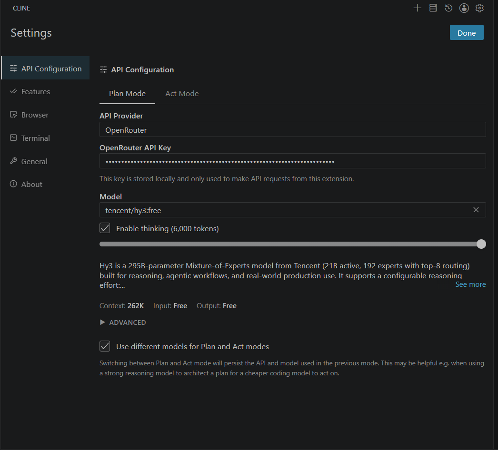
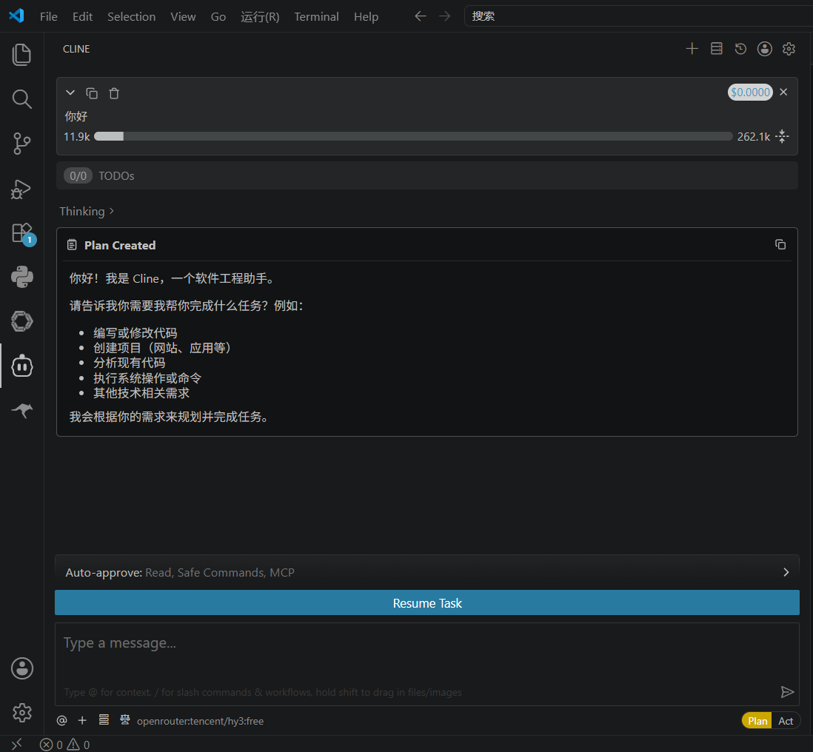

# Cline + Hy3

[Cline](https://github.com/cline/cline) 是 VS Code 里的编程助手插件，支持自定义 API，可以接 Hy3。

## 安装

扩展市场搜 **Cline**，装好后打开侧边栏 Cline 面板。

## 配置

设置里选 **OpenAI Compatible**（不同版本名字可能略有差别）。

OpenRouter：

| 项 | 值 |
|----|-----|
| API Provider | OpenAI Compatible |
| Base URL | `https://openrouter.ai/api/v1` |
| API Key | OpenRouter Key |
| Model | 例如 `tencent/hy3:free` |
| Max tokens | 4096 或 8192 |

TokenHub：Base URL `https://tokenhub.tencentmaas.com/v1`，Model `hy3`。

## 试一次

1. 确认当前模型是 Hy3  
2. 让它写一个简单函数，比如判断字符串是不是回文，并给两个例子  
3. 看回复是否正常；需要的话再让它落到工作区文件里  

## 截图

## 注意

- Cline 能改文件、跑命令，弹权限时看清楚再点  
- 连不上时检查 Base URL 是否带 `/v1`  
- 免费额度有限，调试时少堆超长上下文  
