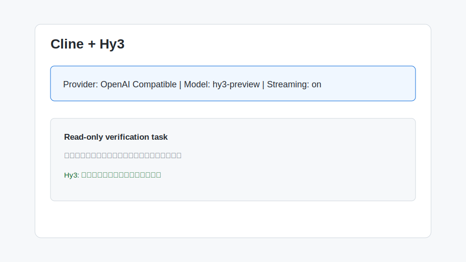

# Cline 接入 Hy3

Cline 是 VS Code 中常见的 AI Agent 插件。若选择 OpenAI Compatible provider，可让 Hy3 参与代码修改、命令执行建议和多步骤任务规划。



## 安装与版本要求

- VS Code
- Cline 插件
- 当前版本支持 OpenAI Compatible / Custom Provider
- TokenHub API Key

## 配置项

| 配置项 | 值 |
| --- | --- |
| API Provider | OpenAI Compatible |
| Base URL | `https://tokenhub.tencentmaas.com/v1` |
| Model ID | `hy3-preview` |
| API Key | TokenHub API Key |
| Streaming | 建议开启 |

## 第一次对话

在 Cline 面板输入：

```text
请检查当前项目结构，只读分析，不要修改文件。输出项目类型、入口文件和建议的下一步。
```

先用只读任务验证模型配置，确认正常后再允许文件编辑。

## 真实任务 Demo

任务：让 Hy3 帮助创建一个小的命令行 README。

输入：

```text
请为当前项目创建 README 的 Usage 部分，包含安装、运行、环境变量和常见错误。先展示计划，等我确认后再修改文件。
```

示例输出：

```text
计划：
1. 读取 package.json / pyproject.toml 判断运行方式。
2. 补充 Usage、Environment、Troubleshooting 三节。
3. 不改动业务代码。
```

## 常见注意事项

- Agent 类工具可能会执行命令或编辑文件，第一次验证建议只允许只读操作。
- 如果工具调用失败，先关闭自动编辑，用普通问答确认 Hy3 配置。
- 如果输出被截断，提高 max tokens 或把任务拆成多步。
- 不要把 API Key 写入 `.cline` 或仓库配置文件。
