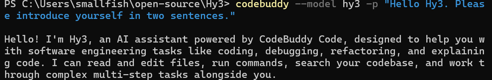
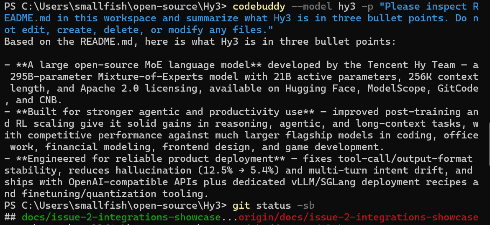

# Use Hy3 with CodeBuddy Code CLI

## Overview

This guide shows how to configure CodeBuddy Code CLI to use Hy3 through an OpenAI-compatible provider.

Verification status: CodeBuddy Code CLI print mode with Hy3 through Tencent Cloud TokenHub mode was manually verified with screenshots.

## Prerequisites

- Install package: `npm install -g @tencent-ai/codebuddy-code`.
- First-party reference: [CodeBuddy documentation](https://www.codebuddy.ai/docs/).
- Tested CodeBuddy Code CLI snapshot: `2.117.2` (an observed test version, not a minimum supported version).
- Observed command paths:
  - `%APPDATA%\npm\codebuddy`
  - `%APPDATA%\npm\codebuddy.cmd`
- Choose one Hy3 setup mode:
  - TokenHub cloud API mode: manually verified for CLI print mode.
  - Local self-hosted mode: Not verified in this PR.

## Option A: TokenHub Cloud API Mode

Use the region-matched credentials and safety rules in [tokenhub.md](tokenhub.md). The table below preserves CodeBuddy-specific fields from the verified Guangzhou run.

The basic TokenHub Hy3 Chat Completions API smoke test is verified in [tokenhub.md](tokenhub.md). CodeBuddy Code CLI print mode through TokenHub was also manually verified.

| Setting | Value |
|:---|:---|
| Config file | `%USERPROFILE%\.codebuddy\models.json` |
| URL | `https://tokenhub.tencentmaas.com/v1/chat/completions` |
| Model ID | `hy3` |
| Model name | Hy3 TokenHub |
| Vendor | Tencent Cloud TokenHub |
| API key | Referenced through `${TOKENHUB_API_KEY}`, not committed and not documented |
| `maxInputTokens` | `128000` |
| `maxOutputTokens` | `4096` |
| `supportsToolCall` | `true` |
| `supportsImages` | `false` |
| `supportsReasoning` | `false` |
| Protocol | OpenAI-compatible Chat Completions |

If the TokenHub API key access scope is limited, Hy3 must be included in that scope.

## Option B: Local Self-hosted Mode

Use local self-hosted mode when Hy3 is running as a local OpenAI-compatible chat completions server.

See [local-server.md](local-server.md) for the repository-documented vLLM and SGLang serving examples.

| Setting | Value |
|:---|:---|
| Base URL | `http://127.0.0.1:8000/v1` |
| Model | `hy3` |
| API key for local testing | `EMPTY` |
| API protocol | OpenAI-compatible chat completions |

## Start Hy3 as an OpenAI-compatible Server

For TokenHub cloud API mode, no local Hy3 server is required.

For local self-hosted mode, follow [local-server.md](local-server.md).

CodeBuddy Code CLI print mode with TokenHub was manually verified. Local self-hosted connectivity was not verified in this PR.

## Configure the Tool

CodeBuddy Code CLI reads a user-level model configuration file from:

```text
%USERPROFILE%\.codebuddy\models.json
```

This file is user-level configuration and must not be committed.

Reference the API key through the `TOKENHUB_API_KEY` environment variable. Do not write the API key directly into `models.json`.

Safe PowerShell pattern for the current session:

```powershell
$SecureApiKey = Read-Host "TokenHub API key" -AsSecureString
$env:TOKENHUB_API_KEY = [System.Net.NetworkCredential]::new("", $SecureApiKey).Password
```

Verified `models.json` shape:

```json
{
  "models": [
    {
      "id": "hy3",
      "name": "Hy3 TokenHub",
      "vendor": "Tencent Cloud TokenHub",
      "apiKey": "${TOKENHUB_API_KEY}",
      "url": "https://tokenhub.tencentmaas.com/v1/chat/completions",
      "maxInputTokens": 128000,
      "maxOutputTokens": 4096,
      "supportsToolCall": true,
      "supportsImages": false,
      "supportsReasoning": false
    }
  ],
  "availableModels": [
    "hy3"
  ]
}
```

The capability flags above describe the CodeBuddy model profile used in this verification. `supportsToolCall: true` was present in the verified configuration, but no dedicated tool-calling task was tested. `supportsImages: false` and `supportsReasoning: false` are conservative client-profile settings and should not be interpreted as general Hy3 or TokenHub capability claims.

This guide verifies CLI print mode (`-p`). Interactive login mode is not verified.

## First Chat

Command:

```text
codebuddy --model hy3 -p "Hello Hy3. Please introduce yourself in two sentences."
```

Result: completed successfully.

Observed response included:

```text
Hello! I'm Hy3, an AI assistant powered by CodeBuddy Code, designed to help you with software engineering tasks like coding, debugging, refactoring, and explaining code.
```

## Real Task Demo

Command:

```text
codebuddy --model hy3 -p "Please inspect README.md in this workspace and summarize what Hy3 is in three bullet points. Do not edit, create, delete, or modify any files."
```

Result: CodeBuddy Code summarized `README.md` in three bullet points.

No files were edited; this was confirmed with `git status -sb` after the demo.

Interactive mode was also tried with:

```text
codebuddy --model hy3
```

It opened the CodeBuddy Code interactive UI but prompted for CodeBuddy login. This verification covers CLI print mode (`-p`), not interactive login mode.

## Screenshots / GIF

- First chat screenshot:



- Real task demo screenshot:



Screenshots are included under `docs/integrations/assets/codebuddy-code/`. GIFs are optional and were not added.

Screenshots and GIFs must not reveal API keys.

## Troubleshooting

- TokenHub API key handling: verified by using `${TOKENHUB_API_KEY}` in `%USERPROFILE%\.codebuddy\models.json`; the API key itself was entered into the current PowerShell session and not committed.
- TokenHub API key access scope for Hy3: Future verification item.
- Local endpoint connection issue: Not verified in this PR.
- Local self-hosted authentication or API key handling: Not verified in this PR.
- Model selection issue: the model ID in `models.json` must be `hy3`. Using `hy3-tokenhub` caused TokenHub to return:

```text
400 The model or service ID 'hy3-tokenhub' does not exist.
```

TokenHub expects model `hy3`.
- Interactive mode: `codebuddy --model hy3` opened the interactive UI but prompted for CodeBuddy login; interactive login mode was not used for this verification flow.
- Dedicated streaming-behavior and tool-calling tasks: Not verified in this PR.

## Tested Snapshot and Evidence

| Item | Value |
|:---|:---|
| OS | Windows 11 25H2 (build 26200) |
| Shell | PowerShell |
| Node.js | `v24.14.1` |
| npm | `11.11.0` |
| Package | `@tencent-ai/codebuddy-code` |
| Install command | `npm install -g @tencent-ai/codebuddy-code` |
| CodeBuddy Code CLI tested snapshot | `2.117.2` |
| Setup mode | Tencent Cloud TokenHub cloud API mode |
| Hy3 server backend | TokenHub cloud API |
| Config file | `%USERPROFILE%\.codebuddy\models.json` |
| URL | `https://tokenhub.tencentmaas.com/v1/chat/completions` |
| Model | `hy3` |
| Verification mode | CLI print mode (`-p`) |
| Verification date | 2026-07-08 |
