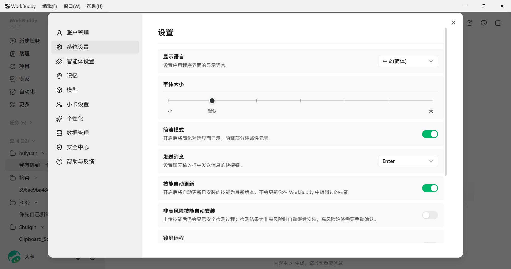
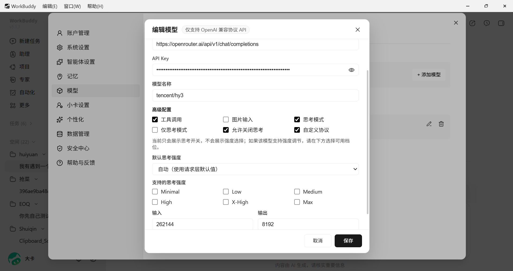
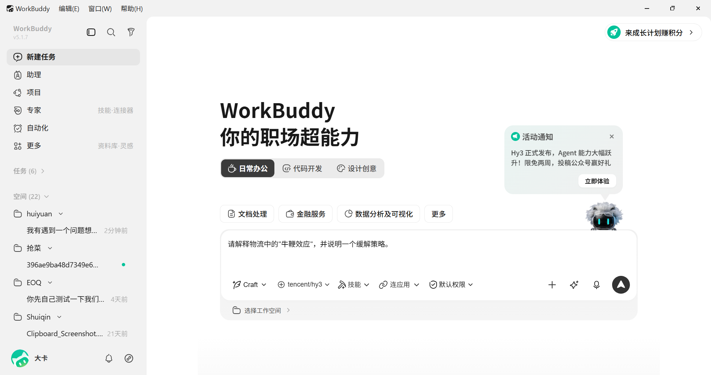
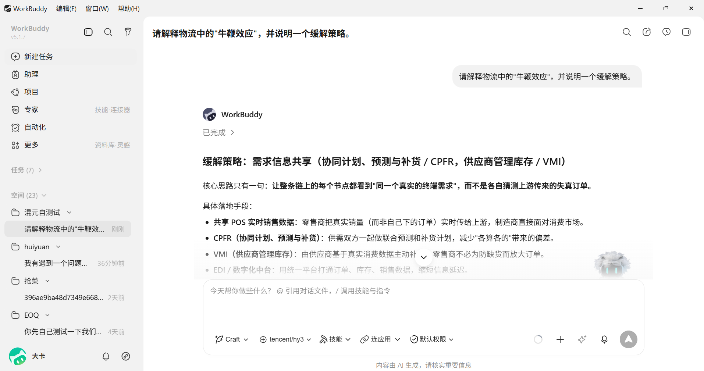
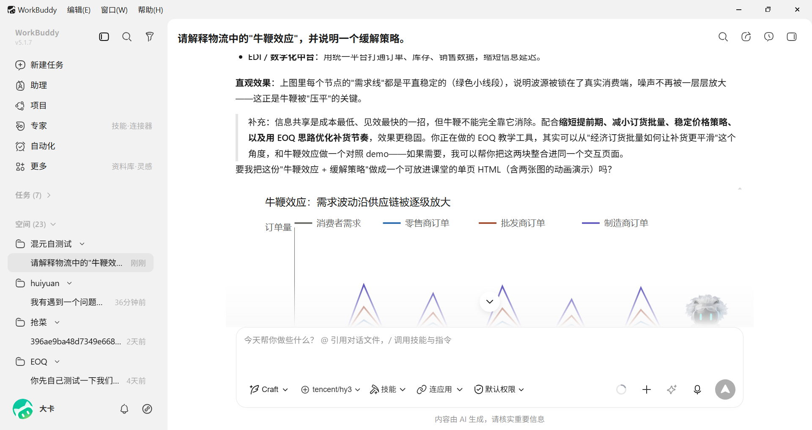
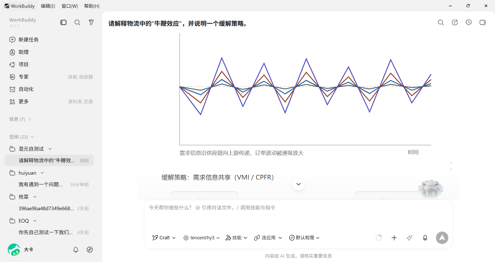
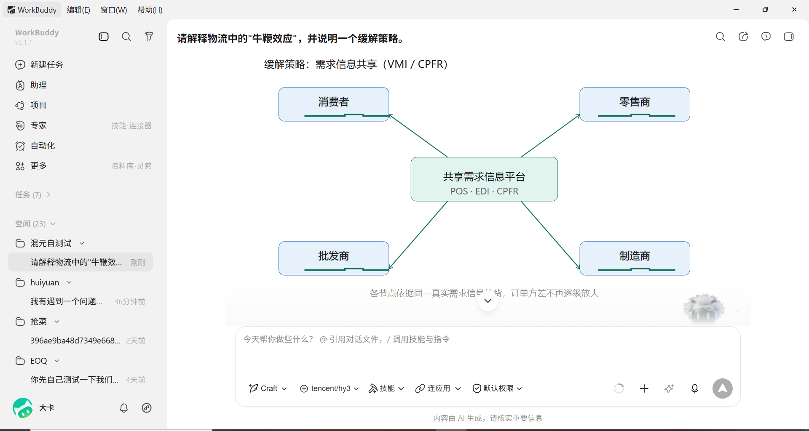

# CodeBuddy / WorkBuddy 接入 Hy3 指南

> CodeBuddy 和 WorkBuddy 是腾讯云出品的 AI 编程助手和全场景办公工作台。两者共享相同的模型配置体系，支持通过 UI 或配置文件接入 Hy3。

> 本指南以 **WorkBuddy 桌面版** 为例，演示通过 OpenRouter 接入 `tencent/hy3`。CodeBuddy 的配置路径与 WorkBuddy 一致。

## 前置条件

- CodeBuddy 或 WorkBuddy 已安装
- 一个 OpenRouter 或腾讯云 TokenHub 的 API Key

> **安装地址**：
> - CodeBuddy：[codebuddy.cn](https://codebuddy.cn)
> - WorkBuddy：[workbuddy.cn](https://workbuddy.cn)

## 方式一：通过 OpenRouter 接入（本指南实测）

### 1. 打开模型设置

1. 启动 WorkBuddy
2. 点击左下角头像（显示你的用户名/头像）
3. 在菜单中选择 **设置**
4. 在左侧菜单中选择 **模型**


*（截图：WorkBuddy 设置页面左侧菜单中的"模型"选项）*

### 2. 添加自定义模型

1. 点击模型页面右上角的 **+ 添加模型**
2. 在供应商选择中点击 **自定义**（Custom）


*（截图：WorkBuddy 自定义模型配置表单，填写接口地址、API Key、模型名称及高级选项）*

### 3. 填写配置信息

| 配置项 | 值 | 说明 |
|--------|-----|------|
| **接口地址** | `https://openrouter.ai/api/v1/chat/completions` | 必须是完整路径，含 `/chat/completions` |
| **API Key** | `sk-or-v1-YOUR_OPENROUTER_KEY` | 你的 OpenRouter API Key |
| **模型名称** | `tencent/hy3` | OpenRouter 上的模型 ID |
| **工具调用** | ✅ 勾选 | Hy3 原生支持 Function Calling |
| **图片输入** | ❌ 不勾选 | 当前 Hy3 版本主要为文本模型 |
| **思考模式** | ✅ 勾选 | 开启 reasoning_effort 支持 |
| **允许关闭思考** | ✅ 勾选 | 用户可在对话中切换 |
| **自定义协议** | ❌ 不勾选 | 使用标准 OpenAI 兼容协议 |
| **输入 Token** | 262144 | 上下文窗口 |
| **输出 Token** | 8192 | 最大输出长度 |

> **关键差异**：WorkBuddy/CodeBuddy 的 URL 必须写完整路径 `/chat/completions`，而 Cursor/Cline/Dify 通常只需要 Base URL 到 `/v1`。这是 WorkBuddy 最容易踩坑的地方。

### 4. 保存并重启

1. 点击右下角 **保存**
2. **完全关闭并重新打开 WorkBuddy**（仅刷新页面不够，必须重启进程）
3. 重启后，新建一个对话，在模型选择器中找到 **自定义模型** → `tencent/hy3`


*（截图：WorkBuddy 对话界面模型选择器显示 `tencent/hy3`，已输入"请解释物流中的牛鞭效应"）*

## 方式二：通过 TokenHub 接入

TokenHub 是腾讯云原生服务，国内延迟更低。配置方式与 OpenRouter 相同，只需替换以下字段：

| 配置项 | 值 |
|--------|-----|
| **接口地址** | `https://tokenhub.tencentmaas.com/v1/chat/completions` |
| **API Key** | 你的 TokenHub API Key |
| **模型名称** | `hy3` |

配置文件方式：

**Windows**：`C:\Users\<用户名>\.workbuddy\models.json`  
**macOS/Linux**：`~/.workbuddy/models.json`

```json
{
  "models": [
    {
      "id": "hy3",
      "name": "Hy3 (TokenHub)",
      "vendor": "Tencent Cloud",
      "url": "https://tokenhub.tencentmaas.com/v1/chat/completions",
      "apiKey": "YOUR_TOKENHUB_KEY",
      "maxInputTokens": 256000,
      "maxOutputTokens": 8192,
      "supportsToolCall": true,
      "supportsImages": false,
      "supportsReasoning": true
    }
  ],
  "availableModels": ["hy3"]
}
```

> **提示**：配置文件保存后，需要**重启** WorkBuddy/CodeBuddy 才能在模型列表中看到新模型。


## 端到端实战 Demo

### 场景：用 Hy3 解释物流"牛鞭效应"并给出可视化策略

这个 Demo 与 Part B 物流教学助手主题一致，展示 WorkBuddy 中 Hy3 的**文本推理 + 数据可视化**能力。

**步骤 1**：新建一个对话，在模型选择器中切换到 `tencent/hy3`

**步骤 2**：输入问题：

```
请解释物流中的"牛鞭效应"，并说明一个缓解策略。
```


*（截图：Hy3 对牛鞭效应问题的结构化回答，给出"需求信息共享"缓解策略）*


*（截图：Hy3 补充说明信息共享的落地手段，并引入需求波动图）*

**步骤 3**：查看完整回答与可视化

Hy3 的回答包含：

1. **核心概念解释**：需求信息沿供应链向上游传递时，订单波动被逐级放大
2. **具体策略**：需求信息共享（POS 实时数据、CPFR、VMI、EDI/数字化中台）
3. **动态图表**：展示消费者需求、零售商订单、批发商订单、制造商订单的波动差异


*（截图：Hy3 生成的折线图，展示需求波动沿供应链被逐级放大）*

4. **缓解策略流程图**：展示消费者、零售商、批发商、制造商通过"共享需求信息平台"协同


*（截图：Hy3 生成的流程图，展示共享需求信息平台连接供应链各节点）*

### 场景：用 Hy3 分析物流 EOQ 教学代码

如果你是物流学教师，可以打开 Part B 的 `hy3-logistics-tutor` 项目，向 Hy3 提问：

```
请分析这个 EOQ 教学工具的项目结构：
1. 模块划分是否清晰？
2. 是否适合课堂演示？
3. 给出 3 条改进建议
```

Hy3 会基于项目代码给出专业反馈，并可直接生成改进后的代码片段。

## 进阶配置

### 推理模式使用

在 WorkBuddy/CodeBuddy 中启用推理模式后，Hy3 会自动展示思维链过程：

- **自动模式**：工具自动判断是否需要推理
- **始终推理**：每次对话都启用推理
- **关闭推理**：快速简单任务时关闭省 Token

### 关联模型配置

在 `models.json` 中可以通过 `relatedModels` 字段配置不同场景下使用的模型：

```json
{
  "models": [
    {
      "id": "hy3",
      "name": "Hy3 (TokenHub)",
      "url": "https://tokenhub.tencentmaas.com/v1/chat/completions",
      "apiKey": "YOUR_TOKENHUB_KEY",
      "maxInputTokens": 256000,
      "maxOutputTokens": 8192,
      "supportsToolCall": true,
      "supportsImages": false,
      "supportsReasoning": true,
      "relatedModels": {
        "reasoning": "hy3-reasoning",
        "longContext": "hy3"
      }
    }
  ]
}
```

### 项目级配置

在项目根目录 `.codebuddy/models.json` 中可以为特定项目指定不同的模型配置，优先级高于用户级配置：

```bash
# 项目根目录
mkdir -p .codebuddy
cp ~/.workbuddy/models.json .codebuddy/models.json
# 修改项目级配置中的模型选择
```

## 常见问题与排错

| 错误现象 | 原因 | 解决方案 |
|---------|------|---------|
| 模型列表中没有 Hy3 | 未重启或配置未保存 | 重启 WorkBuddy/CodeBuddy |
| `404 错误：未找到模型` | URL 填写错误 | 确认 URL 以 `/chat/completions` 结尾 |
| `401 错误：请重新登录` | API Key 无效 | 检查 TokenHub 或 OpenRouter 的 Key 是否有效 |
| `6004 错误` | 模型名不正确 | TokenHub 用 `hy3`，OpenRouter 用 `tencent/hy3` |
| 工具调用不生效 | `supportsToolCall` / 工具调用 未开启 | 在 UI 或 models.json 中设置为 `true` |
| 推理模式不显示 | `supportsReasoning` / 思考模式 未开启 | 在 UI 或 models.json 中设置为 `true` |
| 连接超时 | 网络问题 | 国内用户优先用 TokenHub |
| 回答为空或中断 | 输出 Token 限制过小 | 将输出 Token 调整为 4096 或更大 |

## 注意事项

1. **URL 格式**：WorkBuddy/CodeBuddy 的 URL 必须是完整路径，以 `/chat/completions` 结尾。这与 Cursor/Cline/Dify 等工具不同（它们使用 Base URL 到 `/v1` 即可）。这是 WorkBuddy 最容易踩坑的地方。
2. **设置入口**：WorkBuddy 桌面版的设置入口在左下角头像 → 设置 → 模型，而不是右上角齿轮。
3. **重启生效**：修改 `models.json` 或 UI 中的模型配置后，必须**完全关闭并重新打开** WorkBuddy/CodeBuddy 才能在模型列表中看到新模型。
4. **配置文件位置**：
   - 用户级（全局）：`~/.workbuddy/models.json` 或 `~/.codebuddy/models.json`
   - 项目级（仅当前项目）：`<project>/.codebuddy/models.json`
   - 项目级配置优先级高于用户级
5. **隐藏文件**：Windows 文件浏览器默认隐藏以 `.` 开头的文件夹，需要在"查看"中开启"隐藏的项目"
6. **CodeBuddy Code (CLI)**：如果使用的是命令行版 CodeBuddy Code，配置文件路径为 `~/.codebuddy/models.json`

## 小贴士

1. **双模型配置**：同时配置 TokenHub 和 OpenRouter 两个模型入口，网络不稳定时可快速切换
2. **Auto 模式**：日常简单任务用 Auto 模型，需要深度推理时手动切换到 Hy3
3. **Token 监控**：在 TokenHub 控制台可实时查看 API 调用量和 Token 消耗
4. **配置文件备份**：配置好 `models.json` 后建议备份，重装系统时可直接恢复
