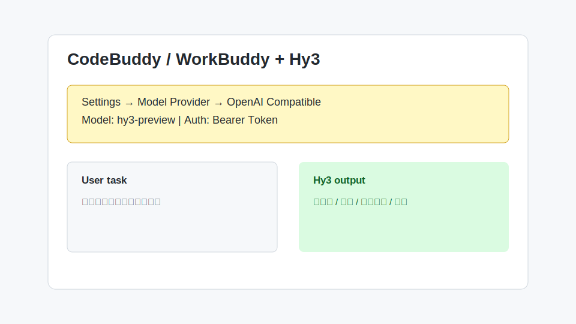

# CodeBuddy / WorkBuddy 接入 Hy3

CodeBuddy / WorkBuddy 类工具通常支持在设置中选择模型服务。如果工具提供 OpenAI Compatible 或自定义模型入口，可以按本指南接入 Hy3。



## 安装与版本要求

- 安装支持自定义模型服务的 CodeBuddy / WorkBuddy 版本
- 可以访问 TokenHub
- 已获取 TokenHub API Key

## 配置项

| 配置项 | 值 |
| --- | --- |
| Provider | OpenAI Compatible |
| Base URL | `https://tokenhub.tencentmaas.com/v1` |
| Model | `hy3-preview` |
| Authentication | Bearer Token |
| API Key | TokenHub API Key |

## 第一次对话

输入：

```text
请用三点说明 Hy3 适合辅助哪些办公或研发任务。
```

预期返回：

```text
1. 需求理解与整理
2. 代码解释与生成
3. 长文总结与任务拆解
```

## 真实任务 Demo

任务：把会议纪要整理成行动项。

输入：

```text
请把以下会议纪要整理成行动项表格，字段包括负责人、任务、截止时间、风险：
产品周五前确认 API 字段；后端下周一完成接口草案；测试需要补充异常用例。
```

示例输出：

```text
| 负责人 | 任务 | 截止时间 | 风险 |
| --- | --- | --- | --- |
| 产品 | 确认 API 字段 | 周五前 | 字段变更影响后端开发 |
| 后端 | 完成接口草案 | 下周一 | 依赖产品字段确认 |
| 测试 | 补充异常用例 | 未指定 | 需要补充明确范围 |
```

## 常见注意事项

- 如果工具里有多个 OpenAI 入口，选择支持自定义 Base URL 的入口。
- 如果只支持官方 OpenAI Key，暂时无法直接接入 Hy3。
- 不要在共享工作区中明文保存 API Key。
- 团队环境建议为 Hy3 配置单独的 API Key，便于统计和撤销。
