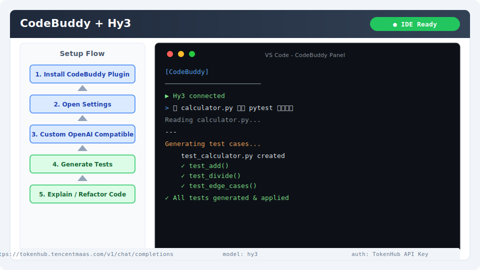

# CodeBuddy 集成指南

[CodeBuddy](https://codebuddy.ai) 是一款 AI 编程助手，支持 VS Code 和 JetBrains IDE 插件。本文档覆盖 **IDE 插件版**（区别于 CLI 版）。

## 安装与版本要求

- **VS Code** 1.85+ 或 **JetBrains IDE** 2023.2+
- **CodeBuddy 插件** 2.0+

安装方式：
- **VS Code**：扩展市场搜索 "CodeBuddy" 安装
- **JetBrains**：`File → Settings → Plugins` → 搜索 "CodeBuddy"

## 核心配置

### 1. 打开设置

右键点击状态栏 CodeBuddy 图标 → **Settings**。

### 2. 添加自定义提供商

| 字段 | 值 |
|------|-----|
| Provider | Custom OpenAI Compatible |
| API URL | `https://tokenhub.tencentmaas.com/v1/chat/completions` |
| API Key | `sk-xxx`（从 TokenHub 获取） |
| Model | `hy3` |

### 各部署模式配置

| 模式 | API URL | 模型名 | 延迟 |
|------|---------|--------|------|
| TokenHub（国内推荐） | `https://tokenhub.tencentmaas.com/v1/chat/completions` | `hy3` | 低 |
| TokenHub（海外） | `https://tokenhub-intl.tencentmaas.com/v1/chat/completions` | `hy3` | 低 |
| OpenRouter | `https://openrouter.ai/api/v1/chat/completions` | `tencent/hy3` | 中等 |
| 本地 vLLM/SGLang | `http://127.0.0.1:8000/v1/chat/completions` | `hy3` | 最低 |

## 第一次对话测试

选中任意代码片段，右键 → **CodeBuddy → Explain Code**。

或打开 CodeBuddy 聊天面板，输入：

```
Hello? 用一句话介绍 Hy3
```

**预期结果**：CodeBuddy 面板显示 Hy3 的回复内容。



## 端到端实战 Demo：生成单元测试

### 场景

为一个 `calculator.py` 文件自动生成 pytest 单元测试，覆盖所有公开函数和边界情况。

### 操作步骤

1. 在 IDE 中打开包含 `calculator.py` 的项目
2. 选中 `calculator.py` 文件
3. 右键 → **CodeBuddy → Generate Tests**
4. 或直接在聊天面板输入：
```
为 calculator.py 编写 pytest 单元测试，覆盖所有公开函数（add, subtract, multiply, divide），包含边界情况如除以零。
```

### 预期输出

CodeBuddy 会自动生成 `test_calculator.py` 文件，包含：

```
✓ test_add()
✓ test_divide()
✓ test_divide_by_zero()
✓ test_edge_cases()
```

## 常见注意事项

1. **API URL 格式**：必须包含完整路径 `/v1/chat/completions`（不是 Base URL）
2. **IDE 区别**：CodeBuddy 在 VS Code 和 JetBrains 中的配置路径略有不同
3. **深度集成限制**：自定义模式下部分 IDE 深度集成功能（实时诊断、内联建议）可能受限
4. **Reasoning 配置**：需要在请求中通过 `extra_body` 传递 `chat_template_kwargs`；CodeBuddy 自定义提供商可能不支持此参数，建议使用默认模式
5. **网络要求**：自部署或使用国内 TokenHub 时需确保 IDE 能访问对应端点
