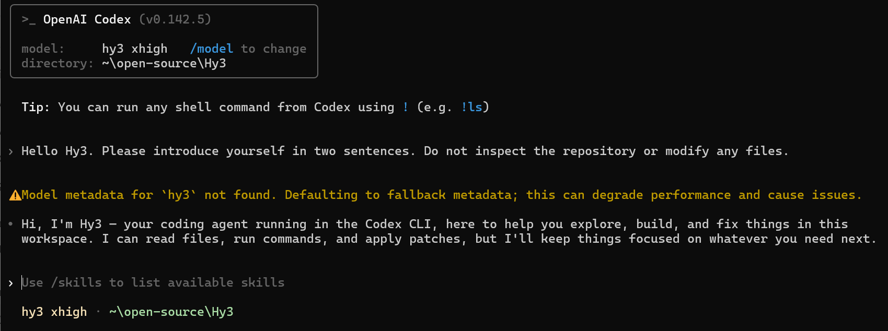
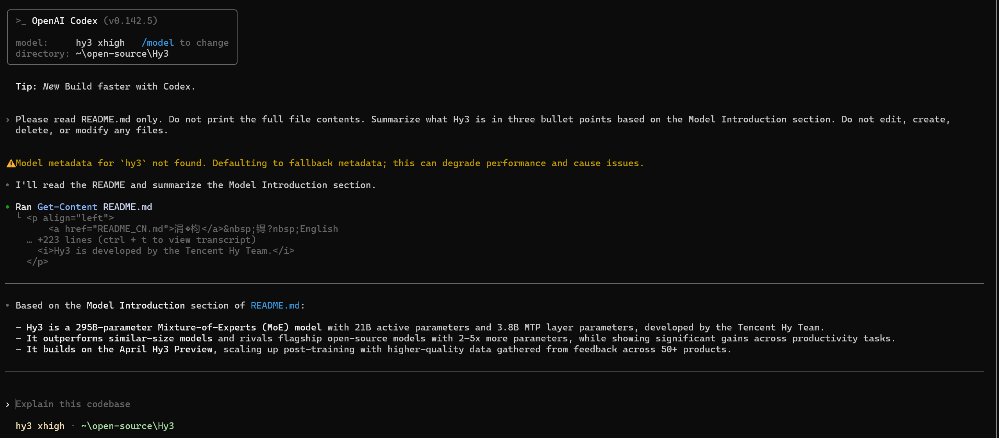
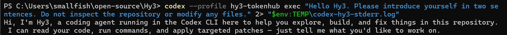
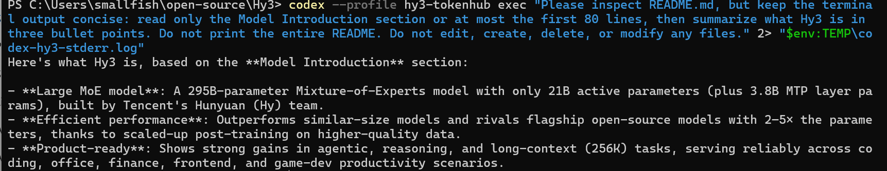

# Use Hy3 with Codex CLI

## Overview

This guide shows how to configure OpenAI Codex CLI to use Hy3 through a custom provider profile using the OpenAI Responses API.

Verification status: Codex CLI with Hy3 through Tencent Cloud TokenHub mode was manually verified with screenshots.

## Prerequisites

- Verified OpenAI Codex CLI version: `0.142.5`.
- npm package: `@openai/codex`.
- Install Codex CLI with npm:

```powershell
npm install -g @openai/codex
```

- Confirm the installed version:

```powershell
codex --version
```

- Observed command paths:
  - `%APPDATA%\npm\codex`
  - `%APPDATA%\npm\codex.cmd`
  - `%APPDATA%\npm\codex.ps1`
- The screenshots and original verification in this guide were produced with Codex CLI `0.142.5`. A later compatibility check used Codex CLI `0.144.1`; this does not change the recorded screenshot verification environment.
- See the [official Codex CLI guide](https://developers.openai.com/codex/cli) for current installation and usage details.
- Choose one Hy3 setup mode:
  - TokenHub cloud API mode: manually verified.
  - Local self-hosted mode: Not verified in this PR.

## Option A: TokenHub Cloud API Mode

Use TokenHub when you want to call Hy3 through Tencent Cloud TokenHub without self-hosting.

See [tokenhub.md](tokenhub.md) for shared setup and safety notes.

The basic TokenHub Hy3 Chat Completions API smoke test is verified separately in [tokenhub.md](tokenhub.md). Codex CLI uses the OpenAI Responses API through its custom provider profile and was also manually verified through TokenHub.

| Setting | Value |
|:---|:---|
| Codex profile | `hy3-tokenhub` |
| User-level profile path | `%USERPROFILE%\.codex\hy3-tokenhub.config.toml` |
| Model provider name | `tokenhub` |
| Codex model | `hy3` |
| TokenHub model | `hy3` |
| TokenHub base URL | `https://tokenhub.tencentmaas.com/v1` |
| TokenHub Responses endpoint | `https://tokenhub.tencentmaas.com/v1/responses` |
| Codex wire API | `responses` |
| API key environment variable | `TOKENHUB_API_KEY` |
| API key | User-created TokenHub API key, not committed and not documented |
| Protocol | OpenAI Responses API through a Codex CLI custom provider profile |

If the TokenHub API key access scope is limited, Hy3 must be included in that scope.

## Option B: Local Self-hosted Mode

The repository documents local Hy3 serving through OpenAI-compatible Chat Completions endpoints in [local-server.md](local-server.md).

Codex CLI custom providers use the OpenAI Responses API. Therefore, do not assume that a Chat Completions-only local endpoint can be used directly by Codex CLI.

| Setting | Value |
|:---|:---|
| Example local base URL | `http://127.0.0.1:8000/v1` |
| Model | `hy3` |
| API key for local testing | `EMPTY` |
| Codex wire API requirement | OpenAI Responses-compatible endpoint |
| Verification status | Not verified in this PR |

For TokenHub cloud API mode, no local Hy3 server is required.

For local self-hosted deployment facts, see [local-server.md](local-server.md). Direct Codex CLI connectivity to the repository-documented local serving endpoints was not verified in this PR.

## Configure the Tool

Codex CLI was configured with a user-level profile:

```text
%USERPROFILE%\.codex\hy3-tokenhub.config.toml
```

Do not commit `%USERPROFILE%\.codex\hy3-tokenhub.config.toml`, Codex auth files, or TokenHub API keys.

Verified profile shape:

```toml
model = "hy3"
model_provider = "tokenhub"

[model_providers.tokenhub]
name = "Tencent Cloud TokenHub"
base_url = "https://tokenhub.tencentmaas.com/v1"
env_key = "TOKENHUB_API_KEY"
wire_api = "responses"
```

Codex CLI currently uses `responses` as the custom-provider wire API. It is also the default when omitted, but this guide sets it explicitly so the actual protocol is clear.

The original Codex CLI `0.142.5` screenshots were captured with `wire_api` omitted. A later compatibility check with Codex CLI `0.144.1` explicitly set `wire_api = "responses"` and completed successfully.

Set the TokenHub API key in the current shell through `TOKENHUB_API_KEY`. Do not write the key into the profile file.

Verified modes:

- Interactive TUI mode first chat.
- Interactive TUI mode README summary task.
- Non-interactive exec mode first chat.
- Non-interactive exec mode README summary task.

## First Chat

Prompt:

```text
Hello Hy3. Please introduce yourself in two sentences. Do not inspect the repository or modify any files.
```

Interactive result: Codex CLI selected model `hy3` with provider `tokenhub` and returned a model response.

Exec command:

```powershell
codex --profile hy3-tokenhub exec "Hello Hy3. Please introduce yourself in two sentences. Do not inspect the repository or modify any files." 2> "$env:TEMP\codex-hy3-stderr.log"
```

Exec result: returned a concise model response.

## Real Task Demo

Interactive README task prompt:

```text
Please read README.md only. Do not print the full file contents. Summarize what Hy3 is in three bullet points based on the Model Introduction section. Do not edit, create, delete, or modify any files.
```

Interactive result: Codex CLI ran `Get-Content README.md` and returned a three-bullet summary based on the Model Introduction section.

Exec README task command:

```powershell
codex --profile hy3-tokenhub exec "Please inspect README.md, but keep the terminal output concise: read only the Model Introduction section or at most the first 80 lines, then summarize what Hy3 is in three bullet points. Do not print the entire README. Do not edit, create, delete, or modify any files." 2> "$env:TEMP\codex-hy3-stderr.log"
```

Exec result: returned a concise three-bullet summary.

No repository files were intentionally edited.

## Screenshots / GIFs

- Interactive first chat screenshot:



- Interactive README demo screenshot:



- Exec first chat screenshot:



- Exec README demo screenshot:



Screenshots are included under `docs/integrations/assets/codex-cli/`. GIFs are optional and were not added.

Screenshots and GIFs must not reveal API keys.

## Troubleshooting

- Codex may warn:

```text
Model metadata for `hy3` not found. Defaulting to fallback metadata.
```

- Some raw runs may print model-manager or stream-delta warnings, such as model-list parsing warnings or `OutputTextDelta without active item`.
- In an additional Codex CLI `0.144.1` compatibility check with explicit `wire_api = "responses"`, the request completed successfully, but Codex printed a model-list parsing warning (`missing field models`) and repeated `OutputTextDelta without active item` messages.
- These warnings did not prevent the final response in the verified compatibility check, but they indicate that TokenHub and Codex CLI are not fully compatible in every auxiliary model-metadata and streaming-event detail.
- Redirecting stderr to a temporary log can keep exec screenshots focused on the successful model response.
- A TokenHub `429 Too Many Requests` error may appear after repeated Codex runs; wait before retrying.
- Do not commit `%USERPROFILE%\.codex\hy3-tokenhub.config.toml` or any Codex auth files.
- Do not include or commit the TokenHub API key.
- TokenHub API key access scope for Hy3: Future verification item.
- Direct local endpoint connectivity: Not verified in this PR.
- Local self-hosted authentication or API key handling: Not verified in this PR.
- Dedicated streaming-behavior and tool-calling tasks: Not verified in this PR.

## Verified Environment

| Item | Value |
|:---|:---|
| OS | Windows 11 25H2 (build 26200) |
| Tool | OpenAI Codex CLI |
| Codex CLI version | `0.142.5` |
| Package | `@openai/codex` |
| Install command | `npm install -g @openai/codex` |
| Command path 1 | `%APPDATA%\npm\codex` |
| Command path 2 | `%APPDATA%\npm\codex.cmd` |
| Command path 3 | `%APPDATA%\npm\codex.ps1` |
| Setup mode | Tencent Cloud TokenHub cloud API mode |
| Hy3 server backend | TokenHub cloud API |
| Codex profile | `hy3-tokenhub` |
| User-level profile path | `%USERPROFILE%\.codex\hy3-tokenhub.config.toml` |
| Model provider name | `tokenhub` |
| Codex model | `hy3` |
| TokenHub model | `hy3` |
| TokenHub base URL | `https://tokenhub.tencentmaas.com/v1` |
| Responses endpoint | `https://tokenhub.tencentmaas.com/v1/responses` |
| Codex wire API | `responses` |
| API key env var | `TOKENHUB_API_KEY` |
| Verified modes | Interactive TUI and non-interactive exec |
| Additional compatibility check | Codex CLI `0.144.1` with explicit `wire_api = "responses"` |
| Additional check result | Final response completed with non-blocking model-list and stream-delta warnings |
| Verification date | 2026-07-09 |
