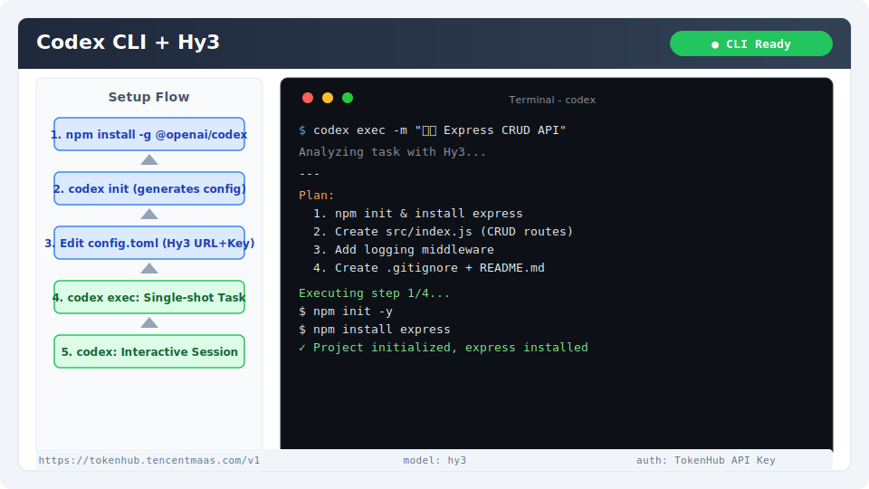

# Codex CLI 集成指南

[Codex CLI](https://github.com/openai/codex) 是 OpenAI 开源的轻量级终端 AI 编程 Agent。支持多种模型后端，通过配置 OpenAI 兼容接口即可接入 Hy3。

## 安装与版本要求

- **Node.js**：≥ 18
- **Codex CLI**：最新版本

安装方式：

```bash
npm install -g @openai/codex
```

验证安装：

```bash
codex --version
```

> 预期输出：`@openai/codex/版本号`（如 `@openai/codex/1.0.0`）

## 核心配置

### 1. 初始化配置

```bash
codex init
```

此命令会生成 `~/.codex/config.toml` 配置文件。

### 2. 编辑配置文件

编辑 `~/.codex/config.toml`（Windows 路径为 `%USERPROFILE%\.codex\config.toml`）：

```toml
# 使用 Hy3 作为模型后端
[model]
provider = "openai-compatible"

[model.openai_compatible]
base_url = "https://tokenhub.tencentmaas.com/v1"
api_key = "sk-xxx"
model = "hy3"
```

### 3. 使用环境变量（可选）

如果不希望写入配置文件，可使用环境变量：

```bash
export CODEX_API_KEY="sk-xxx"
export CODEX_BASE_URL="https://tokenhub.tencentmaas.com/v1"
export CODEX_MODEL="hy3"
```

### 各部署模式配置

| 模式 | base_url | model | 推荐场景 |
|------|----------|-------|----------|
| TokenHub（国内推荐） | `https://tokenhub.tencentmaas.com/v1` | `hy3` | 国内用户首选 |
| TokenHub（海外） | `https://tokenhub-intl.tencentmaas.com/v1` | `hy3` | 海外用户 |
| OpenRouter | `https://openrouter.ai/api/v1` | `tencent/hy3` | 已有 OpenRouter 账号 |
| 本地 vLLM/SGLang | `http://127.0.0.1:8000/v1` | `hy3` | 本地部署开发测试 |

## 第一次对话测试

```bash
codex exec -m "用 Python 写一个计算斐波那契数列的函数，并测试 fib(10)"
```

**预期结果**：终端显示 Codex CLI 使用 Hy3 生成的代码和执行结果。

> - `-m` 参数表示单次消息模式（非交互式）
> - 省略 `-m` 进入交互式对话模式



## 端到端实战 Demo：用 Codex CLI 搭建 Express API 项目

### 场景

使用 Codex CLI 的交互相似模式，让 Hy3 从零搭建一个 Node.js Express REST API 项目。

### 操作步骤

1. 创建新项目目录：

```bash
mkdir hy3-express-demo && cd hy3-express-demo
```

2. 进入交互模式：

```bash
codex
```

3. 在交互会话中输入：

```
创建一个 Express.js 后端项目：
- 初始化 package.json 和安装依赖
- 创建 RESTful API，包含 /api/users 的 CRUD 端点
- 使用内存数组存储用户数据
- 添加请求日志中间件
- 创建 .gitignore 和 README.md
- 确保所有代码通过 ESLint 检查
```

4. 观察 Codex CLI 逐步：
   - 执行 `npm init` 和 `npm install express`
   - 创建 `src/index.js` 包含完整 CRUD 路由
   - 创建项目文档
   - 安装并配置 ESLint

5. 完成后启动服务验证：

```bash
npm start
curl http://localhost:3000/api/users
```

### 预期行为

- Codex CLI 智能规划任务步骤
- 出现确认提示时（如 `npm install`）按 `y` 确认
- 所有文件创建完成，服务可直接运行
- 返回空数组 `[]` 表示 CRUD API 就绪

## 交互模式命令

进入 `codex` 交互模式后，支持以下特殊命令：

| 命令 | 说明 |
|------|------|
| `/help` | 显示帮助 |
| `/clear` | 清除会话历史 |
| `/undo` | 撤销最近操作 |
| `/status` | 显示当前会话状态 |
| `/exit` | 退出交互模式 |

## 常见注意事项

1. **Node.js 版本**：Codex CLI 依赖 Node.js ≥ 18，旧版本可能导致安装失败
2. **Windows 兼容性**：Windows 上使用 Git Bash 或 WSL2 体验最佳，PowerShell / CMD 下文件路径处理可能存在差异
3. **确认提示**：首次运行会弹出执行确认（exec approve），可配置 `auto_approve: true` 跳过
4. **Reasoning 模式**：Codex CLI 当前版本不直接支持 `chat_template_kwargs`，推理模式控制需要通过在系统 Prompt 中注入提示词实现
5. **超时设置**：Hy3 在推理模式下响应较慢，建议调大超时：`export CODEX_TIMEOUT=120000`
6. **多轮会话**：长时间会话可能导致上下文膨胀，适时使用 `/clear` 重置
7. **仓库级操作**：Codex CLI 适合在当前项目目录内使用，切换项目需退出后重新 `cd` 进入
