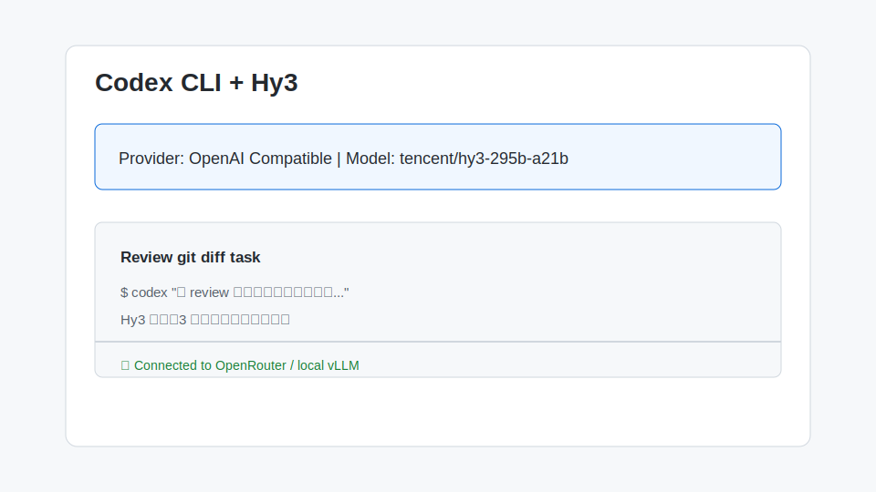

# 在 Codex CLI 中使用 Hy3

[Codex CLI](https://github.com/openai/codex) 是 OpenAI 发布的官方编码 Agent CLI，支持通过 `--provider` / `--model` 参数切换任意 OpenAI-compatible 端点。本文介绍如何把 Codex CLI 的后端换成 Hy3。

## 1. 安装与版本要求

- **Node.js**：≥ 20（Codex CLI 基于 Node.js 发布）
- **Codex CLI**：通过 npm 安装最新版
  ```bash
  npm install -g @openai/codex
  ```
- **网络**：能访问本地 vLLM/SGLang、OpenRouter 或 TokenHub。
- **账号**：已有 Hy3 可用的 API Key。

验证安装：

```bash
codex --version
```

## 2. 核心配置项

Codex CLI 通过环境变量指定 OpenAI-compatible 端点：

```bash
export OPENAI_BASE_URL="https://openrouter.ai/api/v1"
export OPENAI_API_KEY="sk-or-v1-..."
export CODEX_MODEL="tencent/hy3-295b-a21b"
```

Windows PowerShell：

```powershell
$env:OPENAI_BASE_URL="https://openrouter.ai/api/v1"
$env:OPENAI_API_KEY="sk-or-v1-..."
$env:CODEX_MODEL="tencent/hy3-295b-a21b"
```

| 配置项 | 说明 |
| --- | --- |
| `OPENAI_BASE_URL` | Hy3 的 OpenAI-compatible Base URL，例如 OpenRouter `https://openrouter.ai/api/v1` |
| `OPENAI_API_KEY` | 对应服务商的 API Key |
| `CODEX_MODEL` | 模型名，OpenRouter 填 `tencent/hy3-295b-a21b`，本地部署填 `hy3` |

> 如果只想临时切换模型，也可以运行时指定：
> ```bash
> codex --model tencent/hy3-295b-a21b
> ```

## 3. 第一次对话测试

在项目目录下启动 Codex：

```bash
codex
```

输入最小测试 Prompt：

```text
请用一句话介绍 Hy3 模型，并输出数字 1
```

预期结果：Codex 能正常收到 Hy3 的回复，并显示思考与最终答案。



## 4. 端到端实战 Demo：让 Hy3  review 当前 git diff

Codex CLI 支持 `/git` 等快捷指令读取仓库上下文。结合 Hy3 的推理能力，可以用一条自然语言指令完成代码审查：

```bash
codex "请 review 当前仓库的未提交改动，列出 3 个最重要的改进点，并按风险从高到低排序"
```

操作步骤：

1. 进入一个 Git 仓库。
2. 执行 `git diff` 确认有未提交改动。
3. 运行上述 Codex 指令。
4. Hy3 会自动读取 `git diff` 上下文，并给出结构化 review 结果。

示例输出：

```markdown
1. **高风险**：`payment.py` 中缺少对 `amount` 的负数校验，可能导致重复退款。
2. **中风险**：`database.py` 未关闭连接池，高并发下可能耗尽连接。
3. **低风险**：`utils.py` 的日志格式不统一，建议统一使用 JSON 结构化日志。
```

## 5. 常见注意事项

1. **模型参数映射**：Codex CLI 默认使用 OpenAI 协议字段。如果后端是本地 vLLM/SGLang，需要确认其支持 `tools`、`stream` 和 `reasoning` 相关字段；Hy3 的 vLLM/SGLang 部署需开启 `--tool-call-parser` 与 `--reasoning-parser`。
2. **Context Window**：Codex CLI 会把当前项目文件作为上下文发送。Hy3 支持 256K 上下文，但 Codex 默认 tokens 上限较低，可在 `~/.codex/config.yaml` 中调大 `max_tokens`。
3. **全屏交互模式**：Codex CLI 默认进入全屏 TUI。如果只想单次执行，使用 `--quiet` 或管道输入：
   ```bash
   echo "解释这段代码" | codex --quiet
   ```
4. **Rate limit**：OpenRouter 免费模型有 RPM 限制，复杂任务建议降低并发或升级套餐。
5. **Reasoning effort**：Codex CLI 目前对 `extra_body` 支持有限，如需强制开启/关闭 Hy3 推理，建议通过本地 vLLM/SGLang 的默认模板参数控制，或在外部脚本中直接调用 API。
