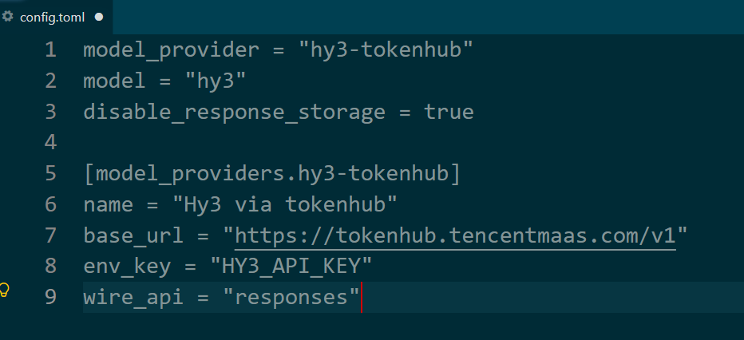
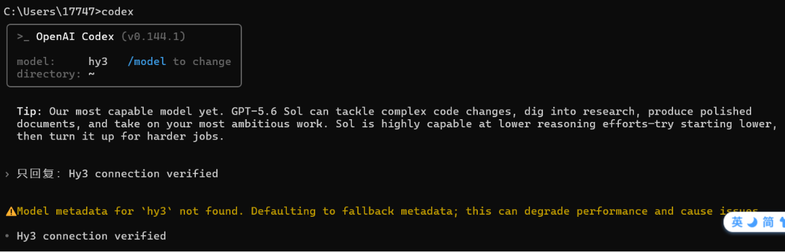
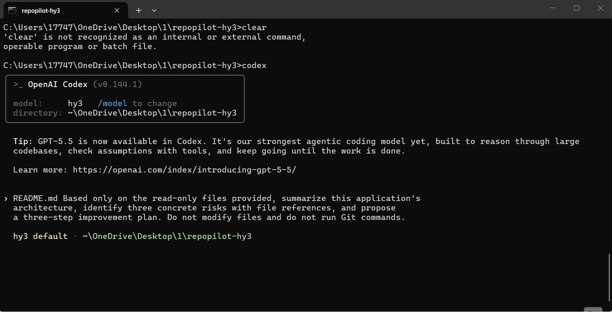

<p align="left">
  <a href="codex-cli.md">English</a>&nbsp; | &nbsp;中文
</p>

# 在 Codex CLI 中使用 Hy3

## 概述

腾讯 TokenHub 提供与当前 Codex CLI 自定义供应商兼容的 Responses API 端点。本流程已于 2026 年 7 月 12 日使用 Codex CLI `0.144.1` 和模型 ID `hy3` 完成验证。

## 配置

在用户级 `~/.codex/config.toml` 中加入：

```toml
model_provider = "hy3-tokenhub"
model = "hy3"
disable_response_storage = true

[model_providers.hy3-tokenhub]
name = "Hy3 via TokenHub"
base_url = "https://tokenhub.tencentmaas.com/v1"
env_key = "HY3_API_KEY"
wire_api = "responses"
```

在当前 PowerShell 会话中设置 Key，然后从仓库根目录启动 Codex：

```powershell
$env:HY3_API_KEY = "<TENCENT_TOKENHUB_API_KEY>"
codex
```



## 连接检查

```text
请只回复：Hy3 connection verified
```



Codex CLI 可能提示没有 `hy3` 的内置模型元数据，并回退到通用元数据。已验证的对话仍能完成，但后续版本中可能需要显式配置模型上下文和推理默认值。

## 只读仓库任务

只附加预期的只读文件，并使用以下原始提示词：

```text
Based only on the read-only files provided, summarize this application's
architecture, identify three concrete risks with file references, and propose
a three-step improvement plan. Do not modify files and do not run Git commands.
```



## 常见问题

- 当前 Codex CLI 自定义供应商要求 `wire_api = "responses"`，不要设置 Chat Completions 模式。
- 确认启动 Codex 的进程能够读取 `HY3_API_KEY`。
- 修改 `config.toml` 或环境变量后，完全退出并重新启动 Codex。

## 参考资料

- [腾讯 TokenHub：在 Codex 中使用 Hy3](https://cloud.tencent.com/document/product/1823/133532)
- [OpenAI Codex 配置参考](https://developers.openai.com/codex/config-reference/)
