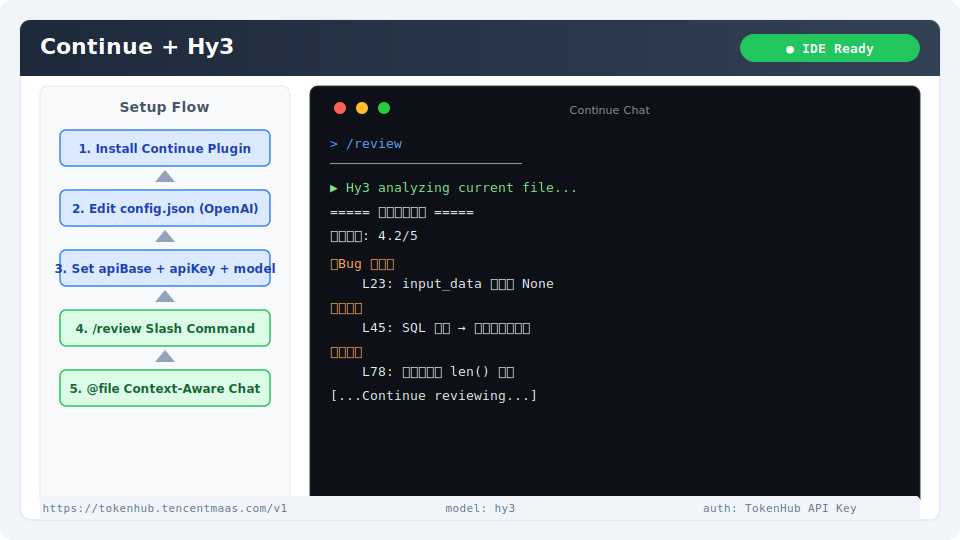

# Continue 集成指南

[Continue](https://continue.dev) 是一个开源的 AI 编程助手，支持 VS Code 和 JetBrains IDE。它提供代码补全、对话式编程和自定义 AI 工作流，支持配置多种模型提供商。

## 安装与版本要求

- **VS Code** 1.85+ 或 **JetBrains IDE** 2023.2+
- **Continue 插件**：最新版本

安装方式：
- **VS Code**：扩展市场搜索 "Continue" 安装
- **JetBrains**：`File → Settings → Plugins` → 搜索 "Continue"

验证安装：侧边栏出现 Continue 图标，`Ctrl+L`（Mac: `Cmd+L`）可打开聊天面板。

## 核心配置

### 1. 打开配置文件

Continue 使用 `config.json` 管理模型配置。

- **VS Code**：`Ctrl+Shift+P` → 输入 "Continue: Open config.json"
- **JetBrains**：侧边栏 Continue → 齿轮图标 → "Open config.json"

### 2. 添加 Hy3 模型

在 `models` 数组中添加：

```json
{
  "models": [
    {
      "title": "Hy3",
      "provider": "openai",
      "model": "hy3",
      "apiBase": "https://tokenhub.tencentmaas.com/v1",
      "apiKey": "sk-xxx"
    }
  ]
}
```

### 3. 完整配置示例

```json
{
  "models": [
    {
      "title": "Hy3",
      "provider": "openai",
      "model": "hy3",
      "apiBase": "https://tokenhub.tencentmaas.com/v1",
      "apiKey": "sk-xxx",
      "requestOptions": {
        "extraBodyProperties": {
          "chat_template_kwargs": {
            "reasoning_effort": "low"
          }
        }
      }
    }
  ],
  "tabAutocompleteModel": {
    "title": "Hy3",
    "provider": "openai",
    "model": "hy3",
    "apiBase": "https://tokenhub.tencentmaas.com/v1",
    "apiKey": "sk-xxx"
  }
}
```

### 各部署模式配置

| 模式 | apiBase | model | 推荐场景 |
|------|---------|-------|----------|
| TokenHub（国内推荐） | `https://tokenhub.tencentmaas.com/v1` | `hy3` | 国内用户首选 |
| TokenHub（海外） | `https://tokenhub-intl.tencentmaas.com/v1` | `hy3` | 海外用户 |
| OpenRouter | `https://openrouter.ai/api/v1` | `tencent/hy3` | 已有 OpenRouter 账号 |
| 本地 vLLM/SGLang | `http://127.0.0.1:8000/v1` | `hy3` | 本地开发测试 |

## 第一次对话测试

1. 使用 `Ctrl+L`（Mac: `Cmd+L`）打开 Continue 聊天面板
2. 在模型选择下拉中切换到 `Hy3`
3. 输入：

```
用 Python 实现一个简单的 LRU Cache，使用 OrderedDict
```

**预期结果**：聊天面板显示 Hy3 生成的完整 LRU Cache 实现代码。



## 端到端实战 Demo：用 Continue 的 Rules 功能创建代码审查工作流

### 场景

利用 Continue 的自定义 Rules 和 Slash Commands 功能，创建一个一键式代码审查工作流，自动审查当前文件的代码质量。

### 操作步骤

1. 在项目根目录创建 `.continuerules` 文件：

```
你是代码审查助手。分析代码时请关注：
1. 潜在的 bug 和逻辑错误
2. 安全漏洞（SQL注入、XSS、不安全反序列化等）
3. 性能问题（不必要循环、内存泄漏等）
4. 代码风格和可读性
5. 测试覆盖率建议
每次审查给出 1-5 分总评。
```

2. 打开任意 Python 文件
3. 使用 `Ctrl+L` 打开聊天面板，选择 Hy3 模型
4. 输入：

```
@file 请审查当前文件，按照 .continuerules 中的标准给出评分和建议
```

5. Continue 会读取当前文件内容和 Rules，Hy3 据此给出结构化审查报告

### 预期输出

```
===== 代码审查报告 =====
总体评分: 4.2/5

【Bug 风险】
- L23: input_data 可能为 None，缺少空值检查

【安全】
- L45: SQL 查询使用字符串拼接，建议改用参数化查询

【性能】
- L78: 循环内重复调用 len()，建议提前计算

【风格】
- 类型注解覆盖完整 ✓
- 函数长度合理 ✓

【测试建议】
- 建议为核心函数 add_user() 和 delete_user() 添加单元测试
```

### 扩展：创建 Slash Command

在 `config.json` 中添加自定义 Slash Command：

```json
{
  "slashCommands": [
    {
      "name": "review",
      "description": "Hy3 代码审查",
      "prompt": "请审查当前文件，按照 .continuerules 中的标准给出评分和建议。输出格式：总体评分 + 分类问题清单 + 改进建议。"
    }
  ]
}
```

配置后，在聊天中直接输入 `/review` 即可触发审查。

## 常见注意事项

1. **配置文件位置**：`config.json` 支持项目级（`.continue/config.json`）和用户级（`~/.continue/config.json`），推荐项目级配置
2. **Tab 自动补全**：Hy3 的 API 延迟相对较高，不建议用于 Tab 自动补全，保留 `tabAutocompleteModel` 为本地模型
3. **`extraBodyProperties` 格式**：Continue 使用 `requestOptions.extraBodyProperties` 传递额外参数，注意 JSON 嵌套层级
4. **reasoning_effort 值**：继续支持通过 `extraBodyProperties` 传递 `chat_template_kwargs`，实现原生推理模式控制
5. **上下文本地管理**：Continue 使用 `@file`、`@folder` 等标签手动管理上下文，建议在复杂任务中明确指定上下文范围
6. **模型热切换**：Continue 支持在聊天过程中切换模型，无需刷新或重置对话
7. **JetBrains 差异**：JetBrains 版本的 Continue 某些功能（如 Slash Commands）的配置路径与 VS Code 不同
