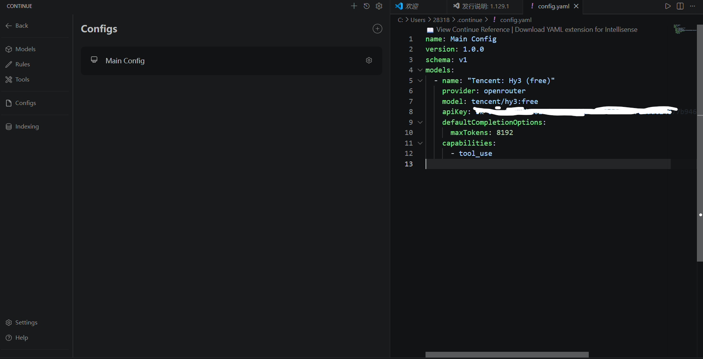
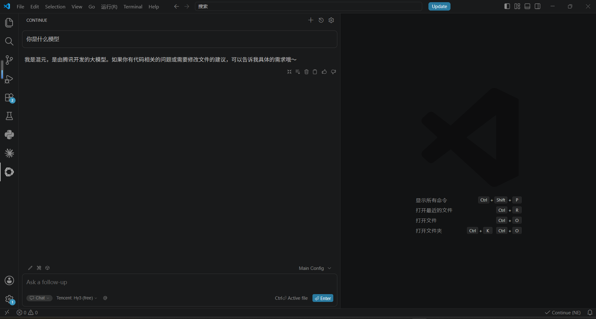

# Continue + Hy3

[Continue](https://continue.dev/) 是 VS Code / JetBrains 里的补全和对话插件，可以填自定义 OpenAI 兼容地址，用来接 Hy3。

## 安装

- VS Code 扩展市场搜 **Continue** 装上
- 准备好 OpenRouter 或 TokenHub 的 Key

装完后侧边栏会有 Continue 图标。

## 配置

打开 Continue 配置（面板齿轮，或本机 `~/.continue/config.json`，以你版本为准）。

OpenRouter 示例（和截图一致）：

```json
{
  "models": [
    {
      "title": "Hy3",
      "provider": "openai",
      "model": "tencent/hy3:free",
      "apiBase": "https://openrouter.ai/api/v1",
      "apiKey": "<YOUR_KEY>"
    }
  ]
}
```

| 字段 | 含义 |
|------|------|
| provider | 选 openai / OpenAI 兼容 |
| model | OpenRouter 上显示的 ID |
| apiBase | `https://openrouter.ai/api/v1` |
| apiKey | 你的 Key |

TokenHub 的话 model 用 `hy3`，apiBase 用 `https://tokenhub.tencentmaas.com/v1`。

界面里如果有 max tokens，填 4096 或 8192 即可；填几十万有时会直接报错。

## 试一次

1. 打开一个源文件，选中几行代码  
2. 打开 Continue，模型选 Hy3  
3. 问：这段代码在干什么，用中文说几句  
4. 能正常回就行  

## 截图





## 常见问题

- Base URL 一般要带 `/v1`
- 401：Key 不对或过期
- 找不到模型：对照提供商页面上的 model id
- 别把带真实 Key 的配置提交到公开仓库
