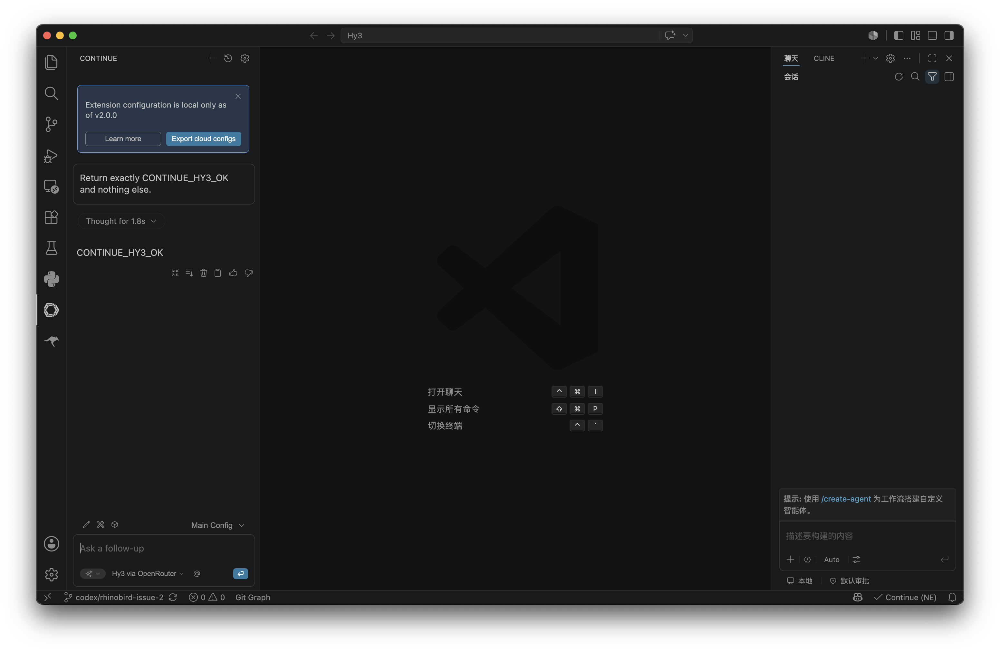

# 在 Continue 中使用 Hy3

Continue 是 VS Code 中的开源 AI Agent。本指南在 VS Code 稳定版和 Continue `2.0.0` 上核对。

## 安装与版本

在 VS Code Extensions 中搜索 `Continue`，确认发布者为 `continue.dev`，或运行：

```bash
code --install-extension Continue.continue
code --list-extensions --show-versions | grep -i continue
```

## 配置

1. 打开 Continue 面板，选择 **Add model**。
2. Provider 选择 **OpenAI Compatible**；若当前版本提供 OpenRouter，可直接选择它。
3. 填写 `https://openrouter.ai/api/v1`、OpenRouter Key 和 `tencent/hy3:free`。
4. 类型选择 Chat，保存后把 Hy3 设为当前 Chat model。

| 配置项 | 值 |
| --- | --- |
| Provider | OpenAI Compatible / OpenRouter |
| Base URL | `https://openrouter.ai/api/v1` |
| Model | `tencent/hy3:free` |
| API Key | Continue Secret Storage 中的 OpenRouter Key |
| 协议 | Chat Completions |

## 真实调用验证

本机在 Continue `2.0.0` 中选择 `Hy3 via OpenRouter`，发送：

```text
Return exactly CONTINUE_HY3_OK and nothing else.
```

Continue 显示 `Thought for 1.8s` 并返回 `CONTINUE_HY3_OK`；截图底部保留当前模型名称。



## 第一次对话

在 Continue Chat 中确认当前模型为 Hy3，然后发送：

```text
只读取当前仓库。请列出顶层目录，并用一句话说明每个目录的职责；不要修改文件。
```

返回内容应与 Explorer 中的真实目录一致。若出现模型臆造，使用 `@Codebase` 或显式添加文件作为上下文后重试。

## 端到端任务

打开一份 README，并发送：

```text
检查当前 README 的安装步骤。生成一个最小补丁：补充缺失的 Python 版本、环境变量和验证命令，不要改动其他章节。
```

审阅 Continue 提供的 diff，只接受目标段落的修改，然后运行文档中的验证命令。最后要求 Hy3 根据实际 diff 生成三条 PR 描述。

## 注意事项

- Continue `2.x` 与旧版 `config.json`/`config.yaml` 界面不同，优先使用当前 UI 添加模型。
- Base URL 应以 `/v1` 结尾，不能写完整 `/chat/completions` 路径。
- 免费模型可能有排队；不要反复点击发送造成重复任务。
- Agent 模式执行命令前必须审阅命令和工作区改动。
