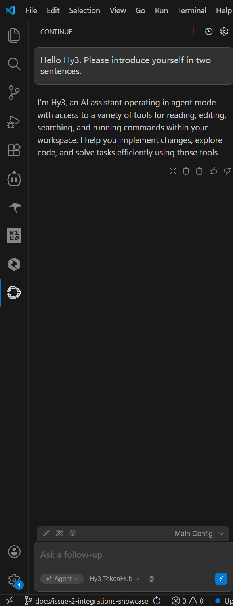
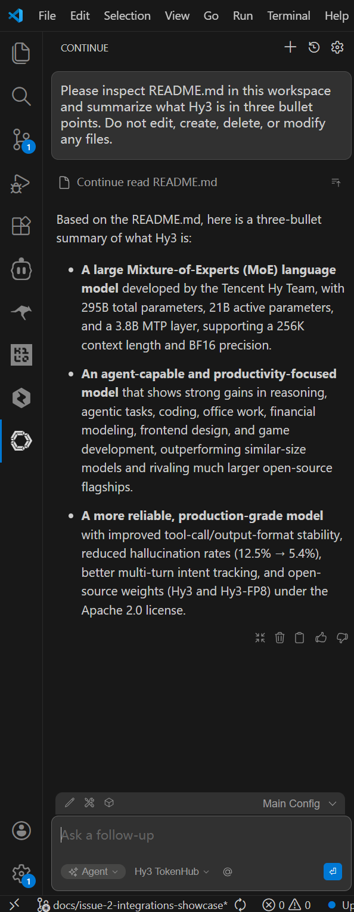

# Use Hy3 with Continue

## Overview

This guide shows how to configure the Continue VS Code extension to use Hy3 through an OpenAI-compatible provider.

Verification status: Continue with Hy3 through Tencent Cloud TokenHub mode was manually verified with screenshots.

## Prerequisites

- Verified Continue version: `2.0.0`.
- VS Code extension identifier: `continue.continue`.
- Install Continue from the VS Code Extensions view, or run:

```powershell
code --install-extension continue.continue
```

- Confirm the installed extension and version:

```powershell
code --list-extensions --show-versions | Select-String -Pattern "continue"
```

Expected verified result:

```text
continue.continue@2.0.0
```

- Continue `2.0.0` uses local YAML configuration.
- Choose one Hy3 setup mode:
  - TokenHub cloud API mode: manually verified.
  - Local self-hosted mode: Not verified in this PR.

See the [official Continue installation guide](https://docs.continue.dev/ide-extensions/install) for current installation details.

## Option A: TokenHub Cloud API Mode

Use TokenHub when you want to call Hy3 through Tencent Cloud TokenHub without self-hosting.

See [tokenhub.md](tokenhub.md) for shared setup and safety notes.

The values below use the verified Guangzhou / China-mainland endpoint. Use the TokenHub domain that matches your API key and service region; see [tokenhub.md](tokenhub.md) for region selection.

The basic TokenHub Hy3 Chat Completions API smoke test is verified in [tokenhub.md](tokenhub.md). Continue through TokenHub was also manually verified.

| Setting | Value |
|:---|:---|
| Base URL | `https://tokenhub.tencentmaas.com/v1` |
| Chat Completions endpoint | `https://tokenhub.tencentmaas.com/v1/chat/completions` |
| Provider | `openai` |
| Model | `hy3` |
| API key source | `${{ secrets.TOKENHUB_API_KEY }}` |
| Global secret file | `%USERPROFILE%\.continue\.env` |
| Protocol | OpenAI-compatible Chat Completions |
| Config name shown in UI | Main Config |
| Model display in Continue UI | Hy3 TokenHub |
| Chat mode used | Agent |

If the TokenHub API key access scope is limited, Hy3 must be included in that scope.

## Option B: Local Self-hosted Mode

Use local self-hosted mode when Hy3 is running as a local OpenAI-compatible Chat Completions server.

See [local-server.md](local-server.md) for the repository-documented vLLM and SGLang serving examples.

| Setting | Value |
|:---|:---|
| Base URL | `http://127.0.0.1:8000/v1` |
| Model | `hy3` |
| API key for local testing | `EMPTY` |
| API protocol | OpenAI-compatible Chat Completions |
| Verification status | Not verified in this PR |

For TokenHub cloud API mode, no local Hy3 server is required.

For local self-hosted mode, follow [local-server.md](local-server.md).

Continue connectivity with TokenHub mode was manually verified. Local self-hosted connectivity was not verified in this PR.

## Configure the Tool

Continue was configured through the user-level YAML configuration file:

```text
%USERPROFILE%\.continue\config.yaml
```

Verified configuration shape:

```yaml
name: Main Config
version: 1.0.0
schema: v1

models:
  - name: Hy3 TokenHub
    provider: openai
    model: hy3
    apiBase: https://tokenhub.tencentmaas.com/v1
    apiKey: ${{ secrets.TOKENHUB_API_KEY }}
```

Store the TokenHub key separately in:

```text
%USERPROFILE%\.continue\.env
```

Use standard dotenv syntax without quotes:

```dotenv
TOKENHUB_API_KEY=<user-created TokenHub API key>
```

Do not place the raw key directly in `config.yaml`. Do not commit, share, or screenshot the `.env` file.

Continue resolves `${{ secrets.TOKENHUB_API_KEY }}` from supported secret sources. For this Windows VS Code verification, the global `%USERPROFILE%\.continue\.env` file was used.

After adding or changing the `.env` secret, completely exit and restart VS Code before testing. A window reload alone may leave the extension using stale secret state.

See the [Continue local secrets documentation](https://docs.continue.dev/faqs#managing-local-secrets-and-environment-variables) for the current secret resolution order and restart requirement.

## First Chat

Mode: Agent.

Prompt:

```text
Hello Hy3. Please introduce yourself in two sentences.
```

Result: completed successfully.

## Real Task Demo

Mode: Agent.

Task:

```text
Please inspect README.md in this workspace and summarize what Hy3 is in three bullet points. Do not edit, create, delete, or modify any files.
```

Result: Continue used its built-in workspace file-reading flow to read `README.md` and returned a three-bullet summary. No repository files were edited.

This verifies Continue's workspace-reading flow in the demonstrated Agent task. It does not independently establish compatibility for every OpenAI-protocol tool-calling behavior.

## Screenshots / GIFs

- First chat screenshot:



- Real task demo screenshot:



Screenshots are included under `docs/integrations/assets/continue/`. GIFs are optional and were not added.

Screenshots and GIFs must not reveal API keys.

## Troubleshooting

- `401` errors can mean the TokenHub API key is missing, incomplete, invalid, or stale in the running VS Code extension.
- Confirm that `%USERPROFILE%\.continue\.env` contains exactly one `TOKENHUB_API_KEY=` entry with the raw key and no quotes.
- Confirm that `config.yaml` contains `apiKey: ${{ secrets.TOKENHUB_API_KEY }}` rather than the raw key.
- After changing `.env`, completely exit all VS Code windows and restart VS Code. Continue may otherwise keep using stale secret state.
- `apiBase` should be `https://tokenhub.tencentmaas.com/v1`, not the full `/chat/completions` endpoint.
- `model` should be `hy3`; the UI display name can be Hy3 TokenHub.
- VS Code extensions do not reliably inherit API keys set only in an interactive PowerShell session. Use a supported Continue `.env` secret source instead.
- TokenHub API key access scope for Hy3: Future verification item.
- Local endpoint connection issue: Not verified in this PR.
- Local self-hosted authentication or API key handling: Not verified in this PR.
- Dedicated streaming-behavior and general OpenAI-protocol tool-calling tasks: Not independently verified in this PR.

## Verified Environment

| Item | Value |
|:---|:---|
| OS | Windows 11 25H2 (build 26200) |
| Editor | VS Code |
| Extension | Continue (`continue.continue`) |
| Continue version | `2.0.0` |
| Setup mode | Tencent Cloud TokenHub cloud API mode |
| Hy3 server backend | TokenHub cloud API |
| Config file | `%USERPROFILE%\.continue\config.yaml` |
| Secret file | `%USERPROFILE%\.continue\.env` |
| Config name shown in UI | Main Config |
| Provider | `openai` |
| Base URL | `https://tokenhub.tencentmaas.com/v1` |
| Chat Completions endpoint | `https://tokenhub.tencentmaas.com/v1/chat/completions` |
| Model | `hy3` |
| Model display | Hy3 TokenHub |
| Chat mode | Agent |
| Verified modes | First chat and read-only workspace README summary |
| Original screenshot verification date | 2026-07-08 |
| Secret-reference compatibility check | 2026-07-10 |
| Secret-reference check result | Connection completed after fully restarting VS Code |
