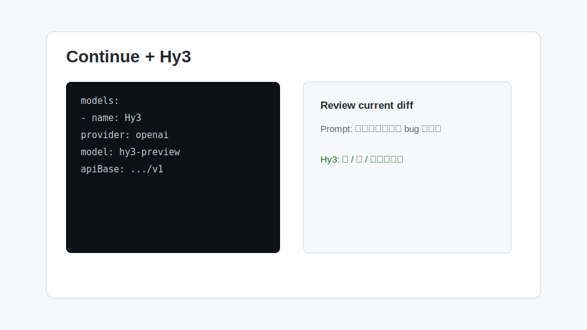

# Continue 接入 Hy3

Continue 是常用 VS Code AI 编程插件。它支持自定义模型配置，适合把 Hy3 用于代码解释、测试生成和仓库问答。



## 安装与版本要求

- VS Code
- Continue 插件
- 支持本地配置 `config.yaml` 或模型配置界面的 Continue 版本
- TokenHub API Key

## 配置项

示例配置：

```yaml
models:
  - name: Hy3
    provider: openai
    model: hy3-preview
    apiBase: https://tokenhub.tencentmaas.com/v1
    apiKey: ${{ env.TOKENHUB_API_KEY }}
```

如果当前 Continue 版本使用图形化模型配置，请填写：

| 配置项 | 值 |
| --- | --- |
| Provider | OpenAI Compatible / OpenAI |
| Model name | `hy3-preview` |
| API Base | `https://tokenhub.tencentmaas.com/v1` |
| API Key | `TOKENHUB_API_KEY` 对应值 |

## 第一次对话

在 Continue Chat 中输入：

```text
请阅读当前打开的文件，总结它的职责、主要函数和潜在风险。
```

## 真实任务 Demo

任务：生成代码审查清单。

输入：

```text
请基于当前 diff 做一次 code review，只列出可能导致 bug 的问题，按严重程度排序。
```

示例输出：

```text
1. 高：异常路径未处理，可能导致请求失败后 UI 一直 loading。
2. 中：缓存 key 未包含用户 ID，可能造成跨用户数据污染。
3. 低：缺少空数组测试。
```

## 常见注意事项

- `apiBase` 通常填写 Base URL，不包含 `/chat/completions`。
- 如果环境变量没有生效，先在终端中确认 `TOKENHUB_API_KEY` 已设置，再重启 VS Code。
- Continue 的不同版本配置字段可能略有差异，优先以当前插件设置页面为准。
