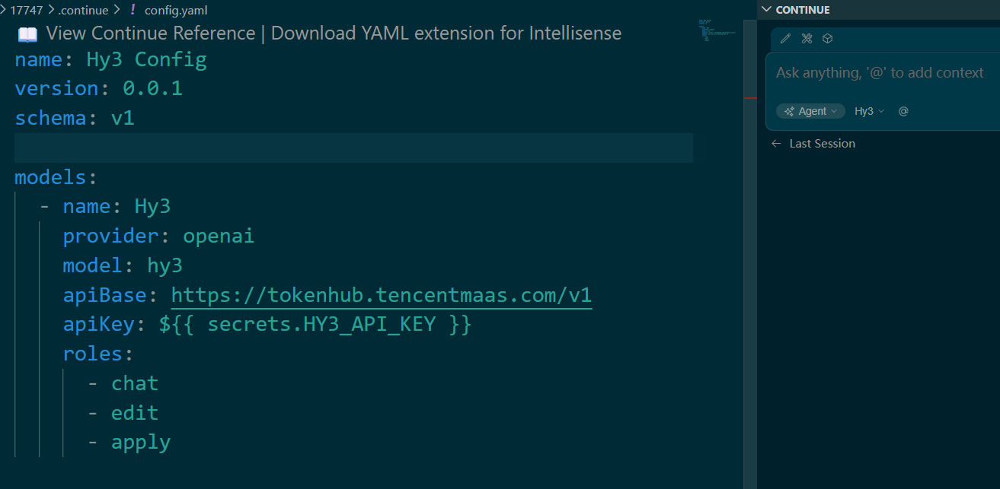
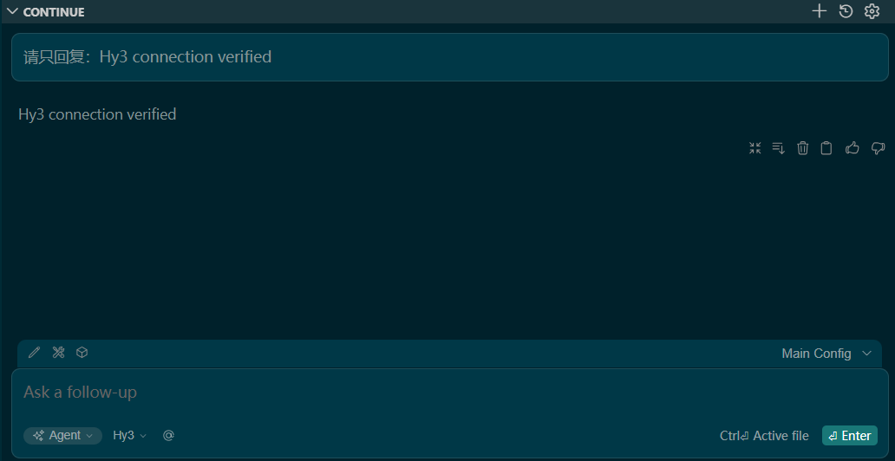
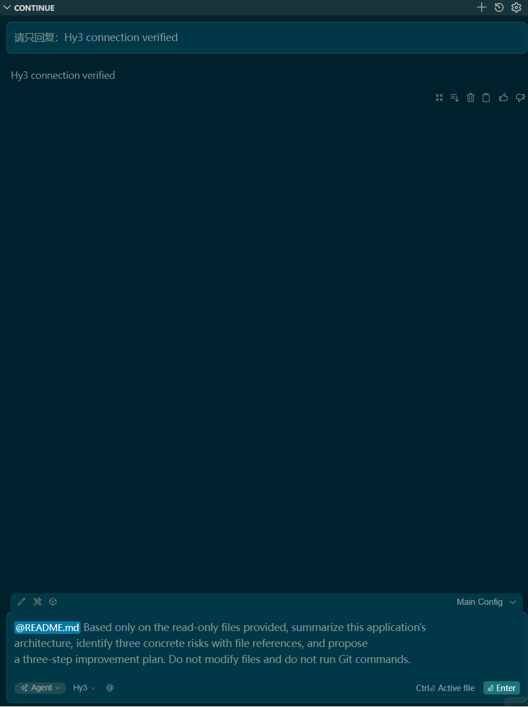

<p align="left">
  <a href="continue.md">English</a>&nbsp; | &nbsp;中文
</p>

# 在 Continue 中使用 Hy3

## 概述

Continue 的 OpenAI 供应商支持自定义 `apiBase`。本流程已使用 2026 年 7 月 12 日可获取的最新 Continue 版本完成验证。

## 配置

将 TokenHub Key 保存为名为 `HY3_API_KEY` 的 Continue Secret，然后在 `config.yaml` 中添加：

```yaml
name: Hy3 Config
version: 0.0.1
schema: v1

models:
  - name: Hy3
    provider: openai
    model: hy3
    apiBase: https://tokenhub.tencentmaas.com/v1
    apiKey: ${{ secrets.HY3_API_KEY }}
    roles:
      - chat
      - edit
      - apply
```



## 连接检查

```text
请只回复：Hy3 connection verified
```



## 只读仓库任务

只把预期文件加入上下文，然后输入以下原始提示词：

```text
Based only on the read-only files provided, summarize this application's
architecture, identify three concrete risks with file references, and propose
a three-step improvement plan. Do not modify files and do not run Git commands.
```



## 常见问题

- 模型没有出现时，保存 `config.yaml` 后重新加载 Continue。
- 确认 Secret 名称与 `HY3_API_KEY` 完全一致。
- Base URL 保持为 `/v1` 根路径，不要追加 `/chat/completions`。

## 参考资料

- [腾讯 TokenHub](https://cloud.tencent.com/product/tokenhub)
- [Continue OpenAI 供应商](https://docs.continue.dev/customize/model-providers/top-level/openai)
