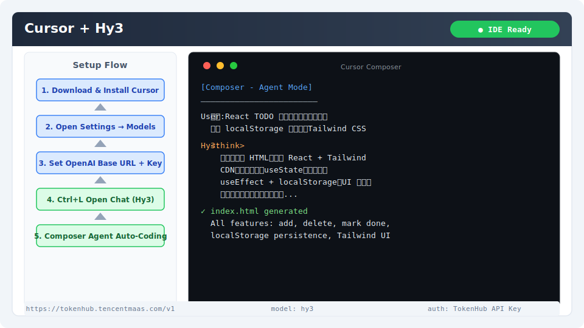

# Cursor 集成指南

[Cursor](https://cursor.com) 是一款基于 VS Code 的 AI 原生编辑器，内置 AI 聊天、代码补全和 Agent 模式。通过配置 OpenAI 兼容接口即可接入 Hy3。

## 安装与版本要求

- **Cursor**：0.45+（建议使用最新版本）
- **系统**：Windows / macOS / Linux

下载安装：访问 [cursor.com](https://cursor.com) 下载对应平台安装包。

验证安装：

```bash
cursor --version
```

## 核心配置

### 1. 打开设置

`Cursor → Settings（齿轮图标）→ Models`

或使用快捷键 `Ctrl+Shift+J`（Mac: `Cmd+Shift+J`）打开设置面板。

### 2. 添加自定义模型

在 Models 设置中，关闭 "OpenAI API Key" 自动获取，填入：

| 字段 | 值 |
|------|-----|
| OpenAI API Key | `sk-xxx`（从 TokenHub 获取） |
| OpenAI Base URL | `https://tokenhub.tencentmaas.com/v1` |

> Cursor 默认使用 `/chat/completions` 和 `/completions` 路径拼接，仅需提供 Base URL 即可。

### 3. 启用自定义模型

在 Models 列表中找到 `hy3`，勾选启用。可在 Chat、Composer、Agent 等不同功能模块中分别配置使用。

### 各部署模式配置

| 模式 | Base URL | 推荐场景 |
|------|----------|----------|
| TokenHub（国内推荐） | `https://tokenhub.tencentmaas.com/v1` | 国内用户首选 |
| TokenHub（海外） | `https://tokenhub-intl.tencentmaas.com/v1` | 海外用户 |
| OpenRouter | `https://openrouter.ai/api/v1` | 已有 OpenRouter 账号 |
| 本地 vLLM/SGLang | `http://127.0.0.1:8000/v1` | 本地部署开发测试 |

## 第一次对话测试

1. 打开 Cursor，使用快捷键 `Ctrl+L`（Mac: `Cmd+L`）打开 Chat 面板
2. 在模型选择下拉中切换到 `hy3`
3. 输入：

```
用一句话介绍腾讯混元 Hy3 模型
```

**预期结果**：Chat 面板显示 Hy3 的回复内容。



## 端到端实战 Demo：使用 Agent 模式创建 Web 应用

### 场景

使用 Cursor 的 Agent 模式（Composer），让 Hy3 自动创建一个完整的 TODO Web 应用。

### 操作步骤

1. 打开一个空项目目录
2. 使用快捷键 `Ctrl+I`（Mac: `Cmd+I`）打开 Composer
3. 确认模型已选择 `hy3`
4. 输入以下 Prompt：

```
创建一个完整的 TODO 管理 Web 应用，要求：
- 使用 React + TypeScript
- 支持添加、删除、标记完成任务
- 使用 localStorage 持久化数据
- 界面简洁美观，使用 Tailwind CSS
- 将所有代码放在单文件 index.html 中
```

5. 点击 "Accept All" 接受生成的代码
6. 右键 `index.html` → **Open with Live Server** 或直接拖入浏览器

### 预期输出

- 生成包含完整 React 组件的单文件 HTML
- 支持添加/删除/标记完成的 TODO 应用
- 浏览器可直接打开运行

## 常见注意事项

1. **Agent 模式需要 Composer**：Cursor 的完整文件操作能力仅在 Composer/Agent 模式下可用
2. **模型选择粒度为功能级**：Chat、Composer、Tab 补全可分别选择不同模型
3. **Tab 补全不建议用 Hy3**：Tab 补全需要极低延迟，建议保留默认模型或使用本地小模型
4. **Base URL 不要加 `/chat/completions`**：Cursor 自动拼接路径
5. **Reasoning 模式暂不支持原生配置**：Cursor 的自定义模型模式下，`chat_template_kwargs` 需要通过在 System Prompt 中注入提示词间接实现
6. **`.cursorrules` 文件**：可在项目根目录创建 `.cursorrules` 文件配置项目级 AI 行为
