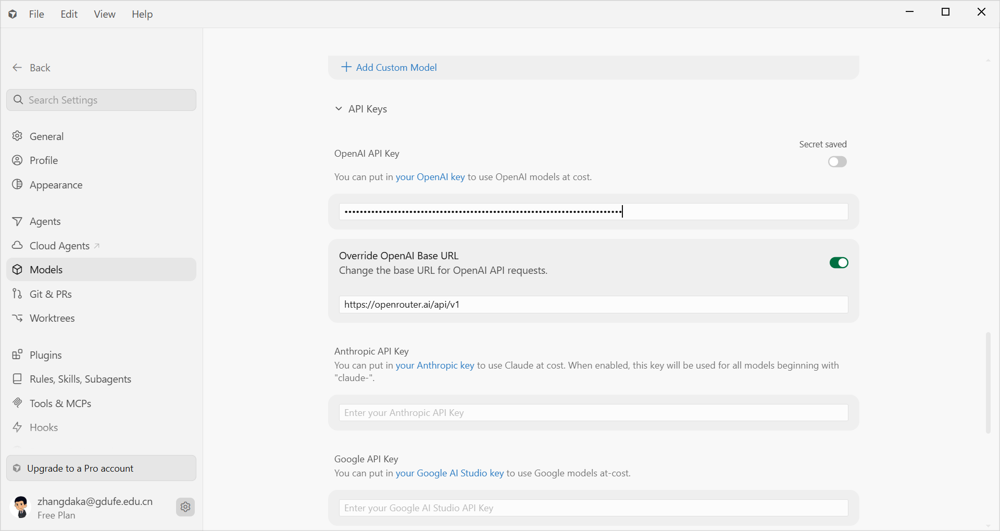
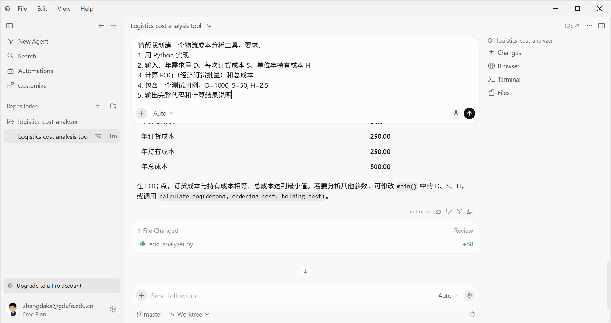
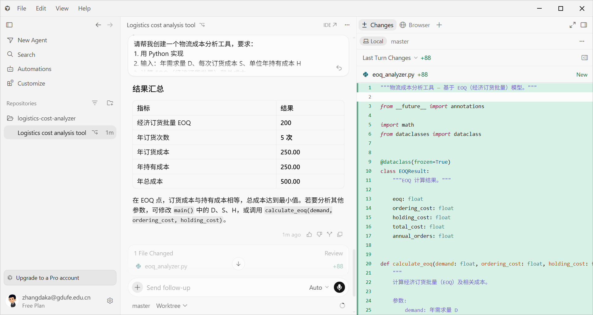

# Cursor 接入 Hy3 指南

> Cursor 是基于 VS Code 的 AI 增强 IDE，支持 Composer 和 Agent 模式。通过 Override OpenAI Base URL 功能，可以将 Hy3 作为自定义模型使用。

## 前置条件

- Cursor >= 0.45（支持 Override Base URL 功能）
- 一个 OpenRouter 或腾讯云 TokenHub 的 API Key

## 安装

从 [cursor.com](https://cursor.com) 下载安装 Cursor。

## 方式一：通过 OpenRouter 接入

### 1. 打开 Model Settings

使用快捷键 `Ctrl+Shift+J`（Mac: `Cmd+Shift+J`）打开 Settings，进入 **Models** 选项卡。


*（截图占位：Cursor Settings > Models 页面）*

### 2. Override OpenAI Base URL

1. 在 Models 页面中，找到 **"Override OpenAI Base URL"** 开关并打开
2. 在 **Base URL** 输入框中填入：`https://openrouter.ai/api/v1`
3. 在 **API Key** 输入框中填入：`sk-or-v1-YOUR_OPENROUTER_KEY`


*（截图占位：Override OpenAI Base URL 配置表单）*

### 3. 添加 Hy3 模型

1. 点击 **"+ Add Custom Model"** 按钮
2. 输入模型名：`tencent/hy3`
3. 点击 **Verify** 验证连接
4. 验证成功后，Hy3 会出现在可用模型列表中，并打开右侧开关


*（截图：模型列表中显示已启用的 tencent/hy3）*

> **注意：Cursor 免费计划限制**
> 配置完成后，在 Composer 或 Chat 中手动选择模型时，免费计划会提示：
> `Named models unavailable. Free plans can only use Auto.`
> 这意味着**免费用户无法手动选择自定义模型（包括 Hy3）**，必须升级到 Pro 计划才能在 Cursor 中实际调用 Hy3。配置方法和验证步骤在免费计划中仍然可以正常执行和截图。

## 方式二：通过腾讯云 TokenHub 接入

配置步骤相同，仅修改两个字段：

| 字段 | 值 |
|------|-----|
| Base URL | `https://tokenhub.tencentmaas.com/v1` |
| API Key | TokenHub API Key |
| Model | `hy3` |

## 端到端实战 Demo

> 本节演示需要 **Cursor Pro** 订阅。免费计划只能选择 Auto 模型，无法手动指定 Hy3。

### 场景：用 Composer 模式创建一个物流成本分析工具

**步骤 1**：在 Cursor 中打开一个空文件夹（例如 `cursor-hy3-demo/`）

**步骤 2**：使用 `Ctrl+K` 打开 Composer，在顶部模型选择器中切换到 `tencent/hy3`，然后输入需求：

```
请帮我创建一个物流成本分析工具，要求：
1. 用 Python 实现
2. 输入：年需求量 D、每次订货成本 S、单位年持有成本 H
3. 计算 EOQ（经济订货批量）和总成本
4. 包含一个测试用例，D=1000, S=50, H=2.5
5. 输出完整代码和计算结果说明
```


*（截图：Composer 中选择 tencent/hy3 并输入物流成本分析需求）*

**步骤 3**：等待 Hy3 生成代码，并查看运行结果


*（截图：Hy3 生成的 EOQ 计算工具代码与运行结果）*

**步骤 4**：使用 `Ctrl+L` 打开 Chat，继续追问细节，例如：

```
请解释 EOQ 公式中各项的经济含义，并说明如何把这个工具扩展为支持批量折扣的模型。
```

## 进阶配置

### 推理模式

Cursor 通过自定义 Base URL 接入时，推理模式需要通过请求参数控制。在 `~/.cursor/settings.json` 中配置：

```json
{
  "openai.additionalRequestBody": {
    "reasoning": {
      "effort": "high"
    }
  }
}
```

> **注意**：此配置会对所有 OpenAI 兼容模型生效，包括 Hy3。

### `.cursorrules` 定制 Hy3 行为

在项目根目录创建 `.cursorrules` 文件：

```
你是一位资深全栈工程师。在编写代码时：
- 使用 TypeScript 严格模式
- 所有公共函数添加 JSDoc
- 使用 async/await 而非 Promise.then()
- 单元测试覆盖率不低于 80%
```

### 长上下文利用

Cursor 默认上下文有限。处理大文件或多文件任务时，可以：

1. 使用 `@file` 和 `@folder` 显式引用相关文件
2. 在 Chat 中手动添加关键代码片段
3. 拆分大任务为多个小任务逐步完成

## 常见问题与排错

| 错误现象 | 原因 | 解决方案 |
|---------|------|---------|
| `Model not found` | 模型名不正确 | OpenRouter 确认用 `tencent/hy3`，TokenHub 用 `hy3` |
| `401 Unauthorized` | API Key 错误 | 检查 Key 是否正确，是否过期 |
| Verify 失败 | Base URL 不正确 | 确保 URL 不含路径错误，末尾不加斜杠 |
| `Named models unavailable. Free plans can only use Auto.` | Cursor 免费计划限制 | 升级到 Pro 才能手动选择自定义模型；免费版只能使用 Auto |
| Tab 补全不使用 Hy3 | 自定义 API Key 仅用于 Chat/Composer | Tab 补全由 Cursor 内置模型处理，无法替换 |
| 推理模式不生效 | 配置方式不同 | 需通过 `openai.additionalRequestBody` 传递参数 |
| 对话中途断开 | Token 限制 | 在 Model Settings 中调整 Max Tokens |

## 注意事项

1. **数据隐私**：使用自定义 API Key 时，请求数据不享受 Cursor 的零数据保留政策——数据会经过你选择的 API 提供商
2. **仅 OpenAI Provider**：Override Base URL 仅对 OpenAI 类型的模型生效，不影响 Claude、Gemini 等其他 Provider
3. **模型名唯一性**：自定义模型名不能与 Cursor 内置模型重名（如 `gpt-4o`、`claude-sonnet-4` 等）
4. **费用自负**：所有通过自定义 API Key 的调用都使用你自己的额度
5. **免费计划限制**：Cursor 免费用户无法手动选择自定义模型，配置和验证步骤虽然可以正常执行，但实际对话需升级到 Pro 才能使用 Hy3

## 小贴士

1. **配合 OpenRouter 仪表盘**：[openrouter.ai/activity](https://openrouter.ai/activity) 实时监控 Cursor 中 Hy3 的 Token 消耗
2. **国内用户**：TokenHub + Cursor 的组合延迟更低，适合日常使用
3. **项目模板**：将 `.cursorrules` 加入项目模板，新项目自动继承 Hy3 行为配置
