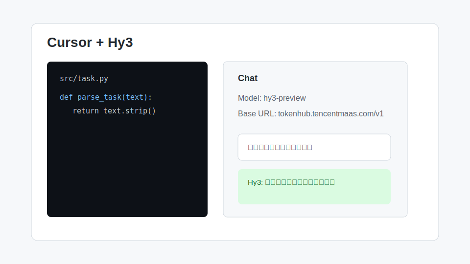

# Cursor 接入 Hy3

Cursor 是常见 AI IDE。若当前版本支持自定义 OpenAI Compatible 模型，可把 Hy3 配置为自定义模型，用于代码解释、重构、生成测试和文档整理。



## 安装与版本要求

- 安装最新版 Cursor
- 当前工作区已经打开一个代码项目
- TokenHub API Key
- Cursor 设置页中可配置 OpenAI Compatible / Custom Model / API Base URL

## 配置项

| 配置项 | 值 |
| --- | --- |
| Provider | OpenAI Compatible / Custom OpenAI |
| Base URL | `https://tokenhub.tencentmaas.com/v1` |
| Model | `hy3-preview` |
| API Key | TokenHub API Key |
| Chat mode | Ask / Edit / Agent 均可先用 Ask 验证 |

## 第一次对话

在 Cursor Chat 中输入：

```text
请用一句话说明当前项目的主要功能。回答前先根据文件名推断项目结构。
```

如果可以得到项目结构分析，说明 Cursor 已经可以通过 Hy3 调用。

## 真实任务 Demo

任务：让 Hy3 为一个函数生成测试用例。

操作流程：

1. 打开一个包含业务函数的文件。
2. 选中函数。
3. 在 Cursor Chat 中输入：

```text
请为选中的函数生成单元测试，覆盖正常输入、边界输入和异常输入。只输出测试代码和必要说明。
```

示例输出：

```text
下面给出 pytest 测试用例，覆盖空输入、合法输入和非法输入三类路径。
```

## 常见注意事项

- 如果 Cursor 自动追加 `/v1`，Base URL 不要重复填写 `/v1/v1`。
- 如果出现 401，检查 API Key 是否来自 TokenHub。
- 如果回复明显过短，可以提高 `max_tokens` 或让提示词要求“完整输出”。
- 如果 Agent 模式失败，先用普通 Chat 验证模型配置，再切换 Agent。
