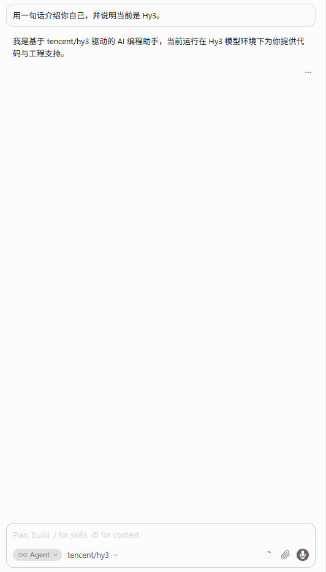

# Cursor × Hy3

配置对照相对仓库根目录 `Hy3/`。

## 本目录文件

| 文件 | 用途 |
|------|------|
| [`docs/integrations/cursor/settings.openrouter.json`](./settings.openrouter.json) | OpenRouter 对照 |
| [`docs/integrations/cursor/settings.tokenhub.json`](./settings.tokenhub.json) | TokenHub 对照 |

```bash
bash docs/integrations/sync_env.sh
```

在 Cursor Settings → Models 按 JSON 字段填写。OpenRouter Base URL 须为：

```text
https://openrouter.ai/api/v1/cursor
```



提交前：`bash docs/integrations/sanitize_secrets.sh`
