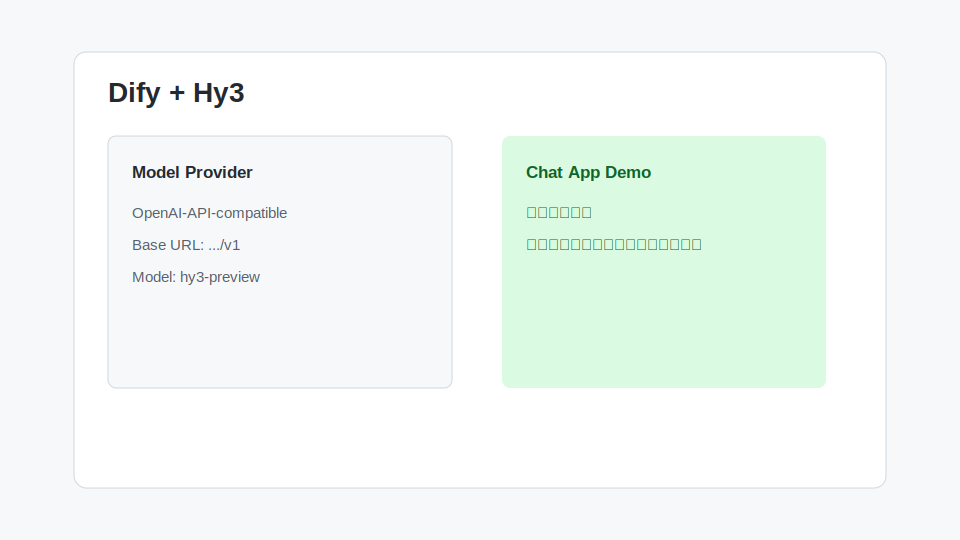

# Dify 接入 Hy3

Dify 是常见低代码 / Agent 平台。通过 OpenAI-API-compatible 模型供应商配置，可以把 Hy3 用作聊天助手、工作流节点或 Agent 模型。



## 安装与版本要求

- Dify Cloud 或自托管 Dify
- 管理员权限或模型供应商配置权限
- TokenHub API Key
- 当前 Dify 版本支持 OpenAI-API-compatible provider

## 配置项

在 Dify 模型供应商中选择 OpenAI-API-compatible：

| 配置项 | 值 |
| --- | --- |
| Provider | OpenAI-API-compatible |
| Base URL | `https://tokenhub.tencentmaas.com/v1` |
| Model name | `hy3-preview` |
| API Key | TokenHub API Key |
| Completion type | Chat |

## 第一次对话

创建 Chat App，选择 Hy3 模型，输入：

```text
请用一句话介绍你能帮助我完成哪些工作流自动化任务。
```

## 真实任务 Demo

任务：做一个“需求澄清助手”。

系统提示词：

```text
你是需求分析助手。用户输入一句模糊需求后，你需要输出：
1. 澄清问题
2. 用户故事
3. 验收标准
4. 可能的接口或页面改动
```

用户输入：

```text
我想让用户可以收藏文章，以后能快速找到。
```

示例输出：

```text
澄清问题：
1. 收藏是否需要分组？
2. 是否需要取消收藏？
3. 是否需要按收藏时间排序？

用户故事：
作为登录用户，我希望收藏文章，以便以后快速查找。
...
```

## 常见注意事项

- Dify 中如果有模型上下文长度、最大输出长度配置，需要按应用场景设置。
- 如果工作流节点需要 JSON 输出，请在 prompt 中明确字段和格式。
- 如果调用工具或外部 API，建议把 Hy3 放在分析或规划节点，把真实执行交给 HTTP / Tool 节点。
- 团队环境建议使用单独 API Key，便于配额管理。
