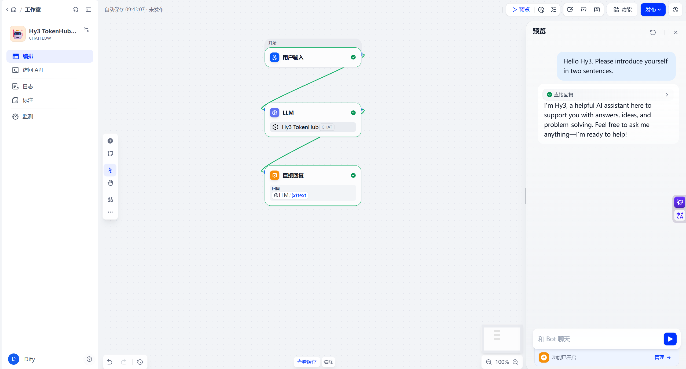
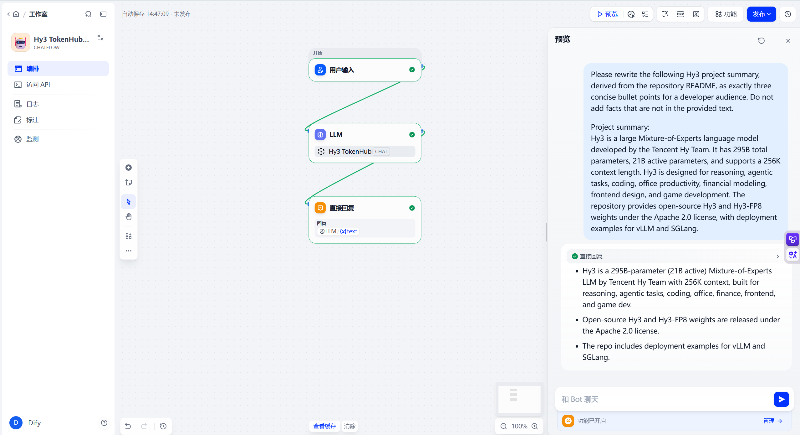

# Use Hy3 with Dify Cloud

## Overview

This guide shows how to configure Dify Cloud to use Hy3 through an OpenAI-compatible provider.

Verification status: Dify Cloud with Hy3 through Tencent Cloud TokenHub mode was manually verified with screenshots.

## Prerequisites

- Access to a Dify Cloud workspace. No local Dify installation was required for this verification.
- Dify app type used: Chatflow.
- Provider/plugin used: OpenAI-API-compatible.
- Provider version shown in the UI: `0.0.55`.
- Choose one Hy3 setup mode:
  - TokenHub cloud API mode: manually verified.
  - Local self-hosted mode: Not verified in this PR.

## Option A: TokenHub Cloud API Mode

Use TokenHub when you want to call Hy3 through Tencent Cloud TokenHub without self-hosting.

See [tokenhub.md](tokenhub.md) for shared setup and safety notes.

The basic TokenHub Hy3 Chat Completions API smoke test is verified in [tokenhub.md](tokenhub.md). Dify Cloud through TokenHub was also manually verified.

| Setting | Value |
|:---|:---|
| Base URL | `https://tokenhub.tencentmaas.com/v1` |
| Chat Completions endpoint | `https://tokenhub.tencentmaas.com/v1/chat/completions` |
| Model name | `hy3` |
| API endpoint model name | `hy3` |
| Model display name | Hy3 TokenHub |
| Model type / conversation type | chat / dialogue |
| API key | User-created TokenHub API key, not committed and not documented |
| Protocol | OpenAI-compatible Chat Completions |

If the TokenHub API key access scope is limited, Hy3 must be included in that scope.

## Option B: Local Self-hosted Mode

The repository documents local Hy3 serving through an OpenAI-compatible Chat Completions endpoint in [local-server.md](local-server.md).

The repository example uses `http://127.0.0.1:8000/v1`. Dify Cloud cannot directly use a loopback address on the user's machine. A Dify deployment with network access to the Hy3 server, or a securely exposed Hy3 endpoint, would be required.

| Setting | Value |
|:---|:---|
| Repository example base URL | `http://127.0.0.1:8000/v1` |
| Model | `hy3` |
| API key for local testing | `EMPTY` |
| API protocol | OpenAI-compatible Chat Completions |
| Dify Cloud connectivity | Requires a network-reachable endpoint; local loopback is not directly reachable |
| Verification status | Not verified in this PR |

For TokenHub cloud API mode, no local Hy3 server is required.

For local self-hosted deployment facts, follow [local-server.md](local-server.md). Dify connectivity to a locally hosted Hy3 endpoint was not verified in this PR.

## Configure the Tool

Verified Dify Cloud setup:

| Field | Verified value |
|:---|:---|
| App type | Chatflow |
| Flow | User input -> LLM node using Hy3 TokenHub -> Direct reply |
| Provider/plugin | OpenAI-API-compatible |
| Provider version shown in UI | `0.0.55` |
| Model name | `hy3` |
| Model display name | Hy3 TokenHub |
| API Base URL | `https://tokenhub.tencentmaas.com/v1` |
| API endpoint model name | `hy3` |
| API key | User-created TokenHub API key, not committed and not documented |
| Function calling | Disabled/not used in this verification; provider pass-through behavior was not tested |
| Vision support | Disabled/not used in this verification |
| Video support | Disabled/not used in this verification |
| Audio support | Disabled/not used in this verification |
| Document support | Disabled/not used in this verification |
| Structured output | Disabled/not used in this verification; provider pass-through behavior was not tested |
| Streaming authorization | Not used in this verification |
| Compatibility mode | Strict OpenAI compatible |

These capability fields describe the verified Dify configuration only. They are not general claims that Hy3 or TokenHub lacks those capabilities.

Context length and max-token values were configured conservatively in Dify Cloud for this verification.

## First Chat

Prompt:

```text
Hello Hy3. Please introduce yourself in two sentences.
```

Result: completed successfully.

## Real Task Demo

Task:

```text
Please rewrite the following Hy3 project summary, derived from the repository README, as exactly three concise bullet points for a developer audience. Do not add facts that are not in the provided text.

Project summary:
Hy3 is a large Mixture-of-Experts language model developed by the Tencent Hy Team. It has 295B total parameters, 21B active parameters, and supports a 256K context length. Hy3 is designed for reasoning, agentic tasks, coding, office productivity, financial modeling, frontend design, and game development. The repository provides open-source Hy3 and Hy3-FP8 weights under the Apache 2.0 license, with deployment examples for vLLM and SGLang.
```

Result: Dify passed the pasted README-derived Hy3 project summary to the Hy3 TokenHub LLM node and returned three concise developer-facing bullet points.

Important boundary: Dify Cloud was not connected to the local Hy3 repository. This guide does not claim that Dify inspected local `README.md` directly.

## Screenshots / GIFs

- First chat screenshot:



- Real task demo screenshot:



Screenshots are included under `docs/integrations/assets/dify/`. GIFs are optional and were not added.

Screenshots and GIFs must not reveal API keys.

## Troubleshooting

- API Base URL should be `https://tokenhub.tencentmaas.com/v1`, not the full `/chat/completions` endpoint.
- API endpoint model name should be `hy3`; Hy3 TokenHub can be used as the Dify display name.
- Do not expose or screenshot the TokenHub API key.
- If Dify cannot call the model, recheck the OpenAI-API-compatible model provider settings, API key, base URL, and model name.
- Capability fields marked as disabled or unused describe this verification setup; they should not be interpreted as general Hy3 or TokenHub capability limits.
- Dify Cloud cannot directly reach `127.0.0.1` on the user's machine. A network-reachable endpoint is required for any local-server integration.
- TokenHub API key access scope for Hy3: Future verification item.
- Local self-hosted authentication or API key handling: Not verified in this PR.
- Dedicated streaming-behavior and tool-calling tasks: Not verified in this PR.

## Verified Environment

| Item | Value |
|:---|:---|
| Tool | Dify Cloud |
| Dify installation | Cloud workspace; no local installation used |
| App type | Chatflow |
| Provider/plugin | OpenAI-API-compatible |
| Provider version shown in UI | `0.0.55` |
| Setup mode | Tencent Cloud TokenHub cloud API mode |
| Hy3 server backend | TokenHub cloud API |
| Flow | User input -> LLM node using Hy3 TokenHub -> Direct reply |
| Base URL | `https://tokenhub.tencentmaas.com/v1` |
| Chat Completions endpoint | `https://tokenhub.tencentmaas.com/v1/chat/completions` |
| Model | `hy3` |
| Model display | Hy3 TokenHub |
| Model type / conversation type | chat / dialogue |
| Verification date | 2026-07-10 |
