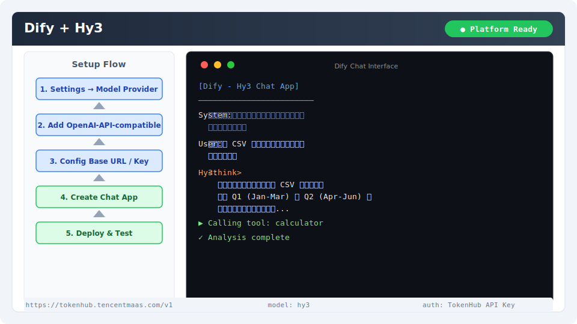

# Dify 集成指南

[Dify](https://dify.ai) 是一个开源低代码 LLM 应用开发平台，支持可视化搭建聊天机器人、Agent 和工作流。通过配置 OpenAI 兼容接口即可接入 Hy3。

## 安装与版本要求

- **Dify**：开源版 0.6+ 或 Dify Cloud 账号
- **部署方式**：Docker 自部署或使用 [Dify Cloud](https://cloud.dify.ai)
- **网络**：Dify 服务器能访问 TokenHub/OpenRouter 端点

## 核心配置

### 1. 添加 Hy3 模型

管理后台 → **Settings → Model Provider** → **Add Model** → 选择 **OpenAI-API-compatible**：

| 字段 | 值 |
|------|-----|
| Model Name | `hy3` |
| Base URL | `https://tokenhub.tencentmaas.com/v1` |
| API Key | `sk-xxx`（从 TokenHub 获取） |
| Type | `LLM` |

### 2. 创建应用

1. **Create Application** → 选择 "Chat App" 或 "Agent"
2. 在模型选择中选 `hy3`

### 各部署模式配置

| 模式 | Base URL | 模型名 | 适用场景 |
|------|----------|--------|----------|
| TokenHub（国内推荐） | `https://tokenhub.tencentmaas.com/v1` | `hy3` | 国内 Dify 部署 |
| TokenHub（海外） | `https://tokenhub-intl.tencentmaas.com/v1` | `hy3` | 海外 Dify 部署 |
| OpenRouter | `https://openrouter.ai/api/v1` | `tencent/hy3` | 已有 OpenRouter 账号 |
| 本地 vLLM/SGLang | `http://127.0.0.1:8000/v1` | `hy3` | 本地开发测试 |

## 第一次对话测试

创建应用后，在预览界面发送消息：

```
你好！请用一句话介绍 Hy3，并输出数字 1
```

**预期结果**：Dify 返回 Hy3 的回复内容。



## 端到端实战 Demo：数据分析 Agent

### 场景

构建一个 Agent 应用，用户上传 CSV 文件后，Hy3 自动分析数据并生成报告。

### 操作步骤

1. 创建 **Agent** 类型应用
2. 选择 `hy3` 模型
3. 开启 **Function Calling**
4. 添加计算器工具
5. 设置系统 Prompt：
```
你是一个数据分析助手。当用户要求计算时，使用计算器工具进行分析。
当用户上传文件时，读取文件内容给出结构化分析报告。
```
6. 上传一个示例 CSV，输入：
```
分析这份 CSV 中第一季度和第二季度的销售趋势差异
```

### 预期行为

- Hy3 通过工具调用读取 CSV
- 分析 Q1（Jan-Mar）和 Q2（Apr-Jun）的聚合指标
- 输出结构化报告

## 推理模式配置

在 LLM 节点的 **参数重写** 中填入：

| 参数路径 | 值 |
|----------|-----|
| `chat_template_kwargs.reasoning_effort` | `high` |

### 各模式推荐场景

| 模式 | Dify 配置值 | 推荐场景 |
|------|------------|---------|
| 直接回复 | `no_think` | 客服问答、翻译 |
| 轻度推理 | `low` | 代码辅助、文档总结 |
| 深度推理 | `high` | 数据分析、复杂推理 |

## 常见注意事项

1. **Base URL 格式**：Dify 的 OpenAI 兼容接口要求 Base URL 以 `/v1` 结尾
2. **函数调用**：Hy3 支持 Function Calling，简单工具调用已验证可用
3. **知识库**：知识库检索质量取决于 Embedding 模型，建议配合专用 Embedding 模型使用
4. **区域匹配**：TokenHub 区域域名必须与 API Key 创建区域一致，广州 Key 不能用新加坡端点
5. **网络连通**：自部署 Dify 需确保网络能访问 TokenHub/OpenRouter 端点
6. **Dify Cloud**：使用 Dify Cloud 时推荐用 OpenRouter（公网可达），TokenHub 可能受地域限制
