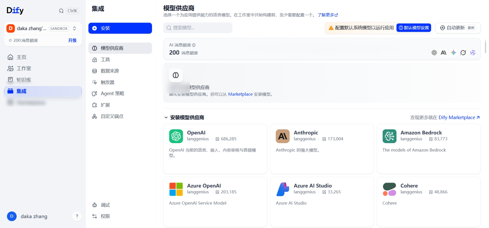
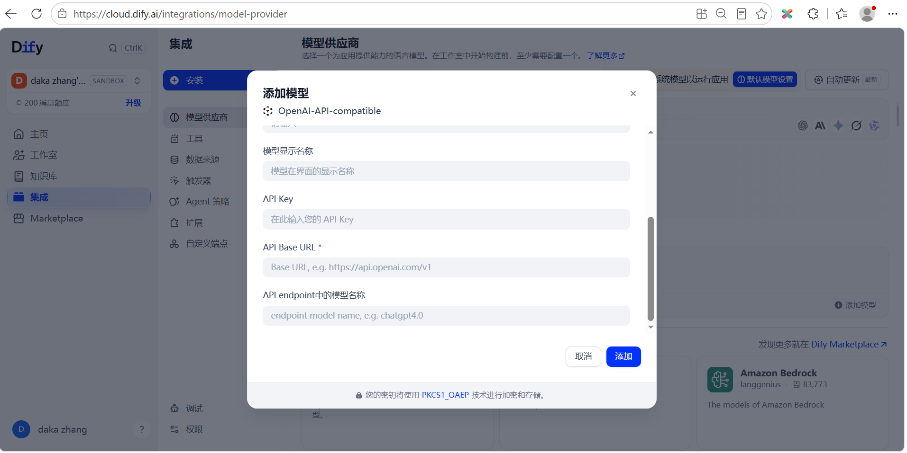
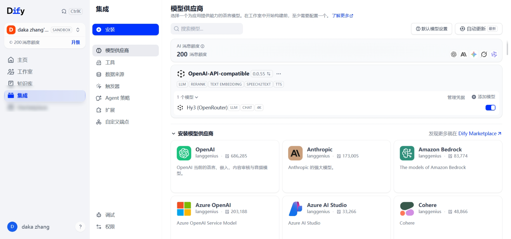
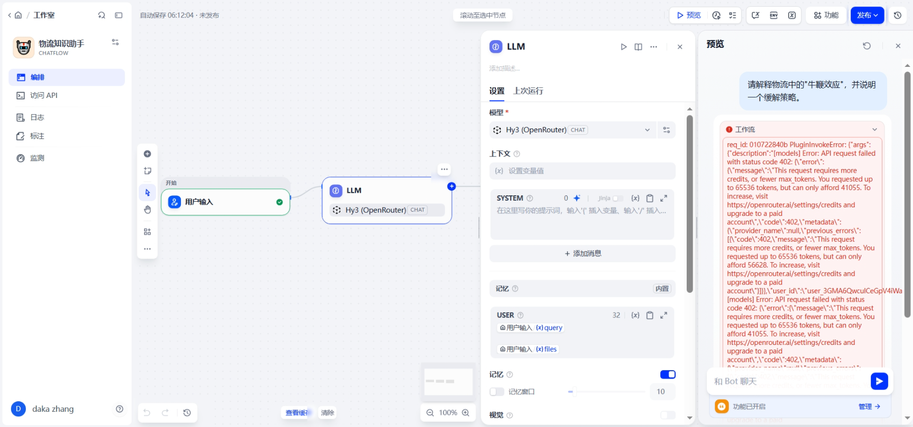
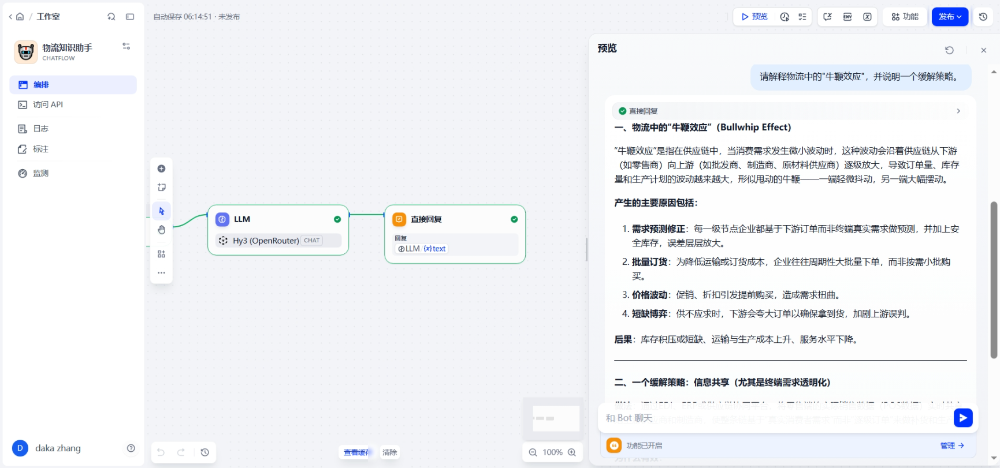
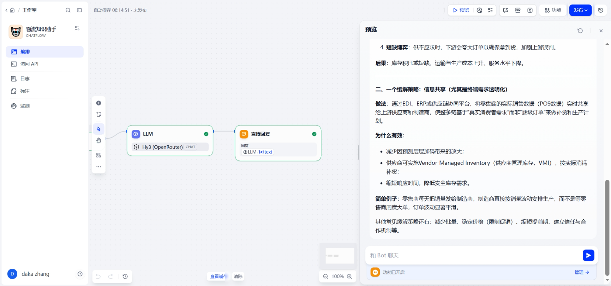

# Dify 接入 Hy3 指南

> Dify 是开源 LLM 应用开发平台，支持可视化工作流编排。通过接入 Hy3，你可以在 Dify 中构建基于 Hy3 的 Agent、知识库问答、工作流等应用。

## 前置条件

- Dify 云版账号（[dify.ai](https://dify.ai) 免费注册）或自托管实例
- 工作区管理员权限（用于添加模型供应商）
- 一个 OpenRouter 或腾讯云 TokenHub 的 API Key

## 部署选择

| 方式 | 适用场景 | 获取方式 |
|------|---------|---------|
| **Dify 云版** | 零配置快速体验 | [dify.ai](https://dify.ai) 注册即用 |
| **Docker 自托管** | 数据隐私、企业内部 | `git clone https://github.com/langgenius/dify.git` |

本文以 Dify 云版为例，自托管版本的模型配置方式完全一致。

## 方式一：通过 OpenRouter 接入

### 1. 进入模型供应商页面

登录 Dify 后，点击右上角头像 → **设置** → **模型供应商**。


*（截图占位：Dify 设置中的模型供应商列表）*

### 2. 添加 OpenAI-API-compatible 供应商

1. 在供应商列表中找到 **"OpenAI-API-compatible"**
2. 点击 **"添加模型"** 按钮


*（截图：Dify 添加 OpenAI-API-compatible 模型，模型类型选择 LLM）*

### 3. 填写模型配置

| 配置项 | 值 | 说明 |
|--------|-----|------|
| **模型名称** | `tencent/hy3` | 必须与服务端完全一致（大小写敏感） |
| **模型类型** | LLM | — |
| **API Key** | `sk-or-v1-YOUR_OPENROUTER_KEY` | OpenRouter 密钥 |
| **API endpoint URL** | `https://openrouter.ai/api/v1` | — |
| **支持 Function Calling** | ✅ 勾选 | Hy3 原生支持 |
| **支持 Vision** | ❌ 不勾选 | Hy3 为纯文本模型 |
| **上下文长度** | `4096` | 根据 OpenRouter 免费额度可调整，建议先设 4K |
| **最大输出 Token** | `8192` | 单次输出上限，对应 OpenRouter 账户余额动态变化 |

> **实测提示**：OpenRouter 免费账户余额会动态变化。如果请求 `max_tokens` 过大，会返回 `402` 错误提示余额不足。首次配置后，可在 LLM 节点的"模型设置"中启用并限制"最大标记"（Max Tokens）为 `4096` 或更小。


*（截图：模型添加成功后，OpenAI-API-compatible 供应商下显示 `Hy3 (OpenRouter)`）*

4. 点击 **"保存"**，完成配置。

### 4. 验证配置

回到 **模型供应商** 页面，确认 "OpenAI-API-compatible" 供应商下出现 `tencent/hy3` 模型，状态为"已连接"。

## 方式二：通过腾讯云 TokenHub 接入

配置步骤与方式一相同，仅修改以下字段：

| 配置项 | 值 |
|--------|-----|
| **模型名称** | `hy3` |
| **API Key** | TokenHub API Key |
| **API endpoint URL** | `https://tokenhub.tencentmaas.com/v1` |

> **提示**：TokenHub 的延迟通常更低，适合国内用户日常使用。

## 端到端实战 Demo

### 场景：创建一个物流知识问答 Chatflow

本 Demo 使用 Dify 的 **Chatflow** 类型，搭建一个最小可用的物流知识问答助手，验证 Hy3 在 Dify 工作流中的调用。

**步骤 1：创建应用**

1. 在 Dify 首页点击 **"创建空白应用"**
2. 选择 **"Chatflow"** 类型（支持记忆的复杂多轮对话工作流）
3. 命名：`物流知识助手`

进入编排页面后，工作流默认为：

```
用户输入 → LLM → 直接回复
```

点击 LLM 节点，在模型下拉框中选择已添加的 **Hy3 (OpenRouter)**。

**步骤 2：运行并调试**

点击右上角的 **预览** 按钮，在右侧预览面板输入：

```
请解释物流中的"牛鞭效应"，并说明一个缓解策略。
```

**步骤 3：处理首次运行错误**

首次运行时，如果 LLM 节点的"最大标记"未启用，Dify 可能默认请求较大的 `max_tokens`，OpenRouter 免费额度会返回 `402` 错误：

```
Error: API request failed with status code 402.
This request requires more credits, or fewer max_tokens.
You requested up to 65536 tokens, but can only afford 41055.
```

**解决办法**：

1. 点击 LLM 节点，展开"模型设置"
2. 启用 **"最大标记"** 开关，设置为 `4096`（或更小）
3. 关闭设置面板，重新发送问题


*（截图：OpenRouter 因 max_tokens 过大返回 402 错误，需要在 LLM 节点中限制最大标记）*

**步骤 4：验证成功响应**

调整 max_tokens 后重新运行，工作流三个节点均显示绿色，右侧预览面板会返回 Hy3 的结构化中文回答：


*（截图：Chatflow 工作流全部节点通过，Hy3 返回牛鞭效应解释）*


*（截图：Hy3 回答的后半部分，包含缓解策略：信息共享与终端需求透明化）*

## 进阶配置

### 工作流编排

Dify 的 **Chatflow / Workflow** 模式可以编排多步骤的 Hy3 调用：

```
用户输入 → 意图识别(Hy3, no_think)
         ├→ 知识问答 → RAG检索 → 深度回答(Hy3, reasoning=high)
         └→ 数据分析 → 代码执行 → 结果解读(Hy3, reasoning=low)
```

### 推理模式控制

在 Dify 的模型参数中可以调整推理模式：

| 场景 | 参数设置 |
|------|---------|
| 快速简单问答 | Temperature: 0.9, 关闭推理 |
| 深度分析问题 | Temperature: 0.9, 添加 `"reasoning_effort": "high"` 到 extra parameters |
| 结构化输出 | Temperature: 0.3, 开启 JSON 模式 |

### 多模型协同

在同一个工作流中，可以使用不同模型处理不同步骤：

- Hy3 负责推理和分析
- 便宜的模型负责意图分类和预处理
- Hy3 负责最终答案的生成和润色

## 常见问题与排错

| 错误现象 | 原因 | 解决方案 |
|---------|------|---------|
| `Connection failed` | API endpoint URL 或 Key 错误 | 先用 curl 测试端点连通性 |
| `Model not found` | 模型名不匹配 | 确认模型名与服务端完全一致（大小写敏感） |
| `402 This request requires more credits` | `max_tokens` 过大超出 OpenRouter 免费余额 | 在 LLM 节点启用"最大标记"并设为 4096 或更小 |
| 长对话突然截断 | Context Window 设置太小 | 将上下文长度设为 256000 |
| 工具调用不生效 | Function Calling 未开启 | 勾选"支持 Function Calling" |
| `429 Too Many Requests` | 速率限制 | 降低调用频率或升级 API 套餐 |
| 知识库检索结果不相关 | 文档切分策略不佳 | 调整为更小的 Chunk Size（512 tokens） |

## 注意事项

1. **管理员权限**：添加模型供应商需要工作区管理员权限，团队版需管理员操作
2. **模型 ID 大小写**：Dify 的模型 ID 是严格大小写敏感的，`tencent/hy3` ≠ `TENCENT/HY3`
3. **上下文长度**：不填或填错会导致长对话被截断，建议初始配置 4K-8K，验证通过后再调大
4. **最大 Token 限制**：OpenRouter 免费账户余额动态变化，首次运行建议将 LLM 节点的"最大标记"限制在 4096 以内，避免 402 错误
5. **多模型环境**：如果同时配置了多个模型供应商，注意在应用创建时选择正确的模型
6. **自托管注意**：自托管 Dify 需要确保服务器可访问外部 API（OpenRouter/TokenHub）

## 小贴士

1. **工作流测试**：先用简单工作流测试 Hy3 连通性，再编排复杂流程
2. **Prompt 优化**：Dify 的 Debug 功能可查看每次调用的完整请求和响应，便于调试 Prompt
3. **费用监控**：Dify 的"日志与标注"页面可查看每次调用的 Token 消耗
4. **知识库质量**：RAG 答案的质量取决于知识库质量，建议在上传文档前做好预处理
5. **模板复用**：将验证通过的 Agent/工作流保存为模板，方便后续快速创建新应用
