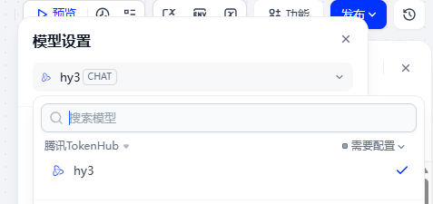
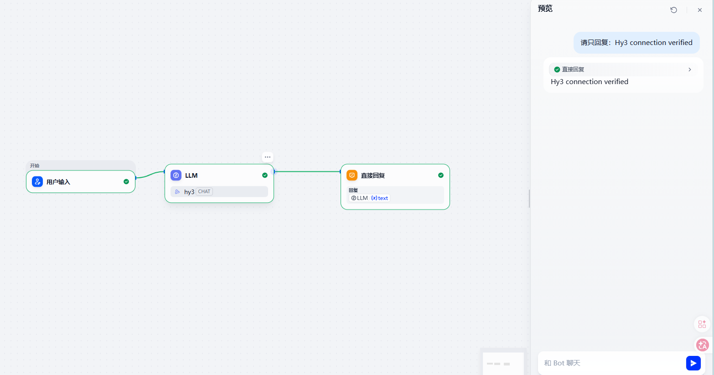
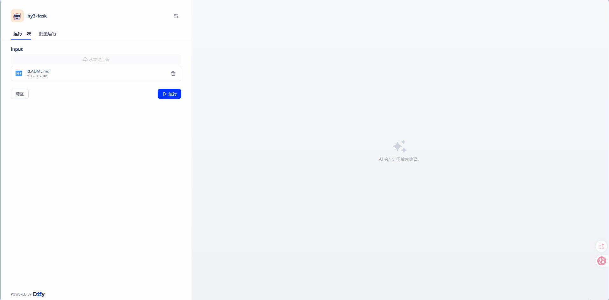

<p align="left">
  English&nbsp; | &nbsp;<a href="dify_CN.md">中文</a>
</p>

# Use Hy3 in Dify

## Overview

The community **Tencent TokenHub** model-provider plugin connects Dify directly to TokenHub and exposes Hy3 as a chat model. This flow was validated on July 12, 2026 with the latest Dify release and plugin `lws123321/tencent-tokenhub` version `0.0.4`.

## Configuration

1. Open **Plugins** and install **Tencent TokenHub** by `lws123321`.
2. Open **Settings → Model Provider → Tencent TokenHub**.
3. Enter the TokenHub API Key. Keep the default API Base URL, or set it to `https://tokenhub.tencentmaas.com/v1`.
4. Select model `hy3` in the workflow LLM node.



## Connection check

Create a workflow with **User Input → LLM → Answer**, then send:

```text
Reply with exactly: Hy3 connection verified
```



## Read-only document task

Add a file input, pass its extracted text to the Hy3 LLM node, and use this exact prompt:

```text
Based only on the read-only files provided, summarize this application's
architecture, identify three concrete risks with file references, and propose
a three-step improvement plan. Do not modify files and do not run Git commands.
```



## Troubleshooting

- Use the **Tencent TokenHub** provider, not the generic OpenAI-compatible provider described in older revisions of this guide.
- Confirm the Key can access Hy3 and the selected model is `hy3`.
- If a custom API Base URL is used, it must be HTTPS and end in `/v1`.

## References

- [Tencent TokenHub Dify plugin](https://marketplace.dify.ai/plugin/lws123321/tencent-tokenhub)
- [Tencent TokenHub](https://cloud.tencent.com/product/tokenhub)
