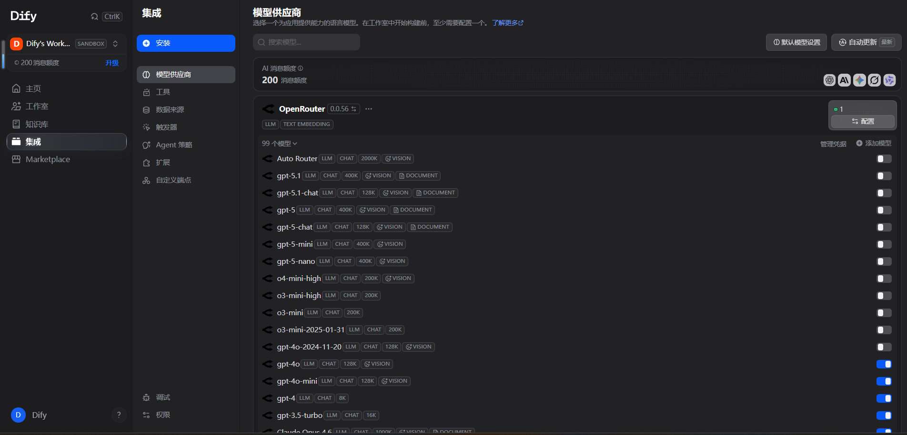
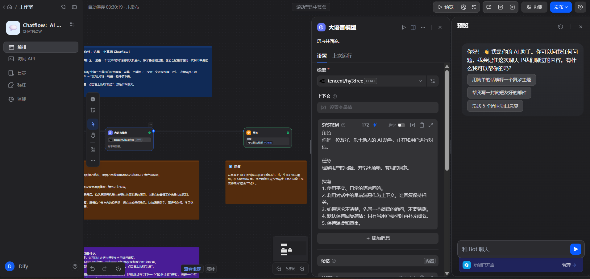

# Dify + Hy3

[Dify](https://dify.ai/) 可以加「OpenAI-API-compatible」模型，把 Hy3 配进去做聊天应用。

## 环境

- 云：https://cloud.dify.ai/（以官网当前入口为准）  
- 或按官方文档自托管  

下面按控制台里加自定义模型来写，菜单名可能随版本略有不同。

## 配置

路径大致是：**设置 → 模型供应商 → OpenAI-API-compatible**。

OpenRouter：

| 项 | 值 |
|----|-----|
| API Endpoint | `https://openrouter.ai/api/v1` |
| API Key | OpenRouter Key |
| Model Name | 例如 `tencent/hy3:free` |
| 模式 | Chat |

TokenHub：

| 项 | 值 |
|----|-----|
| API Endpoint | `https://tokenhub.tencentmaas.com/v1` |
| API Key | TokenHub Key |
| Model Name | `hy3` |
| 模式 | Chat |

保存后，在应用里选这个模型。

## 试一次

1. 新建聊天助手类应用  
2. 模型选刚加的 Hy3  
3. 预览里问：什么是 Pull Request，分几点说  
4. 回答正常就可以  

## 截图

## 注意

- Endpoint 要不要 `/v1` 以你这版 Dify 实测为准  
- 云版和自托管菜单位置不一样  
- 调试时问题短一点，省额度  
