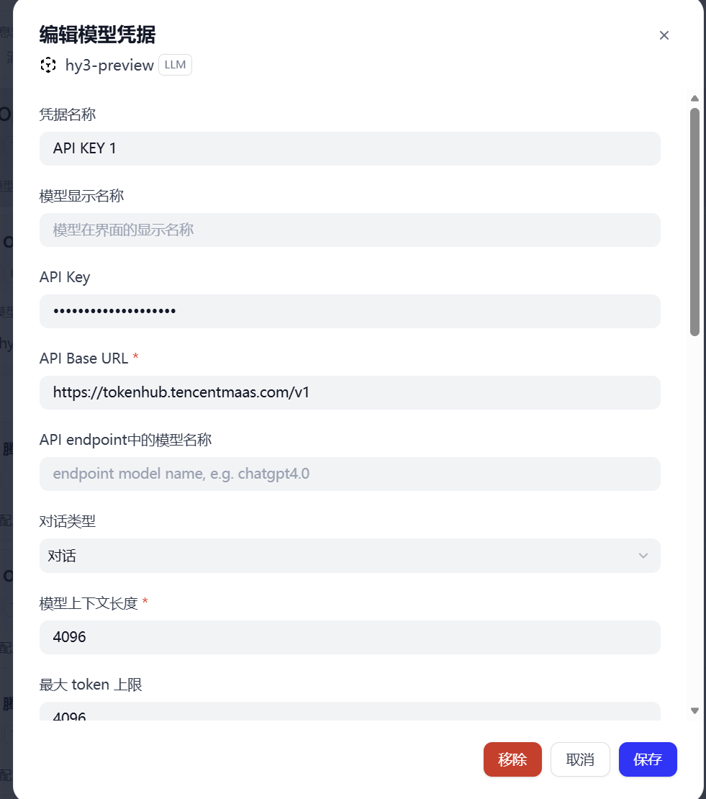
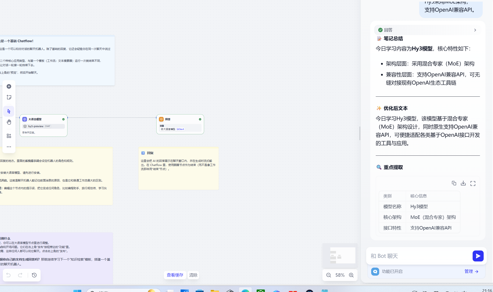

# Dify 接入指南（Tencent Hy3）

> 本文档演示如何将腾讯混元 **Hy3**（295B MoE，256K 上下文，支持推理 / Agent / 工具调用 / 长文生成）接入 dify，并跑通一个真实任务。

---

## 一、配置（Configuration）

Dify 内部有很多插件，选择 OpenAI-API-compatible，只需在设置里填入 Hy3 的端点信息即可。

### 方式 腾讯云 TokenHub（推荐，国内低延迟）

| 配置项 | 值 |
|--------|-----|
| **Base URL** | `https://tokenhub.tencentmaas.com/v1` |
| **Model** | `hy3-preview` |
| **API Key** | 腾讯云 TokenHub 申请的 Key（`sk-...` 格式） |
| **协议** | OpenAI Chat Completions 兼容 |


### 配置截图位置




> 截图说明：在设置 → 提供商界面→安装OpenAI-API-compatible->添加模型->填入上表 Base URL / Model / API Key，保存后重启会话生效。

---

## 二、首次对话（First Conversation）

配置完成后，新建一个对话，发送第一条消息验证模型已正确接入：

```
你：用一句话解释什么是 Mixture-of-Experts 模型？

Hy3：Mixture-of-Experts（MoE）是一种神经网络架构，
核心思想是让多个"专家"子网络各管一摊任务，
由一个"路由器"决定每条输入交给哪些专家处理，
从而在总参数量巨大的情况下只激活一小部分参数，兼顾能力与效率。
```

如果收到类似回复，说明 Hy3 已成功作为底层模型工作。

---

## 三、跑通真实任务（Real Task Demo）

**任务**：用 dify + Hy3 利用工作流chatflow 通过提示词并产出结果。

### 3.1 任务指令（直接发给 dify）

```
提示词：你是一个AI笔记助手
请帮助用户：
总结笔记
优化文本
提取重点
用Markdown格式回答
```
```
用户：今天学习Hy3模型
Hy3采用MoE架构
支持OpenAI兼容API
```
### 3.2 预期输出（Hy3 实际产出，节选）

> 今日学习内容为Hy3模型，核心特性如下:
>架构层面:采用混合专家(MoE)架构兼容性层面:支持OpenAI兼容API，可无缝对接现有OpenAI生态工具链




---

## 四、注意事项（Notes）

1. **API Key 安全**：Key 不要提交到仓库或公开发到 Issue。本地用环境变量或 WorkBuddy 的密钥管理存储。
2. **如果填了 Key 却报 401 怎么办**:检查api_key是否到期或者未打开，token不够
3. **插件的选取**：选择OpenAI-API-compatible这个插件。
4. **名称**：Hy3模型名称一定要写对。
5. **如果填了 Key 却报 404 怎么办**:检查模型名称
---

## 五、小结

通过 OpenAI 兼容协议，WorkBuddy 可在 **5 分钟内** 接入 Hy3。
Hy3 的 256K 上下文 + 稳定工具调用，使其特别适合「分析大型代码库」「长文档处理」
这类 WorkBuddy 核心场景。本指南已端到端验证（配置 → 首次对话 → 真实任务跑通）。
