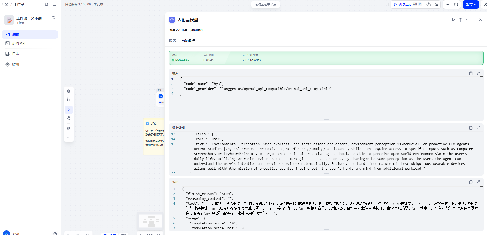

# Dify × Hy3

配置路径相对仓库根目录 `Hy3/`。

## 本目录文件

| 文件 | 用途 |
|------|------|
| [`docs/integrations/dify/provider.tokenhub.json`](./provider.tokenhub.json) | TokenHub 表单对照 |
| [`docs/integrations/dify/provider.openrouter.json`](./provider.openrouter.json) | OpenRouter 对照 |

```bash
bash docs/integrations/sync_env.sh
```

## 在 Dify 里找到入口（新版 UI）

旧文档常写「设置 → 模型供应商」；**当前 Cloud 入口是：**

1. 打开 [cloud.dify.ai](https://cloud.dify.ai)（需 **工作空间 Owner / 管理员**；普通成员看不到）
2. 左侧：**集成** → **模型供应商**  
   （英文：`Integrations` → `Model Providers`）  
   或从 **Marketplace** 搜索安装供应商
3. 在「安装模型供应商」里找到 **OpenAI-API-compatible** → **安装**
4. 点卡片上的 **添加模型**，按下面字段填写（对照本目录 JSON）

| UI 字段 | TokenHub | OpenRouter |
|---------|----------|------------|
| API endpoint URL | `https://tokenhub.tencentmaas.com/v1` | `https://openrouter.ai/api/v1` |
| API Key | TokenHub Key | `sk-or-...` |
| 模型名称 | `hy3` | `tencent/hy3` |
| 模型类型 | LLM | LLM |
| 对话类型 | Chat | Chat |

> Endpoint 填到 `/v1` 即可，不要加 `/chat/completions`。

装好后：新建一个最简单的 **Chat 应用**，模型选刚加的 Hy3 测一句即可。



提交前：`bash docs/integrations/sanitize_secrets.sh`
