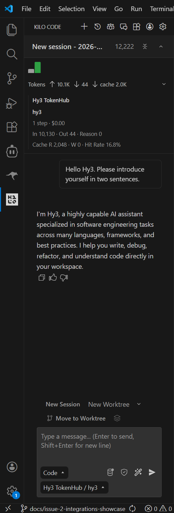
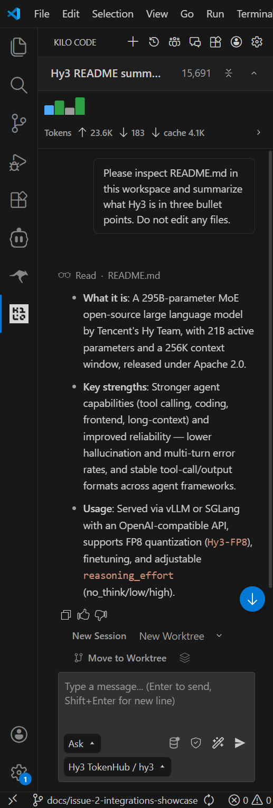

# Use Hy3 with Kilo Code

## Overview

This guide shows how to configure Kilo Code to use Hy3 through an OpenAI-compatible provider.

Verification status: Kilo Code with Hy3 through Tencent Cloud TokenHub mode was manually verified with screenshots.

## Prerequisites

- Verified Kilo Code version: `7.4.1`.
- VS Code extension name: Kilo Code: AI Coding Agent, Copilot, and Autocomplete.
- Publisher: Kilo Code / kilocode.ai.
- VS Code extension identifier: `kilocode.kilo-code`.
- Install Kilo Code from the VS Code Extensions view, or run:

```powershell
code --install-extension kilocode.kilo-code
```

- Confirm the installed extension and version:

```powershell
code --list-extensions --show-versions | Select-String -Pattern "kilo"
```

The screenshots and original verification in this guide were produced with Kilo Code `7.4.1`. A later local extension update does not change the recorded verification environment.

- Choose one Hy3 setup mode:
  - TokenHub cloud API mode: manually verified.
  - Local self-hosted mode: Not verified in this PR.

## Option A: TokenHub Cloud API Mode

Use TokenHub when you want to call Hy3 through Tencent Cloud TokenHub without self-hosting.

See [tokenhub.md](tokenhub.md) for shared setup and safety notes.

The basic TokenHub Hy3 Chat Completions API smoke test is verified in [tokenhub.md](tokenhub.md). Kilo Code-specific setup through a TokenHub custom provider was also manually verified.

| Setting | Value |
|:---|:---|
| Base URL | `https://tokenhub.tencentmaas.com/v1` |
| Chat Completions endpoint | `https://tokenhub.tencentmaas.com/v1/chat/completions` |
| Model ID | `hy3` |
| Model name | `hy3` |
| Provider type | Custom provider |
| Provider API | OpenAI Compatible |
| Provider ID | `hy3-tokenhub` |
| Display name | Hy3 TokenHub |
| API key | User-created TokenHub API key, not committed and not documented |
| Reasoning option | Not enabled |
| Headers | Left empty |
| Protocol | OpenAI-compatible Chat Completions |

If the TokenHub API key access scope is limited, Hy3 must be included in that scope.

## Option B: Local Self-hosted Mode

Use local self-hosted mode when Hy3 is running as a local OpenAI-compatible Chat Completions server.

See [local-server.md](local-server.md) for the repository-documented vLLM and SGLang serving examples.

| Setting | Value |
|:---|:---|
| Base URL | `http://127.0.0.1:8000/v1` |
| Model | `hy3` |
| API key for local testing | `EMPTY` |
| API protocol | OpenAI-compatible Chat Completions |
| Verification status | Not verified in this PR |

For TokenHub cloud API mode, no local Hy3 server is required.

For local self-hosted mode, follow [local-server.md](local-server.md).

Kilo Code-specific connectivity with TokenHub mode was manually verified. Local self-hosted connectivity was not verified in this PR.

## Configure the Tool

For the verified TokenHub configuration, Kilo Code was configured as a custom provider:

| Field | Verified value |
|:---|:---|
| Provider type | Custom provider |
| Provider API | OpenAI Compatible |
| Provider ID | `hy3-tokenhub` |
| Display name | Hy3 TokenHub |
| Base URL | `https://tokenhub.tencentmaas.com/v1` |
| Model ID | `hy3` |
| Model name | `hy3` |
| API key | User-created TokenHub API key, not committed and not documented |
| Reasoning option | Not enabled |
| Headers | Left empty |
| Selected model display | Hy3 TokenHub / hy3 |

This guide verifies the TokenHub custom-provider setup. It does not verify Kilo Gateway or the built-in Tencent Hy3 FREE model.

Verified setup path: **Kilo Code sidebar -> Settings -> Providers -> Custom provider -> Connect**.

Exact Kilo Code secret-storage behavior and untested advanced options are outside the scope of this verification.

## First Chat

Prompt:

```text
Hello Hy3. Please introduce yourself in two sentences.
```

Mode: Code.

Result: completed successfully.

Observed response included:

```text
I'm Hy3, a highly capable AI assistant specialized in software engineering tasks across many languages, frameworks, and best practices. I help you write, debug, refactor, and understand code directly in your workspace.
```

## Real Task Demo

Task:

```text
Please inspect README.md in this workspace and summarize what Hy3 is in three bullet points. Do not edit any files.
```

Mode: Ask.

Result: Kilo Code used its built-in workspace file-reading flow to read `README.md`, completed the task, and returned three bullet points. No files were edited; this was confirmed with `git status -sb` after the demo.

This verifies Kilo Code's workspace-reading flow in the demonstrated task. It does not independently establish compatibility for every OpenAI-protocol tool-calling behavior.

Observed README demo summary:

1. Hy3 is a 295B-parameter MoE open-source large language model by Tencent's Hy Team, with 21B active parameters and a 256K context window, released under Apache 2.0.
2. Hy3 has stronger agent capabilities including tool calling, coding, frontend, long-context, lower hallucination, multi-turn reliability, and stable tool-call/output formats.
3. Hy3 can be served via vLLM or SGLang with an OpenAI-compatible API, supports FP8 quantization, finetuning, and adjustable `reasoning_effort`.

## Screenshots / GIF

- First chat screenshot:



- Real task demo screenshot:



Screenshots are included under `docs/integrations/assets/kilo-code/`. GIFs are optional and were not added.

Screenshots and GIFs must not reveal API keys.

## Troubleshooting

- Install or verify the extension with `code --install-extension kilocode.kilo-code` and `code --list-extensions --show-versions`.
- TokenHub API key handling was verified by using a user-created TokenHub API key without committing, documenting, or displaying it.
- TokenHub API key access scope for Hy3: Future verification item.
- Local endpoint connection issue: Not verified in this PR.
- Local self-hosted authentication or API key handling: Not verified in this PR.
- Model selection issue: TokenHub custom-provider mode was verified with Hy3 TokenHub / `hy3`.
- Kilo Code used its built-in workspace file-reading flow for the README demo. Dedicated OpenAI-protocol tool-calling behavior was not independently tested in this PR.
- Dedicated streaming-behavior testing was not performed in this PR.

## Verified Environment

| Item | Value |
|:---|:---|
| OS | Windows 11 25H2 (build 26200) |
| Editor | VS Code |
| Extension | Kilo Code (`kilocode.kilo-code`) |
| Extension name | Kilo Code: AI Coding Agent, Copilot, and Autocomplete |
| Publisher | Kilo Code / kilocode.ai |
| Kilo Code version | `7.4.1` |
| Setup mode | Tencent Cloud TokenHub cloud API mode |
| Hy3 server backend | TokenHub cloud API |
| Provider type | Custom provider |
| Provider API | OpenAI Compatible |
| Provider ID | `hy3-tokenhub` |
| Display name | Hy3 TokenHub |
| Base URL | `https://tokenhub.tencentmaas.com/v1` |
| Chat Completions endpoint | `https://tokenhub.tencentmaas.com/v1/chat/completions` |
| Model | `hy3` |
| Selected model display | Hy3 TokenHub / hy3 |
| Verified modes | First chat and read-only workspace README summary |
| Verification date | 2026-07-08 |
