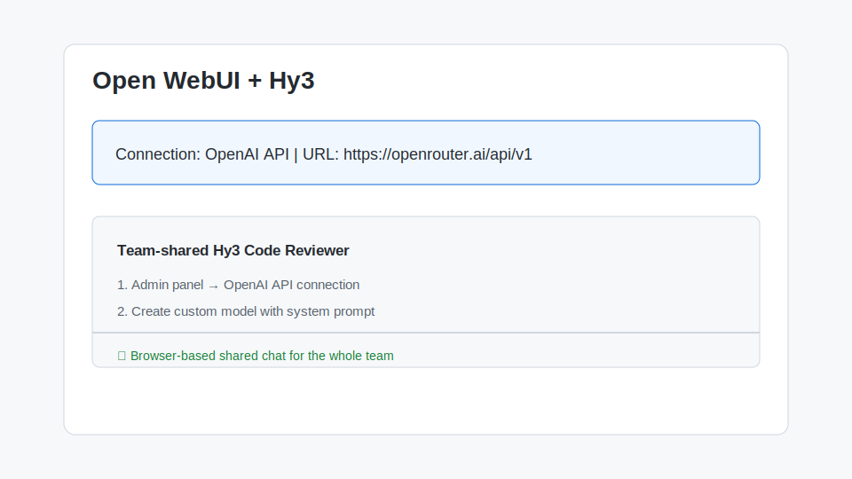

# 在 Open WebUI 中使用 Hy3

[Open WebUI](https://github.com/open-webui/open-webui) 是一个可自托管的 LLM Web 界面，支持 OpenAI-compatible API。通过把 Hy3 的本地或云端端点接入 Open WebUI，可以在浏览器中与家人、团队共享一个 Hy3 聊天界面。

## 1. 安装与版本要求

- **Docker**（推荐）或 Python ≥ 3.11
- **Open WebUI**：通过 Docker 一键启动
  ```bash
  docker run -d -p 3000:8080 \
    -v open-webui:/app/backend/data \
    --name open-webui \
    ghcr.io/open-webui/open-webui:main
  ```
- **Hy3 后端**：本地 vLLM/SGLang 或 OpenRouter/TokenHub 账号
- **网络**：Open WebUI 容器能访问 Hy3 后端地址

安装完成后，打开 `http://localhost:3000` 注册第一个管理员账号。

## 2. 核心配置项

1. 登录 Open WebUI 后，点击右上角头像 → **管理员面板** → **设置** → **外部连接**（或 **Connections**）。
2. 点击 **OpenAI API** 标签页。
3. 填写以下信息：

| 配置项 | 值 |
| --- | --- |
| API URL | `https://openrouter.ai/api/v1` 或 `http://host.docker.internal:8000/v1` |
| API Key | 对应服务商 Key；本地可填 `EMPTY` |
| 模型 ID | 可选，留空会自动拉取；手动填写 `tencent/hy3-295b-a21b` 或 `hy3` |

4. 点击保存，然后刷新页面。

> 如果 Hy3 部署在宿主机上的 vLLM/SGLang，而 Open WebUI 运行在 Docker 中，请使用 `http://host.docker.internal:8000/v1`（Windows/macOS）或 Docker 容器可访问的宿主机 IP（Linux）。

## 3. 第一次对话测试

1. 在 Open WebUI 首页，顶部模型选择器应能看到 `tencent/hy3-295b-a21b` 或 `hy3`。
2. 选择 Hy3 模型。
3. 输入：
   ```text
   请用一句话介绍 Hy3，并输出数字 1
   ```

预期结果：Open WebUI 显示 Hy3 的流式回复。



## 4. 端到端实战 Demo：团队共享的代码审查助手

场景：开发团队在内网部署 Open WebUI + 本地 Hy3，作为统一的代码审查问答入口。

操作步骤：

1. 在 Open WebUI 中新建一个 **模型**（Models → Create Model）。
2. 选择基础模型为 Hy3。
3. 在系统提示词中写入：
   ```text
   你是一位资深代码审查助手。用户会粘贴代码片段或 diff，请：
   1. 先说明代码意图；
   2. 列出潜在 bug、性能问题和安全风险；
   3. 给出具体修改建议。
   ```
4. 保存并命名模型为 **Hy3 Code Reviewer**。
5. 在聊天中粘贴一段代码或 git diff，即可获得结构化 review。

示例输出：

```markdown
### 代码意图
该函数用于计算订单折扣。

### 问题
1. **精度问题**：直接使用浮点数比较金额，可能产生精度误差。
2. **权限问题**：未校验用户是否有权应用该折扣码。
3. **边界问题**：当 `quantity` 为 0 时会返回异常折扣。

### 建议
- 金额统一使用 Decimal。
- 在计算折扣前加入权限校验。
- 对 `quantity <= 0` 返回明确错误信息。
```

## 5. 常见注意事项

1. **Docker 网络**：Open WebUI 容器默认无法访问 `127.0.0.1:8000`（这是容器自己的 localhost）。本地 Hy3 应使用 `host.docker.internal:8000` 或宿主机的局域网 IP。
2. **模型未显示**：保存连接后点击页面顶部的模型下拉框刷新；仍未显示则检查 API URL 和 Key 是否正确。
3. **API URL 末尾 `/v1`**：Open WebUI 的 OpenAI 连接需要完整的 `/v1` 路径。
4. **Reasoning 显示**：Hy3 的 reasoning 输出可能包含思考标签。Open WebUI 默认会把它们渲染为普通文本。如需美化，可在系统提示词中要求模型把思考过程放在 `<think>` 标签内，并配合前端自定义渲染。
5. **并发与配额**：团队共享时，多个用户同时请求会消耗 Hy3 后端资源。建议配置 Open WebUI 的速率限制，或为本地 vLLM/SGLang 预留足够 GPU 资源。
6. **Function Calling**：Open WebUI 的联网搜索、RAG 等功能依赖工具调用。本地部署 Hy3 时需要开启 `--tool-call-parser` 才能正常使用。
