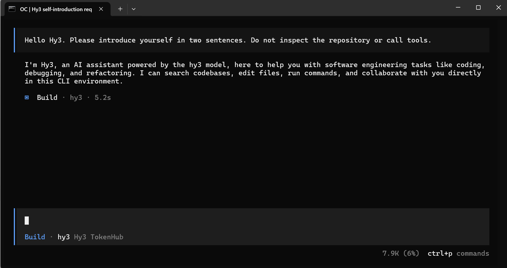
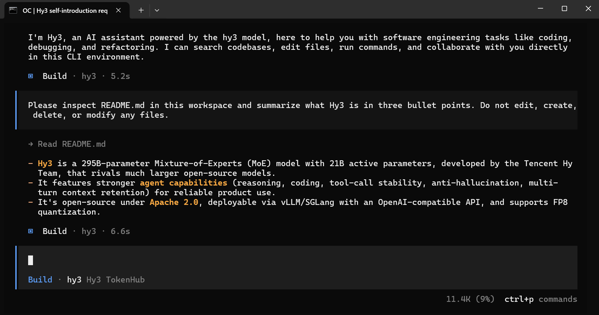

# Use Hy3 with OpenCode

## Overview

This guide shows how to configure OpenCode to use Hy3 through an OpenAI-compatible provider.

Verification status: OpenCode with Hy3 through Tencent Cloud TokenHub mode was manually verified with screenshots.

## Prerequisites

- Install package: `npm install -g opencode-ai`.
- OpenCode version: `1.17.15`.
- Observed command paths:
  - `%APPDATA%\npm\opencode`
  - `%APPDATA%\npm\opencode.cmd`
- Choose one Hy3 setup mode:
  - TokenHub cloud API mode: manually verified.
  - Local self-hosted mode: Not verified in this PR.

## Option A: TokenHub Cloud API Mode

Use TokenHub when you want to call Hy3 through Tencent Cloud TokenHub without self-hosting.

See [tokenhub.md](tokenhub.md) for shared setup and safety notes.

The basic TokenHub Hy3 Chat Completions API smoke test is verified in [tokenhub.md](tokenhub.md). OpenCode through TokenHub was also manually verified.

| Setting | Value |
|:---|:---|
| Base URL | `https://tokenhub.tencentmaas.com/v1` |
| Provider ID | `hy3-tokenhub` |
| Model | `hy3-tokenhub/hy3` |
| API key | Entered into OpenCode local credential storage, not committed and not documented |
| Protocol | OpenAI-compatible |

If the TokenHub API key access scope is limited, Hy3 must be included in that scope.

## Option B: Local Self-hosted Mode

Use local self-hosted mode when Hy3 is running as a local OpenAI-compatible chat completions server.

See [local-server.md](local-server.md) for the repository-documented vLLM and SGLang serving examples.

| Setting | Value |
|:---|:---|
| Base URL | `http://127.0.0.1:8000/v1` |
| Model | `hy3` |
| API key for local testing | `EMPTY` |
| API protocol | OpenAI-compatible chat completions |

## Start Hy3 as an OpenAI-compatible Server

For TokenHub cloud API mode, no local Hy3 server is required.

For local self-hosted mode, follow [local-server.md](local-server.md).

OpenCode connectivity with TokenHub mode was manually verified. Local self-hosted connectivity was not verified in this PR.

## Configure the Tool

Credential setup:

```text
OpenCode TUI -> /connect -> Other
Provider ID: hy3-tokenhub
```

The TokenHub API key was entered into OpenCode local credential storage. No API key was committed or documented.

A root `opencode.json` file was used during local verification only. Do not commit this local test config file in this PR.

Verified `opencode.json` shape:

```json
{
  "$schema": "https://opencode.ai/config.json",
  "model": "hy3-tokenhub/hy3",
  "small_model": "hy3-tokenhub/hy3",
  "provider": {
    "hy3-tokenhub": {
      "npm": "@ai-sdk/openai-compatible",
      "name": "Hy3 TokenHub",
      "options": {
        "baseURL": "https://tokenhub.tencentmaas.com/v1"
      },
      "models": {
        "hy3": {
          "name": "hy3",
          "limit": {
            "context": 128000,
            "output": 4096
          }
        }
      }
    }
  }
}
```

OpenCode model display in the TUI:

```text
Build · hy3 Hy3 TokenHub
```

Exact local credential storage behavior beyond the observed `/connect` flow and advanced options are future verification items.

## First Chat

Prompt:

```text
Hello Hy3. Please introduce yourself in two sentences. Do not inspect the repository or call tools.
```

Result: OpenCode replied directly without repository exploration or tool calls.

Observed response included:

```text
I'm Hy3, an AI assistant powered by the hy3 model, here to help you with software engineering tasks like coding, debugging, and refactoring.
```

## Real Task Demo

Task:

```text
Please inspect README.md in this workspace and summarize what Hy3 is in three bullet points. Do not edit, create, delete, or modify any files.
```

Result: OpenCode read `README.md` and returned three bullet points.

No tracked files were edited by OpenCode; `git status -sb` after the demo only showed the local `opencode.json` test config and the new screenshots as untracked files.

## Screenshots / GIF

- First chat screenshot:



- Real task demo screenshot:



Screenshots are included under `docs/integrations/assets/opencode/`. GIFs are optional and were not added.

Screenshots and GIFs must not reveal API keys.

## Troubleshooting

- TokenHub API key handling: verified by entering the API key through `OpenCode TUI -> /connect -> Other`; the key is stored in OpenCode local credential storage and must not be committed or documented.
- TokenHub API key access scope for Hy3: Future verification item.
- Local endpoint connection issue: Not verified in this PR.
- Local self-hosted authentication or API key handling: Not verified in this PR.
- Local `opencode.json`: used for local verification only and must not be committed in this PR.
- Model selection issue: TokenHub mode verified with provider/model `hy3-tokenhub/hy3`.
- Streaming or tool-use behavior: Not verified in this PR.

## Verified Environment

| Item | Value |
|:---|:---|
| OS | Windows 10.0.26200 |
| Interface | OpenCode TUI |
| Node.js | `v24.14.1` |
| npm | `11.11.0` |
| Package | `opencode-ai` |
| Install command | `npm install -g opencode-ai` |
| OpenCode version | `1.17.15` |
| Setup mode | Tencent Cloud TokenHub cloud API mode |
| Hy3 server backend | TokenHub cloud API |
| Provider ID | `hy3-tokenhub` |
| Base URL | `https://tokenhub.tencentmaas.com/v1` |
| Model | `hy3-tokenhub/hy3` |
| Model display | Build · hy3 Hy3 TokenHub |
| Verification date | 2026-07-08 |
