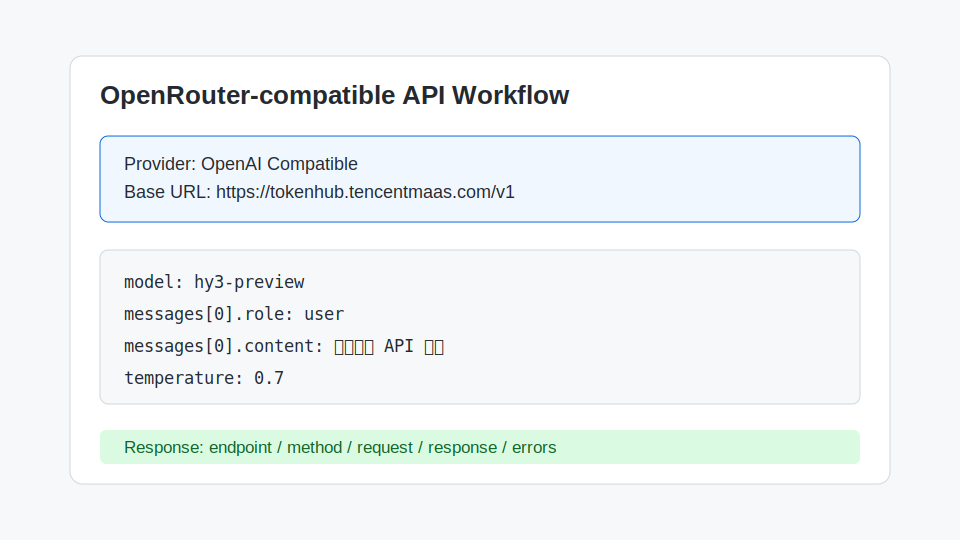

# OpenRouter-compatible API Workflow 接入 Hy3

本指南面向已经熟悉 OpenRouter API 形态的用户：如果当前产品或脚本支持 OpenAI Compatible / OpenRouter-style API 配置，可以把服务地址切换到 TokenHub Hy3。

> 注意：如果 OpenRouter 平台本身未上架 `hy3-preview`，请使用支持自定义 OpenAI Compatible provider 的客户端，把 Base URL 指向 TokenHub。



## 安装与版本要求

- 任意支持 OpenAI Compatible Chat Completions 的 API 客户端
- Python 示例需要 `openai>=1.0.0`
- 已在 TokenHub 获取 API Key

## 配置项

| 配置项 | 值 |
| --- | --- |
| Provider / Protocol | OpenAI Compatible |
| Base URL | `https://tokenhub.tencentmaas.com/v1` |
| Model | `hy3-preview` |
| API Key | TokenHub API Key |
| Endpoint | `/chat/completions` |

## 第一次对话

```bash
curl https://tokenhub.tencentmaas.com/v1/chat/completions \
  -H "Authorization: Bearer $TOKENHUB_API_KEY" \
  -H "Content-Type: application/json" \
  -d '{
    "model": "hy3-preview",
    "messages": [
      {"role": "user", "content": "请用一句话介绍 Hy3。"}
    ],
    "temperature": 0.7
  }'
```

## 真实任务 Demo

任务：把一段产品需求整理成 API 设计清单。

Prompt:

```text
请把下面需求整理成 API 设计清单，包含 endpoint、method、request、response 和错误码：
用户可以创建任务、设置截止时间、标记完成，并查看本周任务统计。
```

预期输出：

```text
1. POST /tasks
2. PATCH /tasks/{id}/deadline
3. PATCH /tasks/{id}/complete
4. GET /tasks/stats/weekly
...
```

## 常见注意事项

- OpenRouter 的模型名和 TokenHub 的模型名不是同一套命名体系，这里固定使用 `hy3-preview`。
- 只填写 TokenHub API Key，不要填写 OpenRouter Key。
- 如果工具要求 `api_base`，使用 `https://tokenhub.tencentmaas.com/v1`。
- 如果工具要求完整 endpoint，使用 `https://tokenhub.tencentmaas.com/v1/chat/completions`。
